# Advanced CSS tutorial

## How CSS works behind the scenes

<details>
<summary>Click to expand/collapse</summary>
<br />

### Three pillars of writing good HTML and CSS

1. Responsive web design

- one website should be responsive for all devices and screen sizes
- achieved by using fluid layouts, media queries, responsive images, correct units, specifying desktop-first vs mobile-first

2. Maintainable and scalable code

- code should be clean, easy-to-understand, it should support future growth and be reusable
- we should know how to organize files, how to name classes, how to structure HTML

3. Web performance

- to improve web performance we should fire less HTTP requests, write less code and compress it, use a CSS preprocessor, use less images, compress images

#### CSS terminology

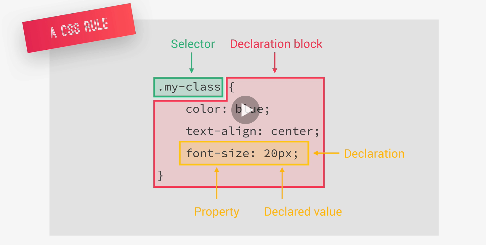

### What happens to CSS when we load up a webpage?

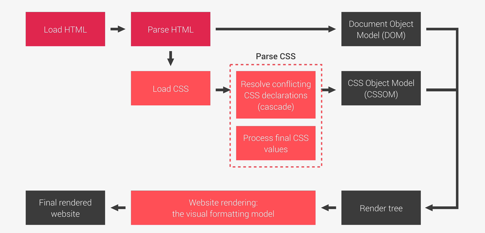

### CSS parsing

#### Cascade

- process of combining different stylesheets and resolving conflicts between different CSS rules and declarations, when more than one rule applies to a certain element
- used to determine style precedence

- CSS sources:

  - author declarations
  - user declarations
  - browser (user agent) declarations

- to determine **precedence** CSS looks at the following, in order:

  - **importance**:
    1. user `!important` declarations
    2. author `!important` declarations
    3. author declarations
    4. user declarations
    5. default browser declarations
  - **specificity** - calculated by comparing how many of the following applies, in order:
    1. inline styles
    2. IDs
    3. classes, pseudo-classes, attributes
    4. elements, pseudo-elements
  - **source order**:
    - if by this point we still can't determine precedence, the last declaration written in code will be applied

- some things to note:
  - use `!important` only as a last resort, it's cleaner and more maintainable to rely on specificity
  - it's better to rely on specificity than on order of selectors, for the same reason (order is usually important when importing 3rd party stylesheets - your own stylesheet should be the last one that is specified)
  - the universal selector, `*`, has no specificity value (0, 0, 0, 0)

#### Processing CSS values

**How are CSS values processed?**

1. _Declared value_ (author declarations)
2. _Cascaded value_ (after the cascade)
3. _Specified value_ (defaulting if there is no cascaded value)
4. _Computed value_ (converting relative values to absolute)
5. _Used value_ (final calculations, based on layout)
6. _Actual value_ (browser and device restrictions)

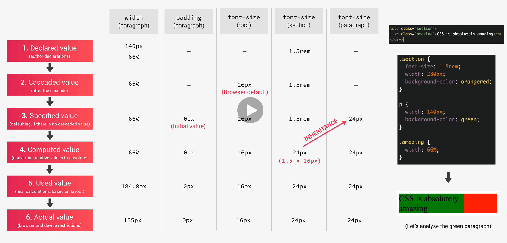

**How units are converted from relative to absolute (px)?**

- each property has an initial value, used if nothing is declared (and if there is no inheriance)
- browsers specify a **root font-size** for each page (usually `16px`)
- percentages and relative values are always converted to pixels
- percentages are measured relative to their **parent's** `font-size`, if used to specify `font-size`
- percentages are measured relative to their **parent's** `width`, if used to specify lentghs
- `em` are measured relative to their **parent's** `font-size`, if used to specify `font-size`
- `em` are measured relative to the **current** `font-size`, if used to specify lengths
- `rem` are always measured relative to the **document's root** `font-size`
- `vh` and `vw` are simply percentage measurements of the viewport's `height` and `width`

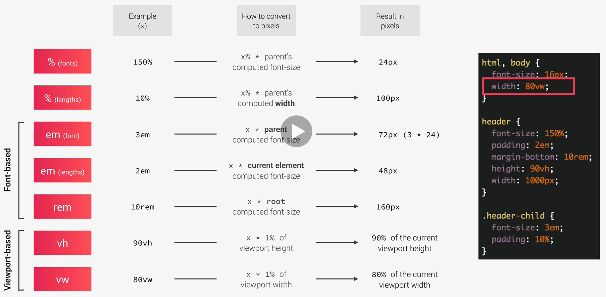

#### Inheritance in CSS

- inheritance passes the values for some specific properties from parents to children - **more maintainable code**
- the computed value of a property is what gets inherited, **not** the declared value
- inheritance of a property only works if no one declares a value for that property
- the `inherit` keyword forces inheritance on a certain property
- the `initial` keyword resets a property to its initial value

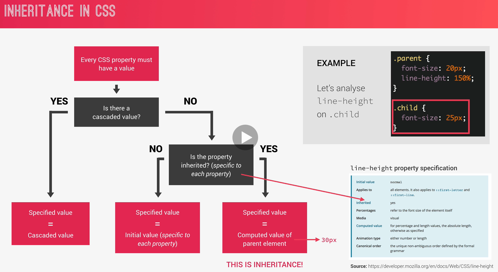

#### Converting px to rem - an effective workflow

- since using `rem` is necessary if we want to write code that is better adjusted for responsivness the best practice is to do it like this:
  - define a base `font-size` inside the root `html` element - use percentages to ensure that browser zooming functionalities work correctly, e.g.
  ```scss
  html {
    /*
    the default font size is 16px, 62.5% of that is 10px
    this rounded number enables us to easily calculate rem values (e.g. 2rem = 2*10px = 20px)
    */
    font-size: 62.5%;
  }
  ```
  - use the relative, `rem`, units instead of pixels everywhere
    - by doing this we can easily achieve responsivness and have one place to change `font-size`, in the root `html` element

#### How CSS renders a website: the visual formatting model

- **the visual formatting model** is an algorithm that calculates boxes and determines the layout of these boxes for each element in the render tree in order to determine the final layout of the page
- it's one of the fundamental concepts of CSS
- it takes into account:
  - **dimensions of boxes**
    - **[the box model](https://www.w3schools.com/css/css_boxmodel.asp)**
    - when using the `box-sizing: border-box;` property the default behavior changes:
      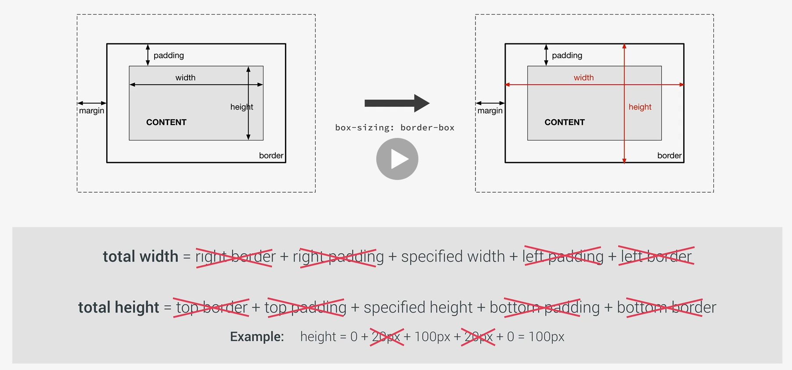
  - **box type**
    - _inline, block, inline-block_
      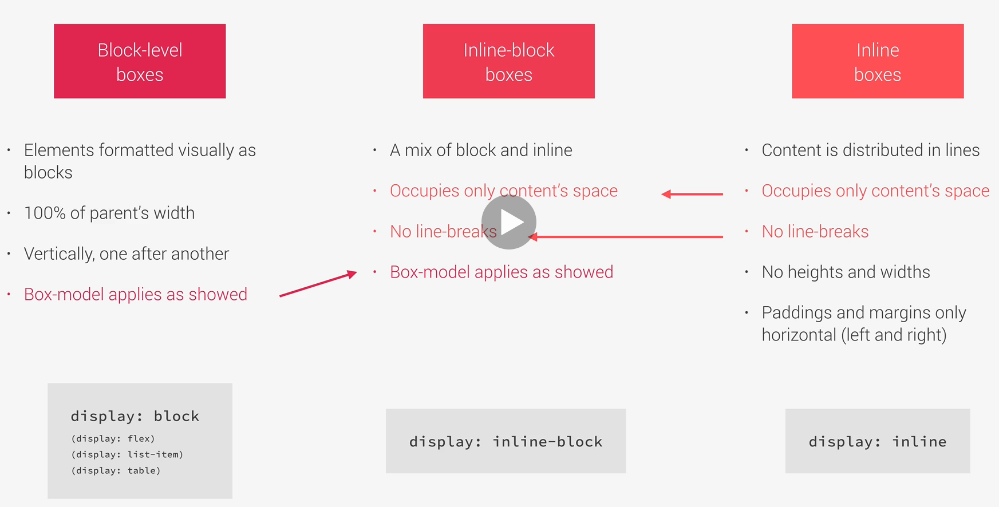
  - **positioning scheme**
    - floats and positioning
      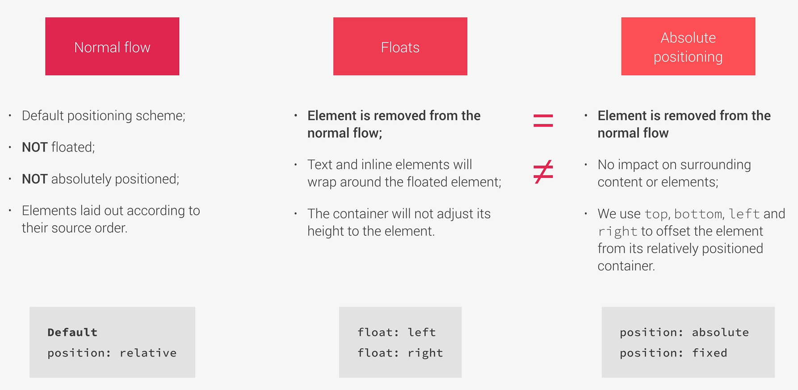
  - **stacking contexts**
    - determining in which order elements get rendered on the page (_z-index, transparency_ and so on)
  - other elements in the render tree
  - viewport size, dimensions of images, etc.

### Basic principles of responsive design

**1. Fluid grids and layouts**

- allow content to easily adapt to the current viewport width
- use `%` instead of `px` for all layout related lengths
- 3 main ways to achieve this:
  - float layouts
  - flexbox
  - CSS grid

**2. Flexible/responsive images**

- images behave differently than other content, we need to make sure that they also adapt to the viewport accordingly
- to do this we always need to specify their width or height using relative units

**3. Media queries**

- to change styles on certain viewport widths (breakpoints), allowing us to create different versions of our website for different widths

</details>

## CSS architecture, components and BEM

<details>
<summary>Click to expand/collapse</summary>
<br />

- we want to write clean, modular and reusable code that is ready to grow

Steps for good architecture:

1. **THINK**

- think about the layout of your web page or web app before writing code
- **component-driven-design**:
  - components are modular building blocks that make up interfaces
  - they are held together by the layout of the page
  - components should be reusable accross a single project and between different projects
  - independence allows us to use them anywhere on the page

2. **BUILD**

- build your layout in HTML and CSS with a consistent structure for naming classes
- **BEM** - **Block Element Modifier** - popular naming convention
  - a **block** is a standalone component that is meaningful on its own
  - an **element** is a part of a block that has no standalone meaning
  - a **modifier** is a different version of a block or an element
  - the syntax is `block__element--modifier`

3. **ARCHITECT**

- create a logical architecture for your CSS with files and folders
- **the 7-1 pattern** - popular file and folder structure where we have 7 different folder for partial Sass files and 1 main file to import all other files into a compiled CSS stylesheet
  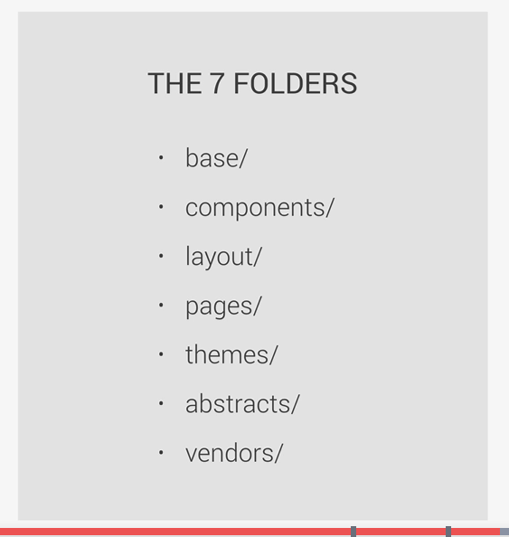

</details>

## SASS

<details>
<summary>Click to expand/collapse</summary>
<br />

- **SASS** is a CSS preprocessor - an extension of CSS that adds power and elegance to the basic language
- to execute SASS code we first need to compile it to normal CSS using a **Sass compiler**

### Main SASS features

- **varialbes** - for reusable values such as colors, font-sizes, spacing etc.
- **nesting** - to nest selectors inside one another, allowing us to write less code
- **operators** - for mathematical operations right inside of CSS
- **partials and imports** - to write CSS in different files and import them all into one single file
- **mixins** - to write reusable pieces of CSS code
- **functions** - similar to mixins, with the difference that they produce a value that can be used
- **extends** - to make different selectors inherit declarations that are common to all of them
  - **[example](./Nexter/sass/_typography.scss)**
- **control directives** - for writing complex code using conditionals and loops

- **NOTE** - there are 2 different syntaxes for writing SASS code - SASS syntax (original) and SCSS syntax - SASS is indentation sensitive, while SCSS uses curly braces - SCSS is preferred

- **SASS EXAMPLES** => https://codepen.io/ngril/pen/KKaeNJG?editors=1100

### Installing and compiling SASS locally

Installing:

- `npm init`
- `npm install node-sass --save-dev`

Setting up sass:

- create a separate `sass` folder and the `main.scss` file inside it
- create a new npm [script](./Natours/package.json) inside package.json which basically invokes the `node-sass` command and specifies the input (`main.scss`) and output (`style.css`) files, we also add the `-w` flag so that the .scss file is watched and that recompilation is triggered on every change (by doing this we don't have to manually recompile sass every time we want to see the change)
- to enable automatic reload in the browser:

  - install the `live-server` npm package globally: `npm install live-server -g`
  - run it inside our project directory with the `live-server` command (it will open our page on http://localhost:8080)

- a simple development and build process can be found [here](./Natours/package.json)

### Using SASS

- when using the BEM naming convention the `&` nesting method is our best friend, since every element has a specific class already

### Implementing the 7-1 CSS architecture with SASS

- create [7 different folders](Natours/sass) within the sass folder:

  - **abstracts** - code that doesn't output any CSS (variables, mixins etc.)
    - contains `_functions.scss`, `_mixins.scss` and `_variables.scss`
  - **base** - holds basic project definitions (project boilerplate)
    - contains `_animations.scss`, `_base.scss` (styles that apply on the entire project), `_typography.scss` and `_utilities.scss`(utility classes)
  - **components** - holds component specific styles
    - contains all the different component specific styles
  - **layout** - for each piece of the global ui, such as global header, footer etc.
  - **pages** - specific styles for a specific page (such as home page)
  - **themes** - if we have different themes
  - **vendors** - if we have 3rd party CSS such as bootstrap

- all of them will hold some partial `.scss` files (whose names start with an underscore, `_`) which will be imported inside the `main.scss` file
- when importing we don't need to specify the starting `_` or the `.scss` extension, [example](./Natours/sass/main.scss)
</details>

## Building a custom grid using floats

<details>
<summary>Click to expand/collapse</summary>
<br />

<details>
<summary>Example HTML</summary>
<br />

```html
<section class="grid-test">
  <div class="row">
    <div class="col-1-of-2">Col 1 of 2</div>
    <div class="col-1-of-2">Col 1 of 2</div>
  </div>

  <div class="row">
    <div class="col-1-of-3">Col 1 of 3</div>
    <div class="col-1-of-3">Col 1 of 3</div>
    <div class="col-1-of-3">Col 1 of 3</div>
  </div>

  <div class="row">
    <div class="col-1-of-3">Col 1 of 3</div>
    <div class="col-2-of-3">Col 2 of 3</div>
  </div>

  <div class="row">
    <div class="col-1-of-4">Col 1 of 4</div>
    <div class="col-1-of-4">Col 1 of 4</div>
    <div class="col-1-of-4">Col 1 of 4</div>
    <div class="col-1-of-4">Col 1 of 4</div>
  </div>

  <div class="row">
    <div class="col-1-of-4">Col 1 of 4</div>
    <div class="col-1-of-4">Col 1 of 4</div>
    <div class="col-2-of-4">Col 2 of 4</div>
  </div>

  <div class="row">
    <div class="col-1-of-4">Col 1 of 4</div>
    <div class="col-3-of-4">Col 3 of 4</div>
  </div>
</section>
```

</details>

<details>
<summary>Example CSS</summary>
<br />

```scss
.row {
  max-width: $grid-width;
  background-color: #eee;
  margin: 0 auto;

  /* here we select everything except the last child */
  &:not(:last-child) {
    margin-bottom: $gutter-vertical;
  }

  @include clearfix;

  /* attribute selector */
  [class^="col-"] {
    background-color: orangered;
    float: left;

    &:not(:last-child) {
      margin-right: $gutter-horizontal;
    }
  }

  .col-1-of-2 {
    width: calc((100% - #{$gutter-horizontal}) / 2);
  }

  .col-1-of-3 {
    width: calc((100% - 2 * #{$gutter-horizontal}) / 3);
  }

  .col-2-of-3 {
    width: calc(
      2 * ((100% - 2 * #{$gutter-horizontal}) / 3) + #{$gutter-horizontal}
    );
  }

  .col-1-of-4 {
    width: calc((100% - 3 * #{$gutter-horizontal}) / 4);
  }

  .col-2-of-4 {
    width: calc(
      2 * ((100% - 3 * #{$gutter-horizontal}) / 4) + #{$gutter-horizontal}
    );
  }

  .col-3-of-4 {
    width: calc(
      3 * ((100% - 3 * #{$gutter-horizontal}) / 4) + 2 * #{$gutter-horizontal}
    );
  }
}
```

</details>

</details>

## Flexbox

<details>
<summary>Click to expand/collapse</summary>
<br />

### An overview and philosophy behind Flexbox

- **Flexbox** is a new module in CSS3 that makes it easy to align elements to one another, in different directions and orders
- flexbox replaces float layouts - using less code that is more readable and logical
- flexbox completely changes the way that we build one-dimensional layouts
- main concepts:
  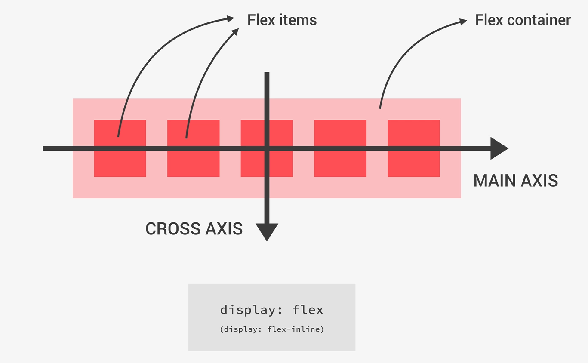

  - we create a flex container by using `display: flex` or `display: flex-inline`
  - all of the children of the flex container are called flex items

- flexbox properties overview:
  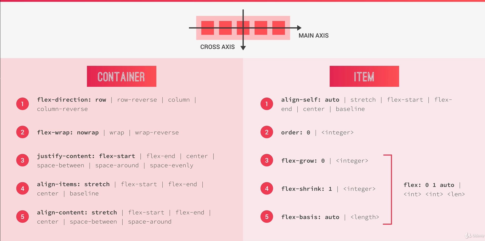

  - container:

    - `flex-direction` => defines the direction of the main axis
    - `flex-wrap` => defines if the flex items wrap into a new line if there is not enough space in the container
    - `justify-content` => defines how will the items be aligned along the main axis
    - `align-items` => defines how will the items be aligned along the cross axis
    - `align-content` => only applies when there is more than one row of flex items, controls how the rows are aligned along the cross axis (if there is some empty space)

  - items:

    - `align-self` - similar to `align-items`, but applied to a single item only
    - `order` - defines the order in which the flex items appear in the container
    - `flex-grow`, `flex-shrink`, `flex-basis` - these help flexbox decide the size of a flexbox item, they can all be specified together using a shorthand property called `flex`
      - the `flex` property, or more specifically `flex-basis`, is the prefered way to define the widths of flex items (instead of the `width` property)

  - **[flexbox examples on codepen](https://codepen.io/ngril/pen/jOBvYLm)**
  - code examples with comments can be found in the **[Trillo project](./Trillo/sass)**, flexbox is awesome, definitely check it out instead of using floats

  - **`margin: auto` trick:**

    ```scss
    .overview {
      display: flex;

      &__stars {
        // this makes the margin occupy all the available space (trick instead of using flex-grow: 1, which would make the star element occupy all the available space, instead of it being empty)
        margin-right: auto;
      }
    }
    ```

</details>

## CSS grid

<details>
<summary>Click to expand/collapse</summary>
<br />

- **NOTE** - Firefox has an amazing dev tools for working with CSS grid
- **[CODE EXAMPLES ON CODEPEN](https://codepen.io/ngril/pen/QWpYVqP?editors=1100)**

### Overview and basic terminology

- **CSS grid layout** is a brand new module that brings a two-dimensional grid system to CSS for the first time
- it completely changes the way we envision and build two-dimensional layouts
- it replaces float layouts, using less, and more readable and logical CSS and HTML
- CSS grid works perfectly together with Flexbox - which is still best to handle one-dimensional components and layouts
- **basic terminology:**
  - axes, container, items:
    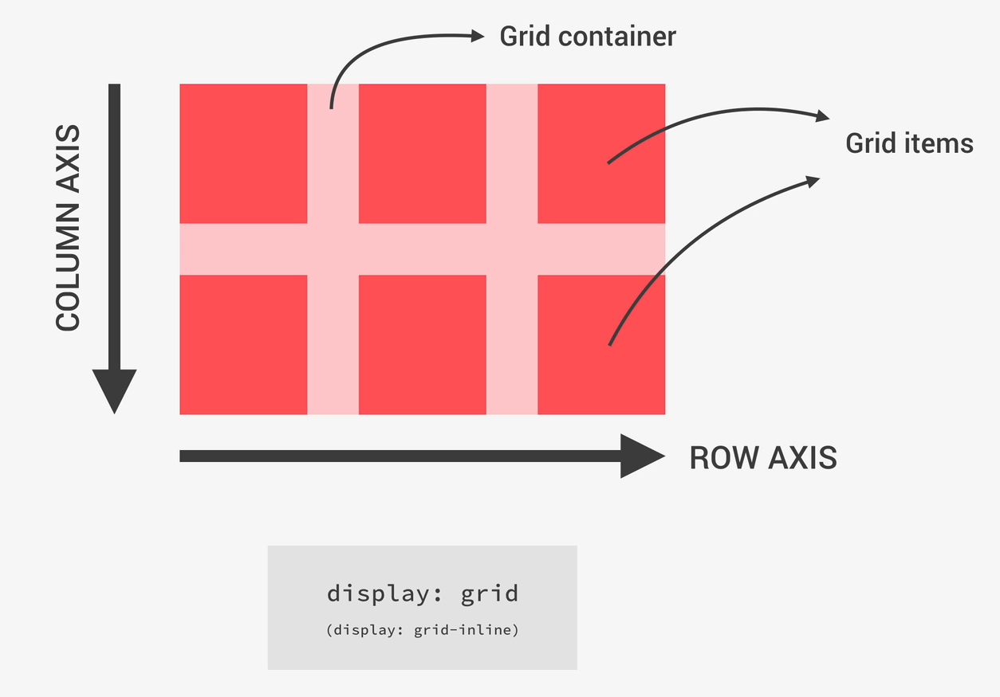
  - tracks, rows, columns, grid lines, gutter:
    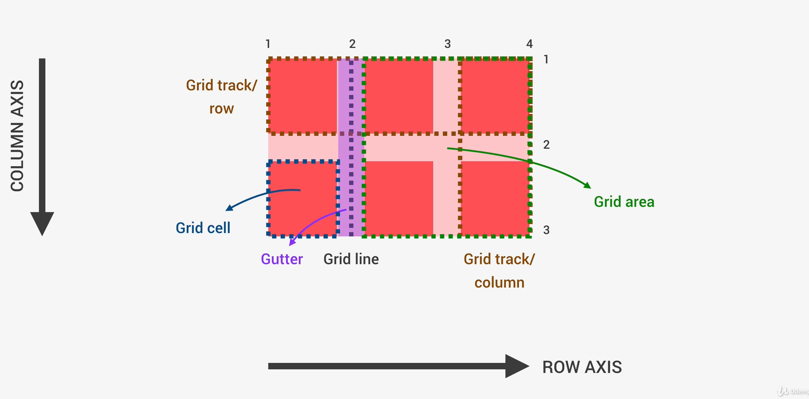
- **CSS grid properties overview:**
  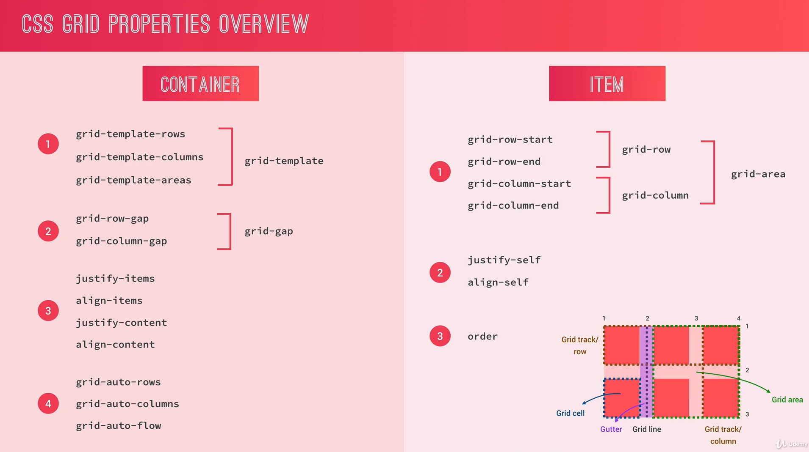

### Getting familiar with the `fr` unit (fractional unit):

- it can be used to create equal width columns and equal height rows
- also it can be used if we want a row / column to occupy the rest of the available space
- for more details look at the [codepen examples](https://codepen.io/ngril/pen/QWpYVqP?editors=1100)
- note that the `fr` unit takes all the available space, but can NEVER be smaller than the minimum content of the cell

### Positioning grid items:

- done by using the following properties and specifying their line numbers:

  - `grid-row-start`, `grid-row-end`, `grid-column-start`, `grid-column-end`
  - example:

  ```scss
  .someClass {
    grid-row-start: 2;
    grid-row-end: 3;
    grid-column-start: 2;
    grid-column-end: 3;
  }
  ```

  - we can also use their shorthands: `grid-row`, `grid-column`
  - example:

  ```scss
  .someClass {
    // row-start / row-end
    grid-row: 2 / 3;
    // column-start / column-end
    grid-column: 2 / 3;
  }
  ```

  - or we can use the absolute shortest way (which is a bit confusing so the one mentioned above is preferred) by using the `grid-area` property
  - example:

  ```scss
  .someClass {
    // it's basically: row-start / col-start / row-end / col-end
    grid-area: 2 / 2 / 3 / 3;
  }
  ```

  - for other usages see examples on [codepen](https://codepen.io/ngril/pen/QWpYVqP?editors=1100)

### Spanning grid items:

- done similarly to positioning, but by specyfing a start-end difference of more than 1, e.g. `grid-column: 2 / 4;`
- another way of doing it is like this: `grid-column: 2 / span 2;`
- if we want the column (or row) to span to the end of the grid we can also do it like this: `grid-column: 2 / -1;`
  - `-1` represents the end of the grid
  - note that this only works if the row or column is explicitly defined

### Alternative grid positioning mechanisms

- **[Naming grid lines](https://codepen.io/ngril/pen/JjWxgKK?editors=1100)**
  - good for larger layouts
- **[Naming grid areas](https://codepen.io/ngril/pen/poeGMaM?editors=1100)**
  - good for small and simple layouts

### Implicit vs explicit grids

- explicit grid contains all of the grid items that we defined ourselves, where as the implicit grid gets automatically added to fit our content
- thankfully we can also style the implicit grid through some properties which can be found in this **[example on codepen](https://codepen.io/ngril/pen/GRWzVbw?editors=1100)**
- this is useful in situations when we don't know the amount of content we will have beforehand (like when we are showing data fetched from some server for example)

### Aligning grid items

- aligning items is pretty similar to flexbox - if we want to align all items we set the `align-items` (column axis) and `justify-items` (row axis) on the container level
- if we want to specifically align one item we can set the `align-self` (column axis) and `justify-self` (row-axis) properties on the item level
- **[example on codepen](https://codepen.io/ngril/pen/ZEePXYW?editors=1100)**

### Aligning tracks

- also similar to flexbox - we use the `justify-content` (aligning horizontally) and `align-content` (aligning vertically) properties
- **[example on codepen](https://codepen.io/ngril/pen/GRWzVbw?editors=1100)**

### Using min-content, max-content and the minmax() function

- by defining rows with `max-content` the layout is created so that the cell with the most content fits without any line breaks or overflowing
- by defining rows or columns with `min-content` the layout is cretad so that the cell with the most content is just large enough so that the content in it fits without overflowing (creates line breaks and fits content to height)
- with the `minmax()` function we define the lowest and the highest value for the size of the row - the value will always be somewhere in between those values
- **[example on codepen](https://codepen.io/ngril/pen/GRWeMLK?editors=1100)**

### Responsive layouts with auto-fill and auto-fit

- the `auto-fill` and `auto-fit` properties in conjunction with styling the implicit grid and the `minmax()` function enable us to write responsive layouts out of the box without needing to write any media queries
- basically these properties can be set when defining row and column templates and provide us with a way of creating exactly the amount of rows / columns that we need
- **[example on codepen](https://codepen.io/ngril/pen/OJpqzbQ?editors=1100)**

### Other notes

- we can have multiple grid items occupying the same cell (if we explicitly set their position to the same grid place in the grid) - to determine which one is shown we can set its `z-index` property
- **a grid item can also become a grid container**, same as with flexbox
- the `grid-gap`, `grid-column-gap` and `grid-row-gap` have become deprecated and replaced with the equivalents without the `grid` prefix => `gap`, `row-gap`, `column-gap`
- CSS grid is often used together with **Flexbox**
  - use the grid for two-dimensional and flexbox for one-dimensional layouts
- [grid challenge](https://codepen.io/ngril/pen/wvJNZVb?editors=1100)

</details>

## CSS grid in practice - Nexter project

<details>
<summary>Click to expand/collapse</summary>
<br />

### Defining the grid and positioning elements

- most of the code examples can be found in the **[Nexter project](./Nexter/sass)**, here I will just leave a few which seem the most important

**Defining the grid example:**

```scss
.container {
  // initializing the grid container
  display: grid;
  // defining grid rows
  // 1st row - 80vh
  // 2nd row - by setting min-content we ensure that the height will be enough for all content to fit
  // 3rd row - by setting the vw we ensure responsivness of the story section (when we resize the viewport the row height will depend on the viewport width)
  // 4th, 5th, 6th row - by setting min-content we ensure that the height will be enough for all content to fit
  grid-template-rows: 80vh min-content 40vw repeat(3, min-content);

  // creating a column grid with a fixed width
  // 8rem is the sidebar column
  // the following 1fr and the one at the end ensures that the 8 column grids with a fixed width can be nicely centered (they are inside a minmax function so that we still have some margin when the viewport width is small)
  // minmax function ensures that column widths are adaptive
  // we are also naming the column tracks for ease of use, the col-start and col-end inside the repeat function will have the numbers at the end, e.g. col-start 1
  grid-template-columns:
    [sidebar-start] 8rem
    [sidebar-end full-start] minmax(6rem, 1fr)
    [center-start] repeat(8, [col-start] minmax(min-content, 14rem) [col-end])
    [center-end] minmax(6rem, 1fr)
    [full-end];
}
```

**Positioning of elements examples:**

```scss
.features {
  // POSITIONING THE FEATURES IN THE GRID
  // we don't need to specify the rows since the features occupy one row based on the order in the html
  // we have named columns which makes this much easier to understand
  grid-column: center-start / center-end;
}

.sidebar {
  // POSITIONING THE SIDEBAR IN THE GRID
  // it spans the entire height - so from the first row to the last
  grid-row: 1 / -1;
  // we have named columns which makes this much easier to understand
  grid-column: sidebar-start / sidebar-end;
}
```

### Responsiveness trick

- it's important to note that we can have nested grids - a grid item can become a grid container if necessary
- we can also achieve a responsive layout without the need of media queries with CSS grid
- **example:**

```scss
.someClass {
  display: grid;

  // with this trick we have responsiveness solved out of the box
  // auto-fit makes it so that we will have as many columns as are able to fit
  // their width will never be less than 25rem, and if there is enough space than it will be 1fr
  grid-template-columns: repeat(auto-fit, minmax(25rem, 1fr));
}
```

### Overlapping of grid items

- in order to achieve overlapping we need to explicitly define the position for both the row and the column
- **example:**

```scss
.home {
  &__img {
    grid-row: 1 / 2;
    grid-column: 1 / -1;
    z-index: 1;
  }

  &__like {
    grid-row: 1 / 2;
    grid-column: 2 / 3;
    z-index: 2;
  }
}
```

### Creating an image gallery

- an image gallery is a typical use case for CSS grid, because without it`s much more difficult to build
- an important part of building it is the use of the `object-fit: cover;` property in order to get around the images trying to maintain their original aspect ratio and because of that overflowing outside of a given grid cell
- in order for the `object-fit` to work we need to wrap the image in a `div` container and set the property `object-fit` to the image itself
- it is also very important to note that in order for `object-fit` to work properly we need to define both the `width` and the `height` of the image
- **example:**

  - HTML:
  <details>
  <summary>expand/collapse</summary>

  ```html
  <!-- Notice that each image is inside its own container (the figure element) -->
  <section class="gallery">
    <figure class="gallery__item gallery__item--1">
      
    </figure>
    <figure class="gallery__item gallery__item--2">
      
    </figure>
    <figure class="gallery__item gallery__item--3">
      
    </figure>
    <figure class="gallery__item gallery__item--4">
      
    </figure>
    <figure class="gallery__item gallery__item--5">
      
    </figure>
    <figure class="gallery__item gallery__item--6">
      
    </figure>
    <figure class="gallery__item gallery__item--7">
      
    </figure>
    <figure class="gallery__item gallery__item--8">
      
    </figure>
    <figure class="gallery__item gallery__item--9">
      
    </figure>
    <figure class="gallery__item gallery__item--10">
      
    </figure>
    <figure class="gallery__item gallery__item--11">
      
    </figure>
    <figure class="gallery__item gallery__item--12">
      
    </figure>
    <figure class="gallery__item gallery__item--13">
      
    </figure>
    <figure class="gallery__item gallery__item--14">
      
    </figure>
  </section>
  ```

  </details>

  - CSS:
  <details>
  <summary>expand/collapse</summary>

  ```scss
  .gallery {
    display: grid;
    grid-template-columns: repeat(8, 1fr);
    // another way to create rows with responsive height is to predefine the height of the entire gallery and then use the fr unit for the height
    grid-template-rows: repeat(7, 5vw);
    gap: 1.5rem;
    // we need to specify the padding because the gap is present only between the rows and columns, and not on the outer edges of the grid
    padding: 1.5rem;

    // we have wrapped each image into its own container so that we can set the object-fit property on the image
    // this needs to be done in order for the images not to overflow to other grid cells (because images in the grid by default always try to maintain their aspect ratio)
    &__item {
      &--1 {
        grid-row: 1 / span 2;
        grid-column: 1 / span 2;
      }

      &--2 {
        grid-row: 1 / span 3;
        grid-column: 3 / span 3;
      }

      &--3 {
        grid-row: 1 / span 2;
        grid-column: 6 / span 1;
      }

      &--4 {
        grid-row: 1 / span 2;
        grid-column: 7 / span 2;
      }

      &--5 {
        grid-row: 3 / span 3;
        grid-column: 1 / span 2;
      }

      &--6 {
        grid-row: 4 / span 2;
        grid-column: 3 / span 2;
      }

      &--7 {
        grid-row: 4 / span 1;
        grid-column: 5 / span 1;
      }

      &--8 {
        grid-row: 3 / span 2;
        grid-column: 6 / span 2;
      }

      &--9 {
        grid-row: 3 / span 3;
        grid-column: 8 / span 1;
      }

      &--10 {
        grid-row: 6 / span 2;
        grid-column: 1 / span 1;
      }

      &--11 {
        grid-row: 6 / span 2;
        grid-column: 2 / span 2;
      }

      &--12 {
        grid-row: 6 / span 2;
        grid-column: 4 / span 1;
      }

      &--13 {
        grid-row: 5 / span 3;
        grid-column: 5 / span 3;
      }

      &--14 {
        grid-row: 6 / span 2;
        grid-column: 8 / span 1;
      }
    }

    &__img {
      width: 100%;
      height: 100%;
      // in order for the object-fit property to work both the width and the height need to be set
      object-fit: cover;
      display: block;
    }
  }
  ```

  </details>

</details>

## Style guide

<details>
<summary>Click to expand/collapse</summary>
<br />

Very useful resources page from the author -> **[here](http://codingheroes.io/resources/)**
Resource for free images -> **[here](https://unsplash.com/)**
Resource for free homepage videos -> **[here](https://coverr.co/)**

### Small tips and tricks

<details>
<summary>Click to expand/collapse</summary>
<br />

- use the `display: block` property for breaking lines when using multiple inline elements, https://www.w3schools.com/cssref/pr_class_display.asp

- when using `float` on all the child elements the parent elements height becomes 0

  - to fix whis issue we add the `::after` pseudoclass with the following properties to the parent (so called [clearfix](./https://www.w3schools.com/howto/howto_css_clearfix.asp) method)
  - example:

  ```scss
  .clearfix::after {
    content: "";
    clear: both;
    display: table;
  }
  ```

- sometimes it is useful to have columns that have the same height. A nice way of doing that is sometimes by using the `display: table;` (parent) and `display: table-cell;` (children) properties. Then we can also use `vertical-align: middle;` to center content inside a specific cell, and also some interesting properties on the children of the cell, such as:

```scss
.someClass {
  column-count: 2;
  column-gap: 4rem;
  column-rule: 1px solid $color-grey-light-2;
}
```

- if we also want a "newspappery" look we can set the `hyphens: auto;` property, so that the browser automatically adds hyphens when the text doesn't fit the column. Note that in order for this to work we need to have the language specified inside the `<html>` tag of our page

- when using floats the best way to add some space between elements is to use the `tranform: translate()` method and not mess with margins at all

- we can use the attributes selector to select all elements with a given attribute

  - this is very powerful because we can also match attribute values using a regex-like syntax
  - example (we are matching all elements that have a class that starts with 'col-'):

  ```scss
  [class^="col-"] {
    background-color: orangered;
    float: left;
  }
  ```

- if we want to calculate something we can use the CSS `calc()` function

  - its advantage is that it can calculate mixed units (so we can mix `%`, `px`, `rem`, and so on)
  - if we are using SASS variables inside we need to wrap them with `#{}`
  - example:

  ```
  width: calc(
    3 * ((100% - 3 * #{$gutter-horizontal}) / 4) + 2 * #{$gutter-horizontal}
  );
  ```

- use utility classes to increase code reusability (in them its okay to use `!important` since we absolutely want them to be applied if we specify them)

- to include icon fonts we download them, put them somewhere inside our project and import them **above** our css style inside the html

- we can use the [`outline`](./https://www.w3schools.com/css/css_outline.asp) property instead of `border` if we want to specify some space (`offset`) between the border and the element

- the direct child selector, `>`, select the direct children of an element and it can be very useful

  - syntax: `.some-class > *` => this will select all direct children of the element

- use the `box-decoration-break` property if you want some element that is broken into multiple boxes to have all the properties applied on both (for example if we have a header which is broken into 2 lines - boxes - and want the padding to be applied to both boxes on both sides)

- a special html element which supports images with caprions is:

```html
<figure>
  
  <figcaption>Some caption</figcaption>
</figure>
```

- if we want to make text wrap around some shape we can use something like this:

```scss
.someClass {
  /* this creates a circle shape */
  --webkit-clip-path: circle(50% at 50% 50%);
  clip-path: circle(50% at 50% 50%);

  /* this makes the text outside the circle wrap around it */
  --webkit-shape-outside: circle(50% at 50% 50%);
  shape-outside: circle(50% at 50% 50%);
}
```

- styling the selected text color and its background is done like this:

```scss
::selection {
  background-color: $color-primary;
  color: $color-white;
}
```

- we can use the `fill:currentColor;` property-value (it doesn't have to be on `fill`) if we want the element to have the same color as the current (or the parent) element

- we can define the paddings using the `vw` unit to make them responsive

</details>

### Universal selector and common properties

<details>
<summary>Click to expand/collapse</summary>
<br />

- `*` is a universal selector that selects all html elements

  - in it we usually remove all paddings and margins which are added by default (`padding: 0; margin: 0;`)
  - an interesting property which can also be added to it is `box-sizing: border-box;` - it makes all paddings and margins added to the total width and height of the element, i.e. if we specify `width: 300px;` on some element the 300 pixels will include the padding and the margin, where as without that property that won't be the case and paddings and margins would be added to the original 300 pixels ([box model](https://www.w3schools.com/css/css_boxmodel.asp))
  - **box-model**:
    
  - a slightly better practice is to add `box-sizing: inherit;` to the universal selector to make that property inherited and than add `box-sizing: border-box;` to the `body` selector - by doing this we can tweak box-sizing in plugins and other components
  - also it is a good practice to add pseudo-elements `::after` and `::before` to the universal selector to ensure their correct styling

- **example**:

```scss
*,
*::after,
*::before {
  margin: 0;
  padding: 0;
  box-sizing: inherit;
}
```

- in the `body` selector we usually specify the font properties because they are inherited by all other page elements
- **example**:

```scss
body {
  font-family: "Lato", sans-serif;
  font-weight: 400;
  /* font-size: 16px; */
  line-height: 1.7;
  color: #777;
  padding: 3rem;

  box-sizing: border-box;
}
```

</details>

### Background properties

<details>
<summary>Click to expand/collapse</summary>
<br />

- we can specify multiple background images using a single `background-image` property (separated by commas)
- this is useful if we want to add gradient to the image - we first specify the gradient and then the image - it results in a gradient color being displayed in front of the the image
- **example** - in the linear gradient we first specify the direction of the gradient, then the starting and ending colors (including opacity), followed by the image which is show behind the gradient:

```scss
background-image: linear-gradient(
    to right bottom,
    rgba(126, 213, 111, 0.8),
    rgba(40, 180, 131, 0.8)
  ), url("../img/hero.jpg");
```

- some other useful properties include `background-size: cover;` which ensures that the image will always take up the entire viewport of the browser window (even when resizing it) and `background-position: top` which makes the image always stay on top of the container when resizing
- one more very cool property is `clip-path: polygon(x y, x y, x y, x y)` with which we can clip the image and create a custom shape from it using the coordinates of the corners (clockwise starting from top left)

  - a useful tool to aid us in this task can be found here, https://bennettfeely.com/clippy/

- if we want a linear gradient color on the text we can use the following:

```scss
.heading-secondary {
  /* makes the heading not span the entire width of the screen */
  display: inline-block;

  /* creates a linear gradient background image */
  background-image: linear-gradient(
    to right,
    $color-primary-light,
    $color-primary-dark
  );

  /* clips the background image so that it's only behind the text  */
  -webkit-background-clip: text;
  background-clip: text;

  /* makes the text transparent therefore making the background image visible */
  color: transparent;
}
```

- linear gradient function also has some advanced features such as specifying percentages where some other color starts, and also the angle of the gradient in degrees

  - by doing this we can achieve the so called solid color gradient, and also something similar to clip path, but also some other advanced stuff
  - **example:**

  ```scss
  .someClass {
    background-image: linear-gradient(
        105deg,
        /* angle of the gradient */ rgba($color-white, 0.8) 0%,
        /* color starting at 0% */ rgba($color-white, 0.8) 50%,
        /* color at 50% */ transparent 50% /* color from 50% */
      ), url(../img/nat-10.jpg);
  }
  ```

- by using something like this we can also create an image composition, something like [this](./Natours/sass/components/_composition.scss)

- another way of achieving a clipped image look which is applicable in some cases is to use the `tranform: skewY()` method which will skew the image

- the `background-blend` property describes how will multiple background images blend together => experiment with this in the console to see the different possibilities and how they look

- the `backdrop-filter` can be used to blur the background image which is behind the current element (for example the background behind the modal)

- the `filter` property allows us to play with the image display properties such as `brightness`

</details>

### Centering any element by using absolute positioning and transform property

<details>
<summary>Click to expand/collapse</summary>
<br />

- if we want to center block elements inside other block elements we can use `margin: 0 auto;`
- however if we want to center some other elements it may be more difficult so the easiest trick to center any element is described below

- _in HTML the positive directions of the axis are from left to right for x, and from top to bottom for y_
- by setting the `position: absolute;` property we can specify the exact position of the element in relation to its closest parent with the `position: relative;` property (if it can't find an element with relative positioning it will use the `body`)
- positioning is specified by using the `top`, `bottom`, `left` or `right` properties
- to center any element we can use absolute positioning combined with the `transform: translate()` CSS property
- **example**
  - with absolute positioning we move the element by 50% from the top and left edges of its parent
  - it is not yet centered because now the top and left edges of the absolutely positioned element are in the center of the parent (and we want the center of an element to be in the middle) - to counter act this we use the `transform: translate(-50%, -50%);` to move the element by -50% in the x and y direction

```scss
.header {
  position: absolute;
  top: 50%;
  left: 50%;
  transform: translate(-50%, -50%);
}
```

</details>

### Advanced CSS animations using @keyframes and the animation property

<details>
<summary>Click to expand/collapse</summary>
<br />

- to create custom CSS animations we use the [@keyframes](https://www.w3schools.com/cssref/css3_pr_animation-keyframes.asp) rule and the [animation](https://www.w3schools.com/cssref/css3_pr_animation.asp) property
- `@keyframes` specifies the animation code (gradually changing from one css style to another)

  - for best browser support:
    - always specify the `0%` and `100%` selectors (start and end of animation)
    - animate only 2-3 properties at a time
  - **example** (`moveInLeft` is the name of the animation):

  ```scss
  @keyframes moveInLeft {
    /* start of animation */
    0% {
      opacity: 0;
      transform: translateX(-100px);
    }

    /* animation 80% done */
    80% {
      transform: translateX(10px);
    }

    /* end of animation */
    100% {
      opacity: 1;
      transform: translateX(0);
    }
  }
  ```

- the `animation` property is used to control the appearance of the animation and bind the animation to an element

  - it's a shortened syntax for many different animation properties
  - syntax: `animation: name duration timing-function delay iteration-count direction fill-mode play-state;`
  - **example** (we specify animation on the element we want animated):

  ```
  animation: moveInRight 1s ease-out;
  ```

- we don't always need to specify the @keyframes, most animations come out of the box and can be used with just the `transition` and `transform` properties, example (sass):

```scss
.heading-secondary {
  transition: all 0.2s;
  &:hover {
    transform: skewY(2deg) skewX(15deg) scale(1.1);
    text-shadow: 0.5rem 1rem 2rem rgba($color-black, 0.2);
  }
}
```

- we can also specify different different settings for specific animations in the `transition` property (durations, timing functions, delays):

```scss
.someClass {
  transition: transform 0.2s, width 0.4s cubic-bezier(1, 0, 0, 1) 0.2s,
    background-color 0.1s;
}
```

- `transform-origin` property can be useful when we are using the `transform: rotate()` and want to specify the the origin of the transformation (for example by default the center of rotation is at the center, we can set it to left or right) - better explanation [here](https://developer.mozilla.org/en-US/docs/Web/CSS/transform-origin)

- **Additional notes**

  - to fix CSS animation shakiness we can specify `backface-visibility: hidden;` on the parent element to the ones animated
  - [`animation-fill-mode`](https://developer.mozilla.org/en-US/docs/Web/CSS/animation-fill-mode) can be very useful when we want to spcify the style of an element before or after the animation has played
  - to create custom transition timing functions (if we don't want to use the built in ones such as `ease in`) we can use the [`cubic-bezier()`](https://www.w3schools.com/cssref/func_cubic-bezier.asp)

    - some helpful resources for this can be found [here](https://easings.net/) and [here](https://cubic-bezier.com/)

  - to create an infinite animation we just need to add `infinite` to the animation property
  - example of infinite pulsating animation using `@keyframes`:

  ```scss
  .someClass {
    &:focus {
      outline: none;
      animation: pulsate 1s infinite;
    }
  }

  @keyframes pulsate {
    0% {
      transform: scale(1);
      box-shadow: none;
    }

    50% {
      transform: scale(1.05);
      box-shadow: 0 1rem 4rem rgba($color: #000000, $alpha: 0.25);
    }

    100% {
      transform: scale(1);
      box-shadow: none;
    }
  }
  ```

</details>

### Pseudo-elements and pseudo-classes, ::after pseudo-element

<details>
<summary>Click to expand/collapse</summary>
<br />

- pseudo-classes are used to style special states of an element

  - **example**: `a:link`, `a:hover`, `a:visited`, `a:active`
  - if we want to select the first or last child of an element we can use the `:first-child` or `:last-child` selectors (pseudo-classes)
  - we can also select all elements except the first or last child using the `:not(:last-child)` selector, similarly there is the `:not(:last-of-type)` in cases where that is applicable (last child is not the element we want but the last element of a given type)
  - an interesting selector is also something like this:

  ```scss
  /* we select the hover class of the parent element and then select all of the children which are not hovered, so we can shrink them a bit */
  .composition:hover .composition__photo:not(:hover) {
    transform: scale(0.95);
  }
  ```

  - the `:target` pseudo element

- pseudo-elements are used to style special parts of an element

  - **example**: `p::first-line`, `p::first-letter`, `h1::before`, `h1::after`

- `::after` pseudo element enables us to insert something after the content of an element

  - we always need to define the `content` property (even if it's empty)
  - it can be very useful for styling and creating animations
  - **example**:

  ```scss
  .btn::after {
    content: "";
    display: inline-block;
    height: 100%;
    width: 100%;
    border-radius: 100px;

    position: absolute;
    top: 0;
    left: 0;
    // note that z-index only works if we have a specified position
    z-index: -1;

    transition: all 0.4s;
  }

  .btn:hover::after {
    transform: scaleX(1.4) scaleY(1.6);
    opacity: 0;
  }
  ```

</details>

### Using native CSS variables (CSS custom properties)

<details>
<summary>Click to expand/collapse</summary>
<br />

#### Why use CSS variables

- we don't need a preprocessor for variables
- they can also be manipulated in the dev tools, they are easier to use in the calc function, they are inherited

#### How to use CSS variables

- we usually define them in the `:root` pseudo class, with `--` before the variable name
- we use them within the `var()` function
- example definition:
  ```scss
  // same as the html selector but with a higher specificity, here we are putting all the CSS variables
  :root {
    --color-primary: #eb2f64;
    --color-primary-light: #ff3366;
    --color-primary-dark: #ba265d;
  }
  ```
- example usage:
  ```scss
  body {
    background-image: linear-gradient(
      to right bottom,
      var(--color-primary-light),
      var(--color-primary-dark)
    );
  }
  ```

</details>

### Using `perspective` and `backface-visibility` properties

<details>
<summary>Click to expand/collapse</summary>
<br />

We can achieve a rotating card by using the `transform: rotateY(180deg)` property in combination with the `perspective` and `bacface-visibility` properties.

**Example**:

```scss
.card {
  /* perspective is a newish property which makes the card look like it is moving towards us */
  /* it needs a large value to look good (experiment!), here it is 1500px */
  perspective: 150rem;
  -moz-perspective: 150rem;

  /* we need this because of absolute positioning in the child element */
  position: relative;

  /* we need to specify this because here we face the same problem like when using floats - the parent height becomes 0 */
  /* the clearfix hack doesn't work when we are using absolute positions unfortunately */
  height: 50rem;

  &__side {
    color: #fff;
    font-size: 2rem;

    /* needs to be same as the above height */
    height: 50rem;

    transition: all 0.8s ease;

    position: absolute;
    top: 0;
    left: 0;
    width: 100%;

    /* this property makes the other card side invisible */
    backface-visibility: hidden;

    border-radius: 3px;
    box-shadow: 0 1.5rem 4rem rgba($color: $color-black, $alpha: 0.15);

    &--front {
      background-color: $color-white;
    }

    /* the front side starts at 0 deg, while the back starts at 180 */
    &--back {
      transform: rotateY(180deg);

      &-1 {
        background-image: linear-gradient(
          to right bottom,
          $color-secondary-light,
          $color-secondary-dark
        );
      }
    }
  }

  /* selecting the front side when the hover state on the card is active, .card:hover .card__side */
  &:hover &__side--front {
    transform: rotateY(-180deg);
  }

  &:hover &__side--back {
    transform: rotateY(0);
  }
}
```

</details>

### CSS masks

<details>
<summary>Click to expand/collapse</summary>
<br />

A mask defines an area where we can look through the element and see what is behind it. It is really similar to clipping.

**Example**:

```scss
.someClass::before {
  // define the background color
  background-color: var(--color-primary);
  // define the mask image - place where we will see behind the element
  mask-image: url(../img/chevron-thin-right.svg);
  // define the mask size
  mask-size: cover;
}
```

</details>

### Styling images

<details>
<summary>Click to expand/collapse</summary>
<br />

One of the pilars of responsive desgin is to make images adapt to different viewport sizes. To achieve this we always need to specify the width (or height) of the image and also use relative units when doing it.

- some useful properties to style images include:
  - `opacity` - makes the image more or less visible (used for stuff other than images as well)
  - `filter` - contains a lot of functions to style the image like `blur`, `brightness`, `sepia` and so on

</details>

### Creating a background video

<details>
<summary>Click to expand/collapse</summary>
<br />

Resource for free homepage videos -> **[here](https://coverr.co/)**

**Example:**

- HTML:

```html
<div class="bg-video">
  <!-- we can specify many different attributes that control how the video is played here -->
  <video class="bg-video__content" autoplay muted loop>
    <!-- we specify 2 formats and a failover text to make sure that the video can be played on all browsers -->
    <!-- if it can't be played because you are using IE than the text will be shown -->
    <source src="img/video.mp4" type="video/mp4" />
    <source src="img/video.webm" type="video/webm" />
    Your browser is not supported!
  </video>
</div>
```

- CSS:

```scss
.bg-video {
  /* dont forget to put relative position to the parent */
  position: absolute;
  top: 0;
  left: 0;

  /* defining dimensions of the container */
  height: 100%;
  width: 100%;
  /* makes the container appear behind other elements */
  // note that z-index only works if we have a specified position
  z-index: -1;
  opacity: 0.15;
  /* clips the rest of the content if the container content is too big to fit the area, VERY IMPORTANT */
  overflow: hidden;

  /* here we also need to define dimensions */
  /* object-fit is similar to specifying background-size: cover property 
    it ensures that the video will always take up the entire viewport of the screen (even when resizing) */
  &__content {
    width: 100%;
    height: 100%;
    object-fit: cover;
  }
}
```

</details>

### Working with SVG icons

<details>
<summary>Click to expand/collapse</summary>
<br />

A great resource can be found **[here](https://icomoon.io/app/#/select)**. Here we can select the icon library we want, select the icons we need from it, and finally download them in the requested format. The important files are, of course the svgs, but also the _symbol-defs.svg_ sprite file from which we can select all the svg files we imported (we copied it to our _img_ project folder and renamed it to _sprite.svg_).

To include an svg to our HTML we use the `<use>` element, example:

```xml
<button class="search__button">
  <svg class="search__icon">
    <!-- here we select the icon from the sprite file by its class name -->
    <use xlink:href="img/sprite.svg#icon-magnifying-glass"></use>
  </svg>
</button>
```

- **disclaimer**: using svg files like this will only work on a web server

To format an svg in css we just need to set its width and height:

```scss
&__icon {
  height: 2rem;
  width: 2rem;
  // by using the fill property wee can change the color of the icon
  fill: var(--color-grey-dark-3);
}
```

If we want to use an svg as a background image - so directly in CSS we do it the same way as with any other _jpg_ or _png_.

</details>

### Creating and styling HTML form inputs

<details>
<summary>Click to expand/collapse</summary>
<br />

- we want to create a reusable css component for styling forms
- this example includes styling of inputs, placeholders and radio buttons

- example:

  - HTML:
  <details>
  <summary>expand/collapse</summary>

  ```html
  <div class="book">
    <div class="book__form">
      <form action="#" class="form">
        <div class="u-margin-bottom-medium">
          <h2 class="heading-secondary">Start booking now</h2>
        </div>

        <!-- we should separate each input and label pair into a form group -->
        <div class="form__group">
          <!-- by matching the id attribute on the input with the for attribute on the label the input is focused when we click on the label as well   -->
          <!-- required attribute enables built in browser validation -->
          <input
            type="text"
            class="form__input"
            placeholder="Full name"
            id="name"
            required
          />
          <label for="name" class="form__label">Full name</label>
        </div>

        <!-- with type email we also enable built in browser email validation -->
        <div class="form__group">
          <input
            type="email"
            class="form__input"
            placeholder="Email address"
            id="email"
            required
          />
          <label for="email" class="form__label">Email address</label>
        </div>

        <div class="form__group u-margin-bottom-medium">
          <div class="form__radio-group">
            <!-- by having the same name on the radio button input only one will be selectable at a time -->
            <input
              type="radio"
              class="form__radio-input"
              id="small"
              name="size"
            />
            <label for="small" class="form__radio-label">
              <!-- since we cannot directly style a radio input we create an empty span element which we will style however we want -->
              <!-- after that we will hide the input element (it will still be selected), which makes it seem that our custom button (span) is actually the input element -->
              <span class="form__radio-button"></span>
              Small tour group
            </label>
          </div>

          <div class="form__radio-group">
            <input
              type="radio"
              class="form__radio-input"
              id="large"
              name="size"
            />
            <label for="large" class="form__radio-label">
              <span class="form__radio-button"></span>
              Large tour group
            </label>
          </div>
        </div>

        <div class="form__group">
          <button class="btn btn--green">Next step &rarr;</button>
        </div>
      </form>
    </div>
  </div>
  ```

  </details>

  - CSS
  <details>
  <summary>expand/collapse</summary>

  ```scss
  .form {
    &__group:not(:last-child) {
      margin-bottom: 2rem;
    }

    &__input {
      font-size: 1.5rem;
      // input elements don't automatically inherit the font properties
      font-family: inherit;
      color: inherit;
      padding: 1.5rem 2rem;
      border-radius: 2px;
      background-color: rgba($color: $color-white, $alpha: 0.5);
      border: none;
      border-bottom: 3px solid transparent;
      width: 90%;
      display: block;
      transition: all 0.3s;

      // pseudo class for when the input is focused
      &:focus {
        // removes the browser default blue focus outline
        outline: none;
        // for accessibility with keyboard we should somehow show which field is in focus
        box-shadow: 0 1rem 2rem rgba($color: $color-black, $alpha: 0.1);
        border-bottom: 3px solid $color-primary;
      }

      // using the built in browser validation (:invalid is another pseudo class)
      &:focus:invalid {
        border-bottom: 3px solid $color-secondary-dark;
      }

      // a newer pseudo element which enables us to style the placeholder text
      &::-webkit-input-placeholder {
        color: $color-grey-dark-2;
      }
    }

    &__label {
      font-size: 1.2rem;
      font-weight: 700;
      margin-left: 2rem;
      margin-top: 0.7rem;
      display: block;
      transition: all 0.3s;
    }

    // adjacent sibling selector, there is also the general sibling selector, ~
    // more can be found here: https://www.w3schools.com/css/css_combinators.asp
    // here we are styling (hiding) the label when the input placeholder is shown
    &__input:placeholder-shown + &__label {
      opacity: 0;
      visibility: hidden;
      transform: translateY(-4rem);
    }

    &__radio-group {
      width: 49%;
      display: inline-block;
    }

    // since we cannot style the normal radio input we are hiding it
    &__radio-input {
      display: none;
    }

    &__radio-label {
      font-size: $default-font-size;
      cursor: pointer;
      position: relative;
      padding-left: 4.5rem;
    }

    // this is our custom radio button
    &__radio-button {
      height: 3rem;
      width: 3rem;
      border: 5px solid $color-primary;
      border-radius: 50%;
      display: inline-block;
      position: absolute;
      left: 0;
      top: -0.4rem;

      &::after {
        content: "";
        display: block;
        height: 1.3rem;
        width: 1.3rem;
        border-radius: 50%;
        position: absolute;
        top: 50%;
        left: 50%;
        transform: translate(-50%, -50%);
        background-color: $color-primary;
        opacity: 0;
        transition: opacity 0.2s;
      }
    }

    // another sibling selector, more can be found here: https://www.w3schools.com/css/css_combinators.asp
    // basically we are styling the ::after pseudo element of our custom radio button when the radio input is checked
    // since our custom button is a child of the sibling element to the radio input the selector is a bit more complex
    &__radio-input:checked ~ &__radio-label &__radio-button::after {
      opacity: 1;
    }
  }
  ```

  </details>

</details>

### Creating and styling the navigation using CSS

<details>
<summary>Click to expand/collapse</summary>
<br />

To build a pure CSS navigation we will use the checkbox hack (similar to radio button hack) - where we will hide the checkboxes itself and create custom buttons inside the `span` element which will serve as our navigation.

- **Example**

  - HTML
  <details>
  <summary>expand/collapse</summary>

  ```html
  <div class="navigation">
    <!-- hidden checkbox (used for opening and closing of navigation window) -->
    <input type="checkbox" class="navigation__checkbox" id="navi-toggle" />

    <!-- our custom styled checkbox which is shown instead of the default one -->
    <label for="navi-toggle" class="navigation__button">
      <span class="navigation__icon">&nbsp;</span>
    </label>

    <!-- navigation background is hidden behind the button at first, when the checkbox is checked it gets scaled so that it seems like a new window is opened -->
    <div class="navigation__background">&nbsp;</div>

    <!-- the actual navigation window which "opens" when the checkbox is checked, until then it is transparent -->
    <nav class="navigation__nav">
      <!-- navigation list with items -->
      <ul class="navigation__list">
        <li class="navigation__item">
          <a href="#" class="navigation__link">
            <span>01</span> About Natours</a
          >
        </li>
        <li class="navigation__item">
          <a href="#" class="navigation__link">
            <span>02</span> Your benefits</a
          >
        </li>
        <li class="navigation__item">
          <a href="#" class="navigation__link">
            <span>03</span> Popular tours</a
          >
        </li>
        <li class="navigation__item">
          <a href="#" class="navigation__link"> <span>04</span> Stories</a>
        </li>
        <li class="navigation__item">
          <a href="#" class="navigation__link"> <span>05</span> Book now</a>
        </li>
      </ul>
    </nav>
  </div>
  ```

    </details>

  - CSS
  <details>
  <summary>expand/collapse</summary>

  ```scss
  .navigation {
    // hiding the default checkbox because we can't directly style it
    &__checkbox {
      display: none;
    }

    // button which is actually in shown instead of the checkbox
    &__button {
      background-color: $color-white;
      height: 7rem;
      width: 7rem;
      position: fixed;
      top: 6rem;
      right: 6rem;
      border-radius: 50%;
      // note that z-index only works if we have a specified position
      z-index: 2000;
      box-shadow: 0 1rem 3rem rgba($color: $color-black, $alpha: 0.1);
      text-align: center;
      cursor: pointer;
    }

    // background which is at first hidden behind the button, and when the checkbox is checked scaled over the entire page
    &__background {
      height: 6rem;
      width: 6rem;
      border-radius: 50%;
      position: fixed;
      top: 6.5rem;
      right: 6.5rem;
      background-image: radial-gradient(
        $color-primary-light,
        $color-primary-dark
      );
      // note that z-index only works if we have a specified position
      z-index: 1000;

      // used for animating the scaling, cubic bezier is a custom transition timing function
      transition: transform 0.8s cubic-bezier(0.86, 0, 0.07, 1);
    }

    // styling the navigation
    &__nav {
      height: 100vh;
      position: fixed;
      top: 0;
      left: 0;
      // note that z-index only works if we have a specified position
      z-index: 1500;

      // at first it is not shown (until the checkbox is checked), hence these 2 properties;
      opacity: 0;
      width: 0;

      transition: all 0.8s cubic-bezier(0.68, -0.55, 0.265, 1.55);
    }

    // styling the navigation list
    &__list {
      position: absolute;
      top: 50%;
      left: 50%;
      transform: translate(-50%, -50%);
      list-style: none;
      text-align: center;
      width: 100%;
    }

    &__item {
      margin: 1rem;
    }

    &__link {
      &:link,
      &:visited {
        display: inline-block;
        font-size: 3rem;
        font-weight: 300;
        padding: 1rem 2rem;
        color: $color-white;
        text-decoration: none;
        text-transform: uppercase;

        // as seen before we can specify the angle of the linear gradient function
        background-image: linear-gradient(
          120deg,
          transparent 0%,
          transparent 50%,
          $color-white 50%
        );

        // at first the background size is huge so only the transparent part of the background is shown
        background-size: 240%;
        transition: all 0.4s;

        // the number is inside the span
        span {
          display: inline-block;
          margin-right: 1rem;
        }
      }

      &:hover,
      &:active {
        // background position on the hover that the white part will be shown
        background-position: 100%;
        color: $color-primary;
        transform: translateX(1rem);
      }
    }

    // FUNCTIONALITY
    // scaling the background when the checkbox is checked
    &__checkbox:checked ~ &__background {
      transform: scale(100);
    }

    // showing the navigation when the checkbox is checked
    &__checkbox:checked ~ &__nav {
      opacity: 1;
      width: 100%;
    }

    // ICON
    // styling the icon inside the button
    &__icon {
      position: relative;
      margin-top: 3.5rem;

      &,
      &::before,
      &::after {
        width: 3rem;
        height: 2px;
        background-color: $color-grey-dark-3;
        display: inline-block;
      }

      &::after,
      &::before {
        content: "";
        position: absolute;
        left: 0;
        transition: all 0.2s;
      }

      &::before {
        top: -0.8rem;
      }

      &::after {
        top: 0.8rem;
      }
    }

    &__button:hover &__icon::before {
      top: -1.1rem;
    }

    &__button:hover &__icon::after {
      top: 1.1rem;
    }

    // when the checkbox is checked transform the 3 lines into an X
    &__checkbox:checked + &__button &__icon {
      background-color: transparent;

      &::before {
        top: 0;
        transform: rotate(135deg);
      }

      &::after {
        top: 0;
        transform: rotate(-135deg);
      }
    }
  }
  ```

    </details>

</details>

</details>

## Responsive design guide

<details>
<summary>Click to expand/collapse</summary>
<br />

- a useful tool for testing media queries is the **responsive design mode** which can be found in the developer console
- **a very important line of code** which needs to be added to the `head` html element is this:

```html
<!-- this basically ensures that the width of the page is the width of the device -->
<meta name="viewport" content="width=device-width, initial-scale=1.0" />
```

### Mobile first vs Desktop first and media query breakpoints

- when using the desktop first approach we first create CSS for the large screen and then shrink the design to accommodate smaller screens
- on the other hand in the mobile first approach we do it the other way around
- when deciding which approach to take always have in mind the user's needs
- responsive design strategies:
  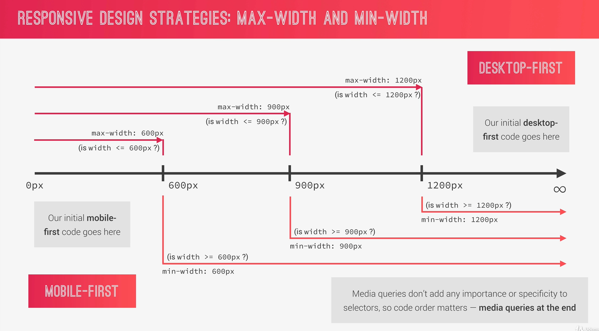

  - **min-width** (mobile-first):
    - mobile first strategy results in smaller, faster and more efficient websites which prioritize content over aesthetic design
    - however the desktop version might feel overly empty, it is a bit counterintuitive to develop and gives developers less creative freedom
  - **max-width** (desktop-first):
    - more natural and easier to develop

- selecting our breakpoints (options):
  - bad - selecting widths of popular devices as breakpoints
  - good - group all the popular devices and determine breakpoints that way - we will use this by looking up data [here](https://gs.statcounter.com/screen-resolution-stats)
  - perfect - look at design breaks and insert breakpoints that way

### Writing media queries using Sass mixins

Instead of writing media queries in separate css files, in sass we can write them directly alongside other parts of the code. Another improvement, so we don't have to define media queries by hand all over the code is to use mixins to define them once, something like this:

```scss
// MEDIA QUERY MANAGER
/*
0 - 600px:      Phone
600 - 900px:    Tablet portrait
900 - 1200px:   Tablet landscape
[1200 - 1800]   is where our normal styles apply
1800px +:       Big desktop

$breakpoint argument choices:
  - phone
  - tab-port
  - tab-land
  - big-desktop

MEDIA QUERY IMPLEMENTATION ORDER: 
1. Base + typography
2. General layout + grid
3. Page layout
4. Components

*/
// 1 em = 16px
// in media queries 1em or 1rem is ALWAYS defined by what comes from the browser root font size, what we define in root is not being looked at at all
// in media queries it is better to ALWAYS use ems
// only screen condition is a best practice (if someone wants to print the page media queries won't be applied)
@mixin respond($breakpoint) {
  @if $breakpoint == phone {
    // 37.5em = 600px / 16px
    @media only screen and (max-width: 37.5em) {
      @content;
    }
  }

  @if $breakpoint == tab-port {
    // 56.25em = 900px / 16px
    @media only screen and (max-width: 56.25em) {
      @content;
    }
  }

  @if $breakpoint == tab-land {
    // 75em = 1200px / 16px
    @media only screen and (max-width: 75em) {
      @content;
    }
  }

  @if $breakpoint == big-desktop {
    // 112.5em = 1800px / 16px
    @media only screen and (min-width: 112.5em) {
      @content;
    }
  }
}
```

- here, with the help of `@if` and `@content` media queries we are creating a sort of media query manager mixin
- when defining media queries it is best to use it using `em` sizes, which are always set as browser defaults (16px) here, no matter what we specified as our root size
- it is also better to use ems than rems inside media queries because of some advanced reasons
- after we have the mixin in place we use it like this:

```scss
html {
  // This defines the size of 1 rem
  font-size: 62.5%; // 1rem = 10px; 10px/16px = 62.5%

  // BE CAREFUL WITH ORDER OF MEDIA QUERIES
  // width < 1200px?
  @include respond(tab-land) {
    font-size: 56.25%; // 1rem = 9px, 9/16 = 56.25%
  }

  // width < 900px?
  @include respond(tab-port) {
    font-size: 50%; // 1rem = 8px, 8/16 = 50%
  }

  // width > 1800px?
  @include respond(big-desktop) {
    font-size: 75%; // 1rem = 12px, 12/16 = 75%
  }
}
```

- when using media queries it is important that the most specific one (the one that can't overlap with others) is below all the others
- for example if we have a width of 1000px both media queries for tablet landscape and tablet portrait are applied at the same time which means that the final result will be which ever is last in the code
- because of that we always need to put media queries in order by width size descending (if we are using `max-width` logic)
- also, if we, for example, have a very large screen on an iPad, and want to change the logic based on if it's possible to hover or not, rather than based on screen size, we can write a media query like this:

```scss
@media only screen and (max-width: 56.25em), only screen and (hover: none) {
}
```

### Writing media queries

- the best approach to writing media queries is to use the responsiveness mode available in the browser dev tools and see the parts that need to be changed on the corresponding screen size
- for examples look at the code in all of the projects, `rem` sizing is absolutelly essential here because otherwise there would be so much more work to be done

### An overview of responsive images

- responsive images are not only part of responsive design, but also of web performance
- **the goal of responsive images is to serve the right image to the right screen size and device**, in order to avoid downloading unnecessary large images on smaller screens
- when to use responsive images:
  1. Resolution switching (decrease image resolution on smaller screen)
  2. Density switching (decrease the image resolution on low resolution screens)
  3. Art direction (different image on smaller screens)

### Responsive images in HTML

**Density switching:**

- instead of the `src` we use `srcset` and specify 2 images with `1x` and `2x` descriptors
- the browser than automatically knows which one to display according to the screen type (if it's a high resolution screen it will display 2x, otherwise 1x)

```html

```

**Art direction:**

- based on the screen size we can display different images by writing media queries directly in the HTML
- to do that we specify a `picture` HTML element which contains one or more `source` elements and an `image` element
- in the source element we can specify the `media` element which defines a media query - meaning the width at which a different source for the image will be used
- we also need to specify a normal `src` in the image in case a browser doesn't support `srcset`

```html
<picture class="footer__logo">
  <source
    srcset="img/logo-green-small-1x.png 1x, img/logo-green-small-2x.png 2x"
    media="(max-width: 37.5rem)"
  />
  
</picture>
```

**Resoultion switching:**

- in order to use images of smaller resolutions on smaller screen sizes we need to specify the pixel widths of the images as a descriptor to the `srcset`
- in the `sizes` attribute we specify media queries and percentages of the viewport width that the images take up on those screen sizes (we calculate them by seeing the amount of pixels the image takes up on a smaller screen and divide it by the media query boundary)
- if none of that is applied we specify the default size

```html


```

### Responsive images in CSS

Responsive images in CSS are fairly simple - we just need to write media queries based on the screen resolution and width, something like this:

```scss
// remember that widths in media queries need to be in em units
// the comma, `,`, represents the OR condition
// this condition means that if the screen has more than 192dpi and more than 37.5 em (600px) the larger image will be shown, or if the screen is larger than 125em (2000px) the larger image will also be shown
@media (min-resolution: 192dpi) and (min-width: 37.5em), (min-width: 125em) {
  background-image: linear-gradient(
      to right bottom,
      rgba($color-secondary-light, 0.8),
      rgba($color-secondary-dark, 0.8)
    ), url("../img/hero.jpg");
}
```

### Testing for browser support

- a useful tool for checking which browser support a specific CSS property can be found [here](https://caniuse.com/).
- even if a browser doesn't support a modern CSS property we can stull use graceful degradation and display a simplified version of the property by utilizing the `@supports` CSS query

### Responsive design tips when using flexbox

- flexbox is a perfect tool for creating a responsive design because it provides us an easy way of changing layouts
- an especially useful thing is to change the `flex-direction` property to `column`

### Responsive design tips when using CSS grid

- the same as above, but even more, applies to CSS grid layouts
- a very useful tip is to define grid columns like this:

```scss
.someClass {
  display: grid;

  // with this trick we have responsiveness solved out of the box
  // auto-fit makes it so that we will have as many columns as are able to fit
  // their width will never be less than 25rem, and if there is enough space than it will be 1fr
  grid-template-columns: repeat(auto-fit, minmax(25rem, 1fr));
}
```

</details>
