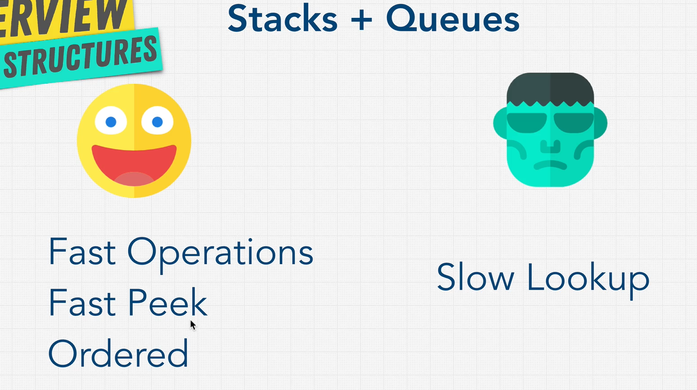

# CODING INTERVIEW BOOTCAMP

Udemy course by Andrei Neagoie

- link to ZTM -> https://zerotomastery.io/
- resources -> https://zerotomastery.io/resources/
- coding challenges -> https://zerotomastery.io/community/coding-challenges/
- link to join the Discord community -> https://discord.com/invite/9KxUUxt7Vd

Link to **[PDF Cheatsheet](./cheatsheet.pdf)**


**[A very useful tool for visualizing data structures & algorithms](https://visualgo.net/en)**

**[A great tool for finding common interview questions](https://leetcode.com/problemset/all/)**

## Getting more interviews

<details>
<summary>Click to expand / collapse...</summary>
<br>

### 1. Resume

- don't spend too much time on the resume
- use an online tool like **https://www.resumemaker.online** (or some other)
- key points:
  - one page
  - relevant skills
  - personalized
  - online link (Github, portfolio,...)
- another useful tool is **https://www.jobscan.co**
- also check out
  this **[article](https://stackoverflow.blog/2020/11/25/how-to-write-an-effective-developer-resume-advice-from-a-hiring-manager/)**

### 2. Github

- contribute to open source projects
- showcase your projects
- create your website / blog...

### 3. LinkedIn

- more important than the resume
- apply to jobs through linkedin
- change your profile often (even small changes so that an updated profile shows to recruiters)

### 4. Portfolio

- it's used to showcase projects
- it's not that important how it looks, you can even use online resources

### 5. Email

- don't apply through emails (referrals are much better)
- message people through LinkedIn using a smart template to probe a bit about the company and possibly get referred
- example:

```
  Hey $BOB,
  I saw your presentation at $CONFERENCE last year on Youtube (or point to some work they have done).
  Great stuff; loved what you did with $FOO, in particular
  $COMMENT_PROVING_YOU_KNOW_WHAT_YOU'RE_TALKING_ABOUT.
  I'm also a $FOO developer. I noticed that your company is hiring
  or $ROLE. I’d love to be a part of your team. Do you have a
  few minutes to chat on Thursday about what you guys are doing?

  Thanks,
  Yourname
  Your website or any public profile link
```

- also better than sending the resume is to contact someone from HR, give them your portfolio and share your motivation
  to go work for some company after which you can ask them if you can come for an interview
- messaging a lead developer or a CEO of a smaller company if you can pick their brain (not asking for a job) might also
  work (people love talking about themselves)

</details>

## Big O notation

<details>
<summary>Click to expand / collapse...</summary>
<br>

**[CHEATSHEET](https://www.bigocheatsheet.com/)**

### Setup:

We'll be using either:

- https://replit.com
- https://glot.io

### What is good code?

1. **Readable**
2. **Scalable** - Big O is important here - time and memory complexity

### Big O and scalability

Big O is the measure of how scalable (efficient) the code is. With the input getting bigger, how much does our function
slow down?


### Big O rules:

1. **Worst case** - when calculating Big O we always look at the worst case scenario
2. **Remove constants** - when calculating Big O we don't look at the specific result of the calculation, because
   constants have an insignificant effect in the grand scheme of things. We don't for example have a result of O(3n + 2)
   , we simplify it to O(n), because in the end it's still a linear increase.
3. **Different terms for inputs** - if we have multiple parameters for a function we need to treat them separately. For
   example if we have 2 function inputs and 2 for loops that iterate over those inputs separately the Big O would be O(a
   - b).
4. **Drop non-dominants** - if we for example have O(n + n^2 + 100) we can drop the non-dominant terms, so this becomes
   O(n^2)

### O(n)

- linear complexity
- as the number of inputs increase, the number of operations that the algorithm performs grows linearly with it

### O(1)

- constant time
- as the number of inputs increase, the number of operations that the algorithm performs remains constant

### O(n^2)

- quadratic time
- as the number of inputs increase, the number of operations that the algorithm performs grows quadratically with it

### O(n!)

- the worst notation (least optimal), factorial time
- we are adding a loop for every added element

### O(log n)

- logarithmic time
- comes into play with binary trees

### Space complexity

- deals with memory consumption of a certain algorithm
- a bit simpler than _time complexity_ which we discussed so far
- 2 ways to store things in memory:
  - **heap** - usually we store variable values here
  - **stack** - usually we keep track of function calls here
- space complexity is caused by:
  - variables
  - data structures
  - function calls
  - memory allocations

</details>

## How to solve coding problems

<details>
<summary>Click to expand / collapse...</summary>
<br>

### What are companies looking for?

1. Analytic skills
2. Coding skills
3. Technical skills
4. Communication skills

### Example

**[GOOGLE VIDEO EXAMPLE](https://www.youtube.com/watch?v=XKu_SEDAykw)** => **[JS solution](./src/2_how_to_solve_coding_problems/exercise-2.js)**

Step by step guide (available in **[PDF cheatsheet](./cheatsheet.pdf)**):

1. Write key points at the top
2. Make sure to doublecheck inputs / outputs
3. Check the mail goal (time / memory complexity)
4. Don't be annoying and ask too many questions
5. Start with the naive / brute force solution (you can just explain it)
6. Say why this is not optimal (complexity)
7. See and comment where you can improve, focus on the bottleneck (largest Big O part)
8. Before starting to code walk through the problem and write down steps
9. Modularize code from the very beginning (small and beautiful parts)
10. Start coding
    - never start coding if you're not sure what you're doing
    - start with the easy part
11. Check for errors (safe guard inputs)
12. Clean code (good naming)
13. Test your code (and ask if you can make assumptions about the input)
14. Ask the interviewer where you can improve, what was the most interesting solution to this problem
15. A followup question (usually for scalability) is solved by the divide and conquer approach

**[Full example](./src/2_how_to_solve_coding_problems/exercise-1.js)**

</details>

## DATA STRUCTURES

<details>
<summary>Click to expand / collapse...</summary>
<br>

**[Mind map](https://coggle.it/diagram/W5E5tqYlrXvFJPsq/t/master-the-interview-click-here-for-course-link/c25f98c73a03f5b1107cd0e2f4bce29c9d78e31655e55cb0b785d56f0036c9d1)**

### Introduction

<details>
<summary>Click to expand / collapse...</summary>
<br>

**data structures + algorithms = programs**

**Data structure:**

- a data structure is a collection of values which allows us to store infromation in a specific way
- each is good or bad depending on the situation (each has its trade-offs)
- the most important questions are:
  - how to build one?
  - how to use it?

</details>

### Arrays

<details>
<summary>Click to expand / collapse...</summary>
<br>

Arrays (lists) organize items sequentionally.


<br>


**Static vs dynamic arrays**

- fixed arrays are limited in size (size needs to be defined beforehand and is unchangeable), where as dynamic ones determine the size on the fly
- appending to dynamic size arrays is usually an O(1) operation, but it can be O(n) - in case where we need to allocate more memory dynamically we need to copy the entire array to a new memory location where more memory is allocated, which has O(n) complexity (don't worry about this)

**Examples**:

- [basics](./src/3_data_structures/arrays/1_basics.js)
- [building an array class](./src/3_data_structures/arrays/2_building_an_array_class.js)
- [reverse a string](./src/3_data_structures/arrays/3_reverse_a_string.js)
- [merge sorted arrays](./src/3_data_structures/arrays/4_merge_sorted_arrays.js)

</details>

### Hash tables

<details>
<summary>Click to expand / collapse...</summary>
<br>

_Hash tables, objects, maps, dictionaries..._

- all of them are just a different way we call hash tables (based on the language we are using). They are called **hash tables** because they use a hash function to access values given a specific key - this is very useful because we don't need to know the index of an element, we just need to give it the key and we can access the value in memory directly.


<br>


**Hash collisions:**

- with enough data and limited memory, we'll eventually run into **hash collisions**
- it happens because there is a finite number of combinations that a hash function can produce
- this problem is usually fixed by using linked lists in a memory position where the collision happened, but there are also many other ways this problem can be fixed

**Examples**:

- [basics](./src/3_data_structures/hash-tables/1_basics.js)
- [building a hash table class](./src/3_data_structures/hash-tables/2_building_a_hash_table_class.js)
- [first recurring char](./src/3_data_structures/hash-tables/3_first_recurring_character.js)

</details>

### Linked lists

<details>
<summary>Click to expand / collapse...</summary>
<br>

- we'll be talking about singly and doubly _linked lists_
- a **linked list** is a list of _nodes_ where each node consists of a **value** and a **pointer** to the next _node_
- the first node is called the **head**, and the last node is called the **tail** of the list
- linked lists are **null terminated** which means that the last element of the list points to `null`


<br>


**Why use linked lists?**

- insertion and deletion is much faster compared to an array because we don't need to shift the entire array, it's enough to just change the pointer (even though they are both O(n) that is just the worst case scenario which is rare)
- unlike hash maps linked lists perserve the order of elements (we can have sorted data)

**Pointers:**

- a pointer is a reference to another place in memory

```js
const obj1 = { a: true };
const obj2 = obj1; // reference
```

**Singly vs doubly linked lists:**

- singly linked lists have a pointer to just the next element, while doubly linked lists point to both the previous and next node
- useful for traversing the list backwards

**Examples:**

- [creating a linked list](./src/3_data_structures/linked-lists/1_creating_a_linked_list.js)
- [creating a doubly linked list](./src/3_data_structures/linked-lists/2_creating_a_doubly_linked_list.js)

</details>

### Stacks and queues

<details>
<summary>Click to expand / collapse...</summary>
<br>

**Stacks:**

LIFO (last in, first out) data structure. Used in quite a lot of places, and many programming languages perform functions using stacks (e.g. JS execution stack).


<br>

In JavaScript implementing stacks can be done with both linked lists, or with arrays, since both can be implemented in a way so that the required operations are O(1). Arrays are probably a bit better (and simpler), since their memory is stored sequentionally (faster execution) and they require less memory - all in all arrays already behave as stacks.

- [Implementation using a linked list](./src/3_data_structures/stacks-and-queues/1_stacks_implementation_linked_lists.js)
- [Implementation using an array](./src/3_data_structures/stacks-and-queues/2_stacks_implementation_arrays.js)

**Queues:**

FIFO (first in, first out) data structure. Like stacks, they're used a lot in a variety of places and they solve a lot of problems.


<br>

In JavaScript implementing queues is much more optimal using linked lists (in comparison to arrays), since removing or adding items from the beginning of an array (the `Array.shift()` / `Array.unshift()` methods, depending on the implementation), which would be needed, have a Big O complexity of O(n). In comparison, these operations are O(1) when using linked lists.

- [Queue implementation](./src/3_data_structures/stacks-and-queues/3_queue_implementation.js)
- [Queue implementation using 2 stacks](./src/3_data_structures/stacks-and-queues/4_implement_queues_using_stacks.js)



</details>

### Trees

<details>
<summary>Click to expand / collapse...</summary>
<br>

- **trees** are a hierarchial data structure where each node descends from the **root node**
- they are one of the most important data structure that is a basis for many many other technologies


**Binary trees:**

- a **binary tree** is a tree where each node can have up to 2 children (and at most one parent)
- a **perfect binary tree** is completely full (all nodes have exactly 2 children unless they are a leaf) and all the leafs are at the same height
  - this type of tree is really efficient and optimized
  - with this tree the number of nodes on each level doubles
  - the number of nodes on the last level is equal to the sum of all previous nodes + 1
- a **full binary tree** is a tree where all nodes have either 0 or 2 children


**O(log n):**

- a special type of Big O complexity that is present when using **binary trees**
- because the total number of decisions that can be made when searching for a value can be calculated with the formula: `height = log nodeCount`
  - that is derived because we can calculate the amount of nodes with the formula: `nodeCount = 2^h - 1`, where `h` is the height
  - we dropped the `-1` from the above formula because it's insignificant
  - this means that the total number of decisions that need to be made when looking up a value within a **dbinary tree** is `log nodeCount`, **O(log n)**

**Binary Search Tree (BST):**


- **rules**:

  1. all child nodes to the right of the parent are greater than the parent, all those to the left are smaller
  2. a node can have up to 2 children

- insert and delete are `O(log n)` because we need to first find the item which we are deleting / where we are inserting

- **[BST implementation](./src/3_data_structures/trees/1_bst.js)**

**Balanced vs unbalanced BST:**

- if we have unbalanced BSTs (e.g. if we are adding to the right branch constantly), we basically have linked lists


- luckily there are methods to balance search trees which are a bit complicated (usually built into the programming language)

**Balanced BSTs:**

- **AVL tree** - https://medium.com/basecs/the-little-avl-tree-that-could-86a3cae410c7
- **Red black tree** - https://medium.com/basecs/painting-nodes-black-with-red-black-trees-60eacb2be9a5
- comparison betwen the two - https://stackoverflow.com/questions/13852870/red-black-tree-over-avl-tree
- they work similarly to normal BSTs, with the difference being that they perform rotations in order to balance themselves

**Binary heaps:**

- a tree where each child node is smaller than its parent (it can also be that every child is larger)
- here the lookup is O(n) because there are no rules about node values other than that they are smaller than the parent
- they are mostly used to perform comparative operations (it's really easy to get all values larger than X) - data storages, sorting algorithms, etc.
- inserts and deletes to binary heaps are tricky since the value needs to bubble up if it's not in the correct order
- on the other hand, since inserts are done left to right they are always balanced and they perserve the order of insertion => memory efficiency
- _NOTE_ - **memory heaps** are **NOT** the same as the heap data structure, `memory heap !== heap data structure`


- another very popular implementation of **binary heaps** are **priority queues**
- examples - emergency room (more severe cases go in first, even if they didn't arrive first) or a popular night club (VIP guests have priority and can enter the club with priority)


**Trie:**

- a specialized type of tree which is used mostly for searching of text and autocompletion because of its high performance


</details>

### Graphs

<details>
<summary>Click to expand / collapse...</summary>
<br>

**Graphs** are one of the most useful data structures when modeling real life. In a graph each item is called a **node (vertex)**. Nodes are connected by **edges**.

Trees and linked lists are actually types of graphs.

Usage examples include Google Maps, Facebook, Amazon suggestions...

**Types of graphs:**

- **directed vs undirected**

  

- **weighted vs unweighted**

  

- **cyclic vs acyclic**

  

One of the more used types of graphs is a **directed acyclic graph (DAG)**.

**[Graph implemenatation approaches](./src/3_data_structures/graphs/graph-approaces.js)**
**[Actual graph implemenatation](./src/3_data_structures/graphs/graph-implementation.js)**


</details>

</details>

## ALGORITHMS

<details>
<summary>Click to expand / collapse...</summary>
<br>

### Recursion

<details>
<summary>Click to expand / collapse...</summary>
<br>

**Recursion** is an important concept which is often used to develop many algorithms. It's a function that calls itself within its own body. It's mostly used when we have repeating processes within the same data structure.

**Stack overflow** - happens when the call stack gets continously filled up, until we run out of memory

**Rules of recursion:**

1. identify the **base case** (stop condition)
2. identify the **recursive case**
3. usually there are 2 returns - one for the _base case_, and one for the recursive case

**Recursive vs iterative:**

- _anything you can do with recursion CAN be done iteratively (using loops)_
- **be careful with recursion** - its time complexity can often be exponential - `O(2^n)`

  

**When to use recursion?**

  

**Examples of recursive algorithms:**

[Factorial](./src/4_algorithms/1_recursion/1_factorial.js)
[Fibonacci](./src/4_algorithms/1_recursion/2_fibonacci.js) - example of exponential time complexity with recursive algorithm

</details>

### Sorting

<details>
<summary>Click to expand / collapse...</summary>
<br>

As more and more data needs to be handled, **sorting and searching** become two of the largest computer science problems.
The issue with sorting is the way the underlying language specific implementations work under the hood.

**Bubble sort:**

- basic sorting algorithm
- it works by bubbling the largest value to the end - we compare 2 values and swap them if the first is larger than the second
- `O(n^2)` time complexity
- [example](./src/4_algorithms/2_sorting/1_bubble-sort.js)

**Selection sort:**

- basic sorting algorithm
- it works by scanning for the smallest element and than swapping that element with the one in the first position
- `O(n^2)` time complexity
- [example](./src/4_algorithms/2_sorting/2_selection-sort.js)

**Insertion sort:**

- insertion sort performs pretty well in cases when the list is almost sorted
- it works by comparing the next item with all the items that preceeded it and putting it in the correct place within the sublist
- `O(n^2)` time complexity, but when array is nearly sorted it can be `O(n)` - _best case scenario_
- [example](./src/4_algorithms/2_sorting/3_insertion-sort.js)

**Merge sort:**

- a divide and conquer algorithm
- works by spliting the array into multiple ones until there is one element per array and then recursively mergeing them into a final sorted array
- `O(n log n)` time complexity - a good algorithm to use
- [example](./src/4_algorithms/2_sorting/4_merge-sort.js)

**Quick sort:**

- complex
- a divide and conquer algorithm
- works by picking a random number and putting it so that all the items to the left of it are smaller than the element, and all to the right larger
- than we do the same for the left and the right side until we have a sorted array
- `O(n log n)` time complexity - a good algorithm to use (worst case is `O(n^2)` if we randomly pick the smallest or the largest item)
- [example](./src/4_algorithms/2_sorting/5_quick-sort.js)

**Stable vs unstable sorting algorithms:**

- a stable algorithm perserves the order of equal items, where as in the unstable one they are not guaranteed to stay that way

**Which sorting algorithm is the best?**

- _insertion sort_ is really good if the input is small or if the items are almost sorted
- _mergesort_ very good in most cases and if we don't care that much about space complexity (memory consumption)
- _quicksort_ is also really good in most cases, but it can sometimes go up to the worst case of `O(n^2)`

</details>

### Searching

<details>
<summary>Click to expand / collapse...</summary>
<br>

**Linear search:**

- looking through the list one by one
- `O(1)` in the best case (if the item we are looking for is the first one), `O(n)` in the worst case (going through the entire list)
- slow

**Binary search:**

- if the list is sorted we can start from the middle and discard multiple values at a time (all the smaller one for example - essentially discarding half the list in the first step alone) and repeat this process until we find the value we are looking for
- this operation takes `O(log n)` (divide and conquer)
- this is why it's good to store data in tree like data structures

**Graph and tree traversal:**

- if we want to visit all nodes of a tree there are 2 different algorithms to do so, **breadth-first-search (BFS)** and **depth-first-search (DFS)**

**Breadth-first-search (BFS)**

- as the name suggests, we are visiting nodes level by level, from left to right
- `O(n)` time complexity

  

**Depth-first-search (DFS):**

- as the name suggests, we are visiting each node until we reach the deepest level, going from left to right
- after we reach the deepest level (a leaf node), we continute from the nearest unexplored ancestor

  

- there are 3 ways of dfs traversal = pre-order, in-order, post-order

  
  

- **[DFS and BFS](src/4_algorithms/3_searching_bfs_dfs/2_bfs_and_dfs.js)** - bfs with queue, bfs with recursion, dfs - in order, post order and preorder, validating a bst
- [BFS vs DFS example interview questions](./src/4_algorithms/3_searching_bfs_dfs/1_bfs_vs_dfs_exercise.js)

  

**Graph traversals:**

- the same techniques (BFS and DFS) can be used when traversing graphs as well

**Dijkstra + Bellman-Ford algorithms:**

- most common algorithms that are used to figure out a shortest path problem of a graph
- even though DFS can do the same thing, it doesn't take into account the weights of the graph edges
- these 2 algorithms take the weight of the edges into account, which is why they are the most optimal for this special use case
- usage example - Google Maps
- Bellman-Ford is very effective at solving the shortest path of a graph problem (over Dijkstra), because it can take into account negative edge weights
- Dijkstra is more efficient in terms of time complexity (Bellman-Ford time complexity worst-case is `O(n^2)`)
- that means that we should use Bellman-Ford if we have negative graph edge weights, and Dijkstra if they're all positive

</details>

### Dynamic programming

<details>
<summary>Click to expand / collapse...</summary>
<br>

Dynamic programming is an optimization technique that uses **caching**. **Memoization** is a specific form of _caching_ that involves caching the value of the return value of a function based on its parameters.

Dynamic programming boils down to using the **divide & conquer** principles in addition to the **memoization** mechanism.


Examples:
[Basics](./src/4_algorithms/4_dymanic_programming/1_memoization_basics.js)
[Fibonnacci with memoization](./src/4_algorithms/4_dymanic_programming/2_fibonacci_memo.js)

</details>

</details>

## Non-technical interviews

<details>
<summary>Click to expand / collapse...</summary>
<br>

**Mindset:**

- treat every interview as a _learning experience_ (this isn't your only opportunity, and don't treat it like that - also don't come in with huge expectations, be relaxed)
- be energetic and excited during the interview
- 3 questions you are actually getting asked during the interview:
  - _Can you do the job?_ - technical part
  - _Can I work with you?_ - behavioral part
  - _Are you going to improve?_ - behavioral part
- 4 heroes (stories prepared):
  - technical story
  - success story
  - leadership story
  - challenge story

**QUESTIONS:**

**Tell me about yourself.**

- mention the following:
  - your triggers for success
  - mention things you want to get asked
  - skills should be relevant to the job
- don't take to long - about a minute is enough

**Why us?**

- make the interviewer feel special - make them feel that this company is your top priority
- show you want to grow
- demonstrate why you are the best candidate
- do your research!

**Why did you leave your old job?**

- no negativity!!!
- you want to grow and learn more, take on a challenge

**Tell me about a problem you solved & how you solved it?**

- have this prepared
- have metrics and numbers
- scalling, performance, security
- SAR method - situation - action - result

**Tell me about an interesting project?**

- relate it to this job

**What is your biggest weakness?**

- don't be fake and say - I work too hard
- real answer
- show how you improved it

**Any questions for us?**

- focus on them, not the company (YOU)
- mention something they mentioned (people like talking about themselves)
- examples:
  - what is the greatest mistake you made when you started working here?
  - where do you see this company going in the next 3-5 years?
  - why did you join this company?
  - have you seen your skills grow in the past year?
  - one time you messed up at the job?
  - what you wish someone told you when you started working here?
- a list of other examples can be found **[here](./https://github.com/viraptor/reverse-interview)**

**Secret weapons**

- never give up (even if didn't go that well)
- simplicity over complexity - maintainable and readable code
- premature optimization is the root of all evil
- focus on the overall goal, don't be not myopic
- no ego

**After the interview:**

- be excited, thank them
- ask for feedback
- ask when you can expect to hear from them
- prepare a closing statement:
  - don't overuse "I" too much
  - talk about the interviewer
  - express how you're the ideal candidate, but without braging - finish the interview strong

</details>

## Offer + negotiation

<details>
<summary>Click to expand / collapse...</summary>
<br>

**Handling rejection:**

- everyone gets rejected sometimes - don't take it too hard
- you're not a bad coder if you get rejected - don't take it personally

**Negotiation 101:**

- what are you salary expectations?
  - e.g. I know that the average software developer in Croatia makes this much, so that can be a good place to start - don't end the conversation!!!
- give reason for everything
- always negotiate - if you never ask the answer is always no
- be positive
- have stakes - something on the line

**Handling an offer:**

- again - don't end the conversation - you can say something along the lines of:

  - this sounds fantastic, I really thought this was a great fit when I met you and got interviewed and am really glad to see that we both agreed and you see a good fit here, currently I'm talking with some other companies as well, so I can't disclose full info on the offer until I'm done with the interview process and can make my decision, but I'm sure we can find something that works great for us since I really like your company, I've had a great time interviewing and would love to be part of your team since I can see myself working long term in your company
  - notice the positivity and asking for more time

  - let other companies know you've received an offer - hello company name - I just want to let you know and give you an update on my interviewing process - I've just received an offer from another company - name - which is quite strong. With that said I'm really excited to potentially be working with your company as I've had a really good time interviewing with you, and I really wanted to see if we can make it work, since my time is now a bit compressed. Is there anything we can do to make this process a bit faster?

- TODO
  - find exact salary you want?
  - what value do you provide?
  - go higher than what you wish to get

**Handling multiple offers:**

1. is there an offer that you feel you're underqualified for? - go with this company!!!
2. long term growth potential? - allowing you to grow
3. will you respect people around you? - are you going to be the smartest of dumbest person in the room - go for being the dumbest
4. salary and benefits? - delay gratification - don't rush
5. is your decision based on desparation? - will this look good on your resume?

**Getting a raise:**

- of course you have to be a good employee
- plan out your career path

1. ask for a raise - if you never ask the answer is always no
2. show. don't tell - show them what you've done and why you deserve it

- keep a folder of all the things you've done well in the past 6 months and your skill level
- ask for more than you want
- ask for a raise every 6 months

**useful links**:

- https://www.youtube.com/watch?v=XY5SeCl_8NE
- https://stackoverflow.com/jobs/salary

</details>

## Interview questions

<details>
<summary>Click to expand / collapse...</summary>
<br>

**Most common questions:**

- [Reverse String](https://leetcode.com/problems/reverse-string)
- [Fizz Buzz](https://leetcode.com/problems/fizz-buzz)
- [Single Number](https://leetcode.com/problems/single-number)
- [Maximum Depth of Binary Tree](https://leetcode.com/problems/maximum-depth-of-binary-tree)
- [Move Zeroes](https://leetcode.com/problems/move-zeroes)
- [Sum of Two Integers](https://leetcode.com/problems/sum-of-two-integers)
- [Reverse Linked List](https://leetcode.com/problems/reverse-linked-list)
- [Excel Sheet Column Number](https://leetcode.com/problems/excel-sheet-column-number)
- [Majority Element](https://leetcode.com/problems/majority-element)
- [Roman to Integer](https://leetcode.com/problems/roman-to-integer)
- [Delete Node in a Linked List](https://leetcode.com/problems/delete-node-in-a-linked-list)
- [Best Time to Buy and Sell Stock II](https://leetcode.com/problems/best-time-to-buy-and-sell-stock-ii)
- [Valid Anagram](https://leetcode.com/problems/valid-anagram)
- [Contains Duplicate](https://leetcode.com/problems/contains-duplicate)
- [First Unique Character in a String](https://leetcode.com/problems/first-unique-character-in-a-string)
- [Convert Sorted Array to Binary Search Tree](https://leetcode.com/problems/convert-sorted-array-to-binary-search-tree)
- [Missing Number](https://leetcode.com/problems/missing-number)
- [Intersection of Two Arrays II](https://leetcode.com/problems/intersection-of-two-arrays-ii)
- [Best Time to Buy and Sell Stock](https://leetcode.com/problems/best-time-to-buy-and-sell-stock)
- [Merge Two Sorted Lists](https://leetcode.com/problems/merge-two-sorted-lists)
- [Happy Number](https://leetcode.com/problems/happy-number)
- [Pascal's Triangle](https://leetcode.com/problems/pascals-triangle)
- [Climbing Stairs](https://leetcode.com/problems/climbing-stairs)
- [Symmetric Tree](https://leetcode.com/problems/symmetric-tree)
- [Maximum Subarray](https://leetcode.com/problems/maximum-subarray)
- [Power of Three](https://leetcode.com/problems/power-of-three)
- [Number of 1 Bits](https://leetcode.com/problems/number-of-1-bits)
- [House Robber](https://leetcode.com/problems/house-robber)
- [Plus One](https://leetcode.com/problems/plus-one)
- [Two Sum](https://leetcode.com/problems/two-sum)
- [Count and Say](https://leetcode.com/problems/count-and-say)
- [Remove Duplicates from Sorted Array](https://leetcode.com/problems/remove-duplicates-from-sorted-array)
- [Factorial Trailing Zeroes](https://leetcode.com/problems/factorial-trailing-zeroes)
- [Valid Parentheses](https://leetcode.com/problems/valid-parentheses)
- [Linked List Cycle](https://leetcode.com/problems/linked-list-cycle)
- [Palindrome Linked List](https://leetcode.com/problems/palindrome-linked-list)
- [Merge Sorted Array](https://leetcode.com/problems/merge-sorted-array)
- [Min Stack](https://leetcode.com/problems/min-stack)
- [Longest Common Prefix](https://leetcode.com/problems/longest-common-prefix)
- [Intersection of Two Linked Lists](https://leetcode.com/problems/intersection-of-two-linked-lists)
- [Implement strStr()](https://leetcode.com/problems/implement-strstr)
- [Sqrt(x)](https://leetcode.com/problems/sqrtx)
- [Reverse Bits](https://leetcode.com/problems/reverse-bits)
- [Valid Palindrome](https://leetcode.com/problems/valid-palindrome)
- [Rotate Array](https://leetcode.com/problems/rotate-array)
- [Count Primes](https://leetcode.com/problems/count-primes)
- [Reverse Integer](https://leetcode.com/problems/reverse-integer)
- [Binary Tree Inorder Traversal](https://leetcode.com/problems/binary-tree-inorder-traversal)

**Amazon interview questions:**

- [Past Interview Questions](https://www.glassdoor.ca/Interview/Amazon-Software-Development-Engineer-Interview-Questions-EI_IE6036.0,6_KO7,36.htm)
- [Two Sum](https://leetcode.com/problems/two-sum)
- [Add Two Numbers](https://leetcode.com/problems/add-two-numbers)
- [Longest Substring Without Repeating Characters](https://leetcode.com/problems/longest-substring-without-repeating-characters)
- [Number of Islands](https://leetcode.com/problems/number-of-islands)
- [Valid Parentheses](https://leetcode.com/problems/valid-parentheses)
- [Longest Palindromic Substring](https://leetcode.com/problems/longest-palindromic-substring)
- [Copy List with Random Pointer](https://leetcode.com/problems/copy-list-with-random-pointer)
- [Best Time to Buy and Sell Stock](https://leetcode.com/problems/best-time-to-buy-and-sell-stock)
- [Merge Two Sorted Lists](https://leetcode.com/problems/merge-two-sorted-lists)

**Facebook interview questions:**

- [Past Facebook Interview Questions](https://www.glassdoor.ca/Interview/Facebook-Software-Engineer-Interview-Questions-EI_IE40772.0,8_KO9,26.htm)
- [Two Sum](https://leetcode.com/problems/two-sum)
- [Number of Islands](https://leetcode.com/problems/number-of-islands)
- [Valid Parentheses](https://leetcode.com/problems/valid-parentheses)
- [Best Time to Buy and Sell Stock](https://leetcode.com/problems/best-time-to-buy-and-sell-stock)
- [Merge Intervals](https://leetcode.com/problems/merge-intervals)
- [Reverse Linked List](https://leetcode.com/problems/reverse-linked-list)
- [Most frequent words in a terabyte of data](https://stackoverflow.com/questions/12525455/most-frequent-words-in-a-terabyte-of-data)

**Google interview questions:**

- [Past Google Interview Questions](https://www.careercup.com/page?pid=google-interview-questions)
- [Min Stack](https://leetcode.com/problems/min-stack)
- [Number of Islands](https://leetcode.com/problems/number-of-islands)
- [Valid Parentheses](https://leetcode.com/problems/valid-parentheses)
- [Trapping Rain Water](https://leetcode.com/problems/trapping-rain-water)
- [Merge Intervals](https://leetcode.com/problems/merge-intervals)
- [Next Closest Time](https://leetcode.com/problems/next-closest-time)
- [Word Break](https://leetcode.com/problems/word-break)
- [Next Permutation](https://leetcode.com/problems/next-permutation)
- [How to remove given character from](http://javarevisited.blogspot.sg/2015/04/how-to-remove-given-character-from.html)

**Domain specific questions:**

- [Awesome link for questions](https://github.com/DopplerHQ/awesome-interview-questions)
- [Frontend developer](https://github.com/h5bp/Front-end-Developer-Interview-Questions)

</details>
