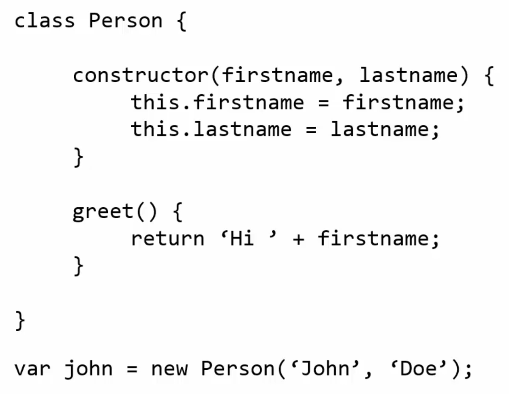

# JavaScript tutorial

# BASICS

<details>
<summary>Click to expand / collapse</summary>
<br/>

## JavaScript basics

- [JS behind the scenes](./1_JavaScriptBasics/1_js_behind_the_scenes.js)

  - How JS code is ran
  - Execution context and Execution stack
  - Execution phases
  - Hoisting
  - Scoping and scope chain
  - The 'this' keyword

- [DOM manipulation and events](./1_JavaScriptBasics/2_dom_manipulation_and_events.js)

  - DOM access and manipulation
  - Events and event handling

- [Inheritance and prototype chain](./1_JavaScriptBasics/3_inheritance_and_prototype_chain.js)

  - primitives, objects
  - prototype, prototype chain
  - function constructors, Object.create

- [Primitives vs objects](./1_JavaScriptBasics/4_primitives_vs_objects.js)

  - deep vs shallow copy

- [IIFEs (Immediately invoked function expressions)](./1_JavaScriptBasics/5_IIFEs.js)

  - acheiving privacy in vanilla JS

- [Closures](./1_JavaScriptBasics/6_closures.js)

  - inner function argument access

- [Bind, call and apply](./1_JavaScriptBasics/7_bind_call_apply.js)
  - setting the 'this' variable of a function

<br/>

## ES6 new features

- [let and const variable declarations](./2_ES6NewFeatures/1_let_and_const.js)

- [ES6 block scoping](./2_ES6NewFeatures/2_blocks_and_IIFEs.js)

- [ES6 new string methods](./2_ES6NewFeatures/3_strings.js)

- [Arrow functions](./2_ES6NewFeatures/4_arrow_functions_and_this.js)

  - arrow functions and how does the 'this' variable work within them

- [Destructuring functions](./2_ES6NewFeatures/5_destructuring.js)

- [ES6 new array methods](./2_ES6NewFeatures/6_arrays.js)

  - Array.from(), for of loops, find, findIndex

- [Spread operator](./2_ES6NewFeatures/7_spread_operator.js)

- [Rest parameters operator](./2_ES6NewFeatures/8_rest_parameters.js)

- [Default parameters](./2_ES6NewFeatures/9_default_parameters.js)

- [Maps](./2_ES6NewFeatures/10_maps.js)

- [Classes](./2_ES6NewFeatures/11_classes.js)

- [Class inheritance](./2_ES6NewFeatures/12_classes_with_subclasses.js)

<br/>

## Asynchronous JavaScript

- [Basic async example](./3_AsynchronousJavaScript/1_async_basics.js)

  - setTimeout()
  - basic mechanisms, event loop

- [Callbacks](./3_AsynchronousJavaScript/2_callbacks.js)

- [Promises](./3_AsynchronousJavaScript/3_promises.js)

  - promise states
  - resolve and reject
  - producing and consuming promises

- [Async await](./3_AsynchronousJavaScript/4_async_await.js)

- [AJAX](./3_AsynchronousJavaScript/5_ajax.js)
  - AJAX (Asynchronous JavaScript And XML)
  - fetch API

<br/>

## JavaScript project

A modern recipe app using npm, babel and webpack.

- [Project link](./4_modern_js_project)
- [Project notes](./4_modern_js_project/NOTES.txt)

<br/>

</details>

<br/>

# UNDERSTANDING THE WEIRD PARTS

<details>
<summary>Click to expand / collapse</summary>
<br/>

## Execution contexts and lexical environments

<details>
<summary>Click to expand / collapse</summary>
<br/>

### Conceptual aside (important terms)

<details>
<summary>Click to expand / collapse</summary>
<br/>

**Syntax parser:**

- a **syntax parser** is a program that reads your code and determines what it does and if its grammar (syntax) is valid
- basically a program that helps the compiler translate our code into machine code

**Lexical environment:**

- it means where something sits physically in the code you write
- 'lexical' means 'having to do with words or grammar'
- a **lexical environment** exists in programming languages in which **where** you write something is important

**Execution contexts:**

- a wrapper to help manage the code that is running
- there are lots of lexical environments - which one is currently running is managed by **execution contexts**
- it can contain things beyond what you've written in code

**Name / value pair:**

- a name which maps to a unique value
- the name may be defined more than once, but only can have one value in any given **execution context**
- that value may be more _name/value pairs_

**Object:**

- a collection of name / value pairs
- this is the simplest definition when talking about _JavaScript_, it's just that simple

**Javascript and 'undefined'**

- `undefined` is a special value in JS which means that the variable hasn't been defined yet
- all variables are initialized to that value during the creation of the execution context in a process called _hoisting_
- it's a really bad practice to manually set variables to 'undefined' because it's better to have it mean that the variable was never initialized

**Single-threaded, synchronous execution:**

- **single-threaded** means that one command is being executed at a time (maybe not under the hood of the browser though, but from our perspective)
- **synchronous** means one at a time and in order

**Function invocation:**

- it just means running a function - in JS it's done by using parenthesis, `()`

**Variable environment:**

- where the variables live and how they relate to each other in memory

**Scope:**

- where a variable is available in your code and if it's truly the same variable, or a new copy

**Asynchronous:**

- more than one at a time

</details>

### The global environment and the global object

- whenever code is run in JS it's ran inside an execution context
- the base execution context is the **global execution context** (it's accessible to everything from anywhere in your code)
- the global execution context automatically creates 3 things for us (by the JS engine):
  - **the global object** - in the browser it's is the _window_ object
  - **the special `this` variable** - at the global level, wiithin the browser, it's the same as the _window_ object
  - **a link to the outer environment** - in the case of the global context it is **null** since there is nothing outside of it
- when we say _global_ in JS it means "not inside a function"
- in JS when we create variables or functions (and we're not inside another function at the same time) they get attached to the global object (window) and are ran within the _global execution context_
- **[code examples](./understanding-the-weird-parts/execution-contexts-and-lexical-environments/1_global_environment_and_global_object.js)**

### The execution context: creation and hoisting

There are 2 phases that the execution context goes through:

**Creation phase:**

- create the _global object_, _the 'this' variable_ and the _link to the outer environmant_ in memory
- setup memory space for variables and functions => **hoisting**
- **hoisting**:
  - before our code is executed line by line the JS engine sets up memory space for variables and functions and hence they already exist in memory
  - all variables are initially set to `undefined`, and functions sit in memory with the entirety of their code
- **[code examples](./understanding-the-weird-parts/execution-contexts-and-lexical-environments/2_execution_context_creation_and_hoisting.js)**

**Execution phase:**

- code gets executed line by line (JS is synchronous by default)

### Function invocation and the execution stack

- each invoked function creates it's own execution context which is put on the top of the **execuction stack**
- whichever context is on the top of the stack is the one that is currently running
- after the execution of a specific context finishes it is poped off (removed) from the _execution stack_
- the _global execution context_ is always at the bottom of the execution stack

  

### Functions, context and variable environments

- each variable is unique within its own execution context
- **[code examples](./understanding-the-weird-parts/execution-contexts-and-lexical-environments/3_variable_environment.js)**

  

### The scope chain

- when a function is called JS first looks for variables defined within itself
- if it doesn't find them there it looks at the outer environment link (which is also created during the _execution context creation phase_)
- to determine the **outer environment link** of an execution context we are **NOT looking at the order of the execution stack**, but rather the **lexical environment** (where the function is written)
- **[code examples](./understanding-the-weird-parts/execution-contexts-and-lexical-environments/4_scope_chain.js)**

  

### What about asynchronous code?

- there is another list, other than the execution stack, which sits on top of the JS engine, the **event queue**
- since the browser consists of things other than the JavaScript engine, we sometimes want to communicate with them (e.g. for sending HTTP requests)
- when the browser has an event outside of the JS engine for which we want to be notified of, it's placed on the **event queue**
- the event queue gets executed at the moment the _execution stack_ is emptied
- at that time the JS engine looks to find whether we have a function which should respond to a given event, and if we do it creates a new execution context, executes it, and removes the event from the queue
- it's important to note that the JS engine itself isn't asynchronous, rather the browser is producing events asyncronously, and the JS engine is synchronously handling them whenever the execution stack is empty and an event is present in the event queue
- **[code examples](./understanding-the-weird-parts/execution-contexts-and-lexical-environments/5_asynchronous_callbacks_and_the_event_queue.js)**

</details>

## Types and operators

<details>
<summary>Click to expand / collapse</summary>
<br/>

### Conceptual aside (important terms)

<details>
<summary>Click to expand / collapse</summary>
<br/>

**Dynamic typing:**

- you don't tell the engine what type of data a variable holds, it figures it our while your code is running
- because of that variables can hold different types of values because it's all figured out during execution

**Operator precedence:**

- the order in which functions (opearators) get called

**Operator associativity:**

- when operators have the same precedence _associativity_ is what determines the order in which operators get called (_left-to-right_ or _right-to-left_)
- for example the `+` operator has left-to-right associativity, while the `=` operator has right-to-left

**Coercion:**

- converting a value from one type to another
- type coercion happens a lot in JS since it's dynamically typed

</details>

### Primitive types

- a type of data that represents a single value, which means it's not an object
- in JS there are 6 of them:
  - `undefined` - represents lack of existence (when the engine hasn't set a value for the variable)
  - `null` - represents lack of existence (when we explicitly don't want to set a value for the variable)
  - `boolean` - `true` or `false`
  - `number` - a floating point number (there are always some decimals)
  - `string` - a sequence of characters
  - `symbol` - used in ES6

### Operators

- a special **function** that is syntactically written differently
- generally they take 2 values and return a result
- _precedence_ and _associativity_: **[MDN docs](https://developer.mozilla.org/en-US/docs/Web/JavaScript/Reference/Operators/Operator_Precedence)**
- **[comparison operators examples](./understanding-the-weird-parts/types_and_operators/types_and_operators.js)**
- **[sameness docs](https://developer.mozilla.org/en-US/docs/Web/JavaScript/Equality_comparisons_and_sameness)**

### Booleans and existence

- truthy values are coerced to true, falsy ones to false
- logical operators also return resolved truthy values which can be used to conditionally run some parts of the code (using `&&`) or set fallback values (using `||`)
- this can be used when checking for the existence of a value, **[examples](./understanding-the-weird-parts/types_and_operators/2_booleans_and_existence.js)**

### Default values

- **[code examples](./understanding-the-weird-parts/types_and_operators/3_default_values.js)**
- **[code examples - framework aside](./understanding-the-weird-parts/types_and_operators/default-values-framework-aside/index.html)**

</details>

## Objects and functions

<details>
<summary>Click to expand / collapse</summary>
<br/>

### Conceptual aside (important terms)

<details>
<summary>Click to expand / collapse</summary>
<br/>

**Expression:**

- a unit of code that results in a value
- it doesn't have to save to a variable

**Statement:**

- statements just do work and don't result in a value

**Arguments:**

- the parameters you pass to a function (general name)
- JS also gives us a keyword of the same name which contains them all

**Mutate:**

- to change something
- immutable means that it can't be changed

**By value vs by reference:**

- deep and shallow copy difference when using primitives vs when using objects
- when using primitives we make deep copies, **by value**

  
  <br />

- when using objects we make shallow copies, **by reference**

  
  <br />

- **[code examples](./understanding-the-weird-parts/objects_and_functions/7_by_value_vs_by_reference.js)**

**Arrays are collections of 'anything':**

- since JS is dynamically typed an array can hold different value types (even objects and functions)
- **[code examples](./understanding-the-weird-parts/objects_and_functions/9_arrays.js)**

**Callback function:**

- a function you give to another function, to be run when the other function is finished
- so the function you invoke, 'calls back' by calling the function you gave it when it finishes

</details>

### Framework aside (popular feature usages)

<details>
<summary>Click to expand / collapse</summary>
<br/>

### Faking namespaces

- a **namespace** is a container for variables and functions
- it's typically used to keep variables and functions with the same name separate
- JS by default doesn't have namespaces, objects are often used as containers to fake namespaces
- **[code examples](./understanding-the-weird-parts/objects_and_functions/3_faking_namespaces.js)**

### Function overloading

- JS doesn't have out of the box support for function overloading (since functions are actually objects)
- since we have first-class functions it isn't a problem (there are other mechanisms such as default parameters or binding)

### Function factories

- example of taking advantage of closures

</details>

### Dangerous aside (dangers within the language)

<details>
<summary>Click to expand / collapse</summary>
<br/>

### Automatic semicolon insertion

- semicolons are actually optional in JS
- the JS engine tries to automatically insert them where it expects them to be, this can cause big and hard to debug problems, especially with the `return` statement (it puts a semicolon automatically if we go to the new line immediatelly after the return statement)
- that's because we should never write code like this:

```js
// JS will automatically insert a semicolon after the return statement since it doesn't see anything else in that line
function a() {
  return;
  {
    name: "test";
  }
}
```

- but rather like this:

```js
// now it won't do it since it has seen the { character
function a() {
  return {
    name: "test",
  };
}
```

- **aslo we should always put our own semicolons**

</details>

### Objects and the dot

- objects consists out of properties (primirives or objects) and methods (member functions)
- the object is stored in some memory location, and contains references to memory locations of its properties and methods
- to access members of the object we can use the **member access operator, `[]`**, or the **dot operator, `.`**
- **[code examples](./understanding-the-weird-parts/objects_and_functions/1_objects_and_the_dot.js)**

### Objects and object literals

- **[code examples](./understanding-the-weird-parts/objects_and_functions/2_objects_and_object_literals.js)**

### JSON and object literals

- _JSON => JavaScript Object Notation_
- object literals and JSON are not the same thing, even though they have a similar syntax
- **[code examples](./understanding-the-weird-parts/objects_and_functions/4_JSON_and_object_literals.js)**

### Functions are objects

- in JS **functions are objects** => first class functions concept
- everything you can do with other types you can do with functions (assign them to variables, pass them around, create them on the fly)
- a function is a special type of object
- a function doesn't have to have a name (it can be anonymous)
- the code we write inside the function is actually stored within the CODE property of the function object (and it's invocable)
  
  
- **[code examples](./understanding-the-weird-parts/objects_and_functions/5_functions_are_objects.js)**

### Function statements and function expressions

- reminder: **expressions** are units of code which result in a value, where as **statements** are units of code which just do the work, without resulting in a value
- in JS, since functions are objects, we have both _function statements_ and _function expressions_
- as we have first class functions we can store them in variables, pass them around as parameters, just declare them as function statements...
- **[code examples](./understanding-the-weird-parts/objects_and_functions/6_function_statements_and_function_expressions.js)**

### Objects, functions and 'this'

- when a function is invoked an execution context is created (the CREATION PHASE)
- it contains the following:
  - _variable environment_ (or the _variable object_) - all variables and functions created within this function get attached to it
  - a _link to the outer environment_ - used for _lexical scoping_ and creating the _scope chain_
  - **the 'this' keyword** - a pointer to a different object depending on how the function is called
- **rules of 'this':**
  - 'this' gets initialized when the functions gets invoked (not before)
  - when used within **'normal' function calls**, the 'this' variable points to the **global object**
  - when used within **method calls** (when a function is a property of an object), 'this' points to **that object** (the parent of the function method)
  - if we have an **inner function within an object method**, the 'this' keyword will point to the **global object** again (weird but it is how it is)
  - to circumvent this problem and get the 'expected behavior' we can use the **self pattern** where we create a self variable within the object method, initialize it to 'this', and then use self instead of 'this' within the inner function
- **[code examples](./understanding-the-weird-parts/objects_and_functions/8_the_this_keyword.js)**

### 'arguments' and spread

- when you execute a function, during the creation phase of the execution context, another special argument is created, `arguments`
- it contains values of all the parameters that were passed to a function
- it is an **array-like object**
- deprecated with the introduction of the **spread parameter** (`...`), e.g. `function greet(...args) { // some code }`
- **[code examples](./understanding-the-weird-parts/objects_and_functions/10_the_arguments_keyword.js)**

### Immediately invoked function expressions (IIFE)s

- a mechanism that enables us to run functions on the fly (at the point of their creation)
- **[code examples](./understanding-the-weird-parts/objects_and_functions/11_IIFEs.js)**
- they provide 'safe' code because of the way JS works
- frameworks often wrap their entire code within an IIFE
- if we want to mutate some object, or even the global object, we can just pass it to the IIFE as a parameter

  
  

### Understanding closures

- when we return a function from another function the inner function will still have access to all of the parameters and variables of the outer function - even though the outer function has already executed and its execution context was poped out of the stack
- this is because of 2 mechanisms:
  - during the creation of an execution context its variable object is created - and that object exists in memory for some time, even after the execution context was poped out of the stack (eventually JS garbage collector cleans it up though)
  - the inner function and its execution context have a link to the outer environment, which is the execution context of the outer function, and its variable object which is still in memory
- this mechanism, which closes in all the variables which it's supposed to have access to, is called a **closure**
- JS engine will make sure that this always happens - that the inner function has access to all variables it's supposed to - by the use of _closures_

  

- **[code examples](./understanding-the-weird-parts/objects_and_functions/12_understanding_closures.js)**
- code example explanations (for loop example):

  

### call(), apply(), and bind()

- with these methods we can control the value of the `this` variable during the creation of the execution context
- all functions in JS get access to them (since functions are objects these are their method properties)
- **`.bind()`**
  - returns an exact copy of the function
  - _1st parameter_ is the value of the this variable it will be pointing to
  - we can also set other predefined variables with it
- **`.call()`**
  - invokes the function, same as using the `()`
  - we can set the this variable manually using the _1st parameter_
- **`.apply()`**
  - invokes the function, same as using the `()`
  - we can set the this variable manually using the _1st parameter_
  - the difference between `call` and `apply` is that call takes in other function arguments sequentionally (using the rest parameters syntax), while apply takes them in the form of an array (which can sometimes be more useful)
- usage examples:
  - **function borrowing** - using methods of one object on another object by setting the this variable to it using `call` / `apply`
  - **function currying** - creating function copies with permanent predefined values of some parameters
- **[code examples](./understanding-the-weird-parts/objects_and_functions/15_call_apply_bind.js)**

### Functional programming

- a programming paradigm which is enabled by the use of first-class functions (functions being used like objects)
- functions should avoid mutating data (rather they should return something new)
- libs such as `lodash` are built upon this concept
- **[code examples](./understanding-the-weird-parts/objects_and_functions/16_functional_programming.js)**

</details>

## Object-oriented JavaScript and prototypal inheritance

<details>
<summary>Click to expand / collapse</summary>
<br/>

### Conceptual aside (important terms)

<details>
<summary>Click to expand / collapse</summary>
<br/>

**Reflection:**

- an object can look at itself, listing and changing its properties and methods
- **[code examples](.understanding-the-weird-parts/object-orientend-js-and-prototypal-inheritance/2_reflection.js)**

</details>

### Understanding the prototype (protoypal inheritance)

- all objects in JavaScript (including functions) have access to the **prototype** property, which is a reference to other objects (usually accessible through the `__proto__` property, which is not to be confused with the actual `prototype` property which all functions have, but is only used by _function constructors_, see the next chapter for more clarification - TLDR the prototype can be accessed through the `__proto__` property)
- when we access a property of an object, ex. `obj.prop1`, it first looks for the property within its properties, and if it doesn't find it looks into the **prototype**
- this can also be recursive, the prototype of an object can have its own prototype
- this recursion, where an object has its prototype, which can then have its prototype, and so on, is called the **protoype chain**
- **[code examples](.understanding-the-weird-parts/object-orientend-js-and-prototypal-inheritance/1_understanding_the_prototype.js)**

  

### Everything in JavaScript is an object (or a primitive)

- at the bottom of the prototype chain is the **base JavaScript object** which is set to the prototype of every object
- it has some properties and methods which are common to all objects (such as the `toString` method)
- for functions there are also the `bind`, `call`, and `apply` methods we talked about earlier (the base function object has its own prototype which is actually the base object with just the basic methods common to objects, so at the end of the prototype chain there is always the same base object)
- for arrays there are a lot of helpful properties and methods such as `.length`, `.map()`, `.pop()`, `.push()`...
- we can examine it further in the browser console if we access the `__proto__` property of the object / function / array

</details>

## Building objects

<details>
<summary>Click to expand / collapse</summary>
<br/>

### Dangerous aside (dangers within the language)

<details>
<summary>Click to expand / collapse</summary>
<br/>

**'new' and functions:**

- if we accidentally don't use the 'new' keyword when using _function constructors_ we will set all of the properties to the global object, and also initialize variables which were created this way to `undefined` (which will cause errors if we try to use some of the properties or methods of that variable somewhere later in code)
- e.g:

```js
// if we accidentally do this
var john = Person("John", "Smith");

// insted of
var john = new Person("John", "Smith");
```

- to try and avoid this error as much as we can we should follow the convention that _function constructors_ should be named starting with an uppercase letter, and 'normal' functions with a starting lowercase letter
- this can be additionally enforced by the use of linters (ESLint)

**Built in function constructors:**

- we can create primitive types using the built in _function constructors_ such as `new Number(5)`, `new String("asd")` and so one
- here we are using so called reference types (object wrappers around primitive values)
- we can even add new functionalities to built-in _function constructors_ (can be useful, but mostly dangerous)
- generally we should not use the built-in _function constructors_ to create primitive values!
- **[code examples](./understanding-the-weird-parts/building_objects/3_built_in_function_constructors.js)**

**Arrays and the for...in loop:**

- since arrays are objects they behave a bit differently than in other programming languages
- array entries are actually key-value pairs where the key is the position index of an element
- if we (or some framework) add something to the _prototype_ of the `Array` built-in `function constructor` and use the _for-in_ loop it would also loop through the added property in the prototype because the _for-in_ loop goes through all of the objects properties by default
- **TLDR don't use for in loops with arrays!**
- **[code examples](./understanding-the-weird-parts/building_objects/4_arrays_and_forin_loop.js)**

</details>

### Function constructors, 'new', and the history of JavaScript

- JavaScript was created by _Brendan Eich_
- it was called JavaScript to attract Java developers
- because of that the `new` operator was introduced, so that the creation of objects can look similar to Java, e.g. `var john = new Person();`
- the `new` operator creates an empty object and changes where the `this` variable points to and makes it so that it points to the Person object (in this case)
- as long as the function we are invoking doesn't return a value the object created by the `new` operator will be the one that is returned
- a **function constructor** is a normal function that is used to construct objects
- summary of the flow:
  1. `new` operator creates an empty object and points the `this` variable within the function to it
  2. the _function constructor_ is invoked and using the `this` variable sets some properties on the newly created empty object
  3. if no other values are returned from the _function constructor_ the object created by the `new` operator is returned
- **[code examples](./understanding-the-weird-parts/building_objects/1_function_constructors.js)**

### Function constructors and '.prototype'

- in addition to some properties mentioned in the previous lectures, all functions also have the **prototype** property
- unless we use a function as a function constructor it's never used
- it's used only by the `new` operator
- **this is very confusing - the `prototype` property set on a function is not the actual prototype of the function!!!**
  - it's the _prototype_ of any objects created by the _function constructor_
  - the actual _prototype_ can usually be accessed through the `__proto__` property
  - when we call the `new` keyword it creates an empty object and it sets its _prototype_ (its `__proto__` property) to the `.prototype` property of the _function constructor_
- **[code examples](./understanding-the-weird-parts/building_objects/2_function_constructors_and_prototype.js)**

### Object.create and Pure Prototypal Inheritance

- since function constructors are just a way to mimic other programming languages, there is also another way to create objects with which prototypal inheritance is embraced
- `Object.create()` creates an empty object with its prototype pointing to anything you passed to it
- **pure prototypal inheritance** means that we don't use any other concept (such as _function constructors_) to define how an object is structured, we simply make objects and then create new objects from them pointing to other objects in their prototype
- if we want to modify those new objects we simply override values from the prototype with custom ones
- before `Object.create()` (dinosaur times of Internet Explorer 6 probably) **polyfills** were used
  - a **polyfill** is code that adds a feature which the engine _may_ lack (older and newer browsers - filling in the gaps)
- **[code examples](./understanding-the-weird-parts/building_objects/5_object_create_and_pure_prototypal_inheritance.js)**

### ES6 and classes

- ES6 introduced the `class` keyword and concept which is basically just syntactic sugar (a different way to type something which doesn't change how it works under the hood) for _function constructors_
- it doesn't work like it does in other programming languages where classes are just blueprints for objects, and if you define a class, until you initialize it nothing happens
- in JS **when we define a class we already created an object** which will be used as a prototype for other objects
- if we want to set a prototype, in ES6 we can do it via the `extends` keyword:
- it looks something like this:

  
  

</details>

## Odds and ends

<details>
<summary>Click to expand / collapse</summary>
<br/>

### `typeof`, `instanceof` and figuring out what something is

- `typeof` tells us of what type something is
- `instanceof` - checks if an object is an instance of some type (class)
- **[code examples](./understanding-the-weird-parts/odds_and_ends/1_typeof_instanceof.js)**

### Strict mode

- a way to tell the JavaScript engine to process the code in a stricter way
- it's enabled by the string `"use strict";` which must go either at the top of the file, or at the top of a function
- [MDN docs on strict mode](https://developer.mozilla.org/en-US/docs/Web/JavaScript/Reference/Strict_mode)
- **[code examples](./understanding-the-weird-parts/odds_and_ends/2_strict_mode.js)**

</details>

## Building a framework / library

<details>
<summary>Click to expand / collapse</summary>
<br/>

- it's pretty cool

### Requirements

- we'll call it **greetr**
- when given a first name, last name, and optional language, it generates formal and informal greetings
- support english and spanish languages
- it should be reusable
- it should be easy to type, `G$()`
- it should support jQuery

### 1. Structuring safe code

- we need to create a separate reusable execution context whose variables won't clash with anything
- to do this we wrap the entire code into an IIFE (immediatelly invoked function expression)

### 2. Our object and its prototype

- here we'll copy jQuery structure where we don't need to use the `new` keyword to create a new object
- to do this we'll wrap the invocation of a new object within another function
- we'll add functionalities of the object to its prototype
- we'll expose it to the global object using the `Greetr` name, and also a shorter alias, `G$`

### 3. Properties and chainable methods

- to add functionalities we attach them to the object prototype
- to make them chainable we return `this` from them, during execution `this` will be set to the calling object

- **[code examples](./understanding-the-weird-parts/building_a_framework)**
- **[Greetr lib - ES5](./understanding-the-weird-parts/building_a_framework/Greetr.js)** - good for understanding the concepts
- **[Greetr lib - ES6](./understanding-the-weird-parts/building_a_framework/GreetrES6.js)** - much cleaner and more readable

</details>

## TypeScript, ES6 and transpiled languages

<details>
<summary>Click to expand / collapse</summary>
<br/>

**Transpiled language:**

- to **transpile** is to convert the syntax of one programming language to another
- in this case those languages don't really ever run anywhere, but are instead processed by _transpliers_ that generate JavaScript

**TypeScript**

- one of the most popular transpiler languages that adds types to JavaScript
- [official docs](https://www.typescriptlang.org/)
- [TypeScript tutorial](https://github.com/NGril/typescript-tutorial)

- another example is **[Babel](https://babeljs.io/)** which lets us use modern JS features in browsers that don't yet support it

</details>

## ES6 Promises, Async, and Await

<details>
<summary>Click to expand / collapse</summary>
<br/>

**How asynchronous code is handled in JavaScript:**

- as we've said, by default JavaScript is **synchronous** (it executes commands in order) and **single-threaded** (one command at a time)
- however JavaScript engine is embedded within some other execution environment (such as the browser or NodeJS) which is asynchronous
- asynchronous processes are actually running within that other environment, and when they are done the JavaScript engine is then notified that the process is done through events which the JS engine puts within its event queue
- once the execution stack is empty the events from the queue are processed using the callback functions which we defined in our code

  

**Promises:**

- before promises and the async-await syntax async code was handled using purely callback functions
- this was hard to read and manage (callback hell, pyramid of doom), also not all use cases were covered
- a **promise** is a _standardized approach_ to dealing with asynchronous events and callbacks

  - it is an object that represents a future value (for a process that's already running)
  - we can handle the returned value when it becomes available using the handler functions which we add using the `.then(function ())` method
  - **[code examples](./understanding-the-weird-parts/promises_async_await/1_how_promises_work.js)** - our own dummy implementation of a promise (for better understanding)

- the built in _Promise_ object has some nice features such as .then chaining which effectively removes the pyramid of doom
- **[code examples](./understanding-the-weird-parts/promises_async_await/2_promises.js)**

**Async and await:**

- _syntactic sugar_ for dealing with async values, even more readable than the .then syntax
- under the hood it's based on the older promise syntax though
- with it we can write code that looks like it's synchronous
- 2 new keywords - `async` (we need to mark the function with it) and `await` (we add it before the value we are awaiting, basically blocking execution of the function until the promise is resolved)
- we can think of it like the execution context of the async function was temporarely poped of the execution stack until the promise is resolved
- note that this is still async code, which means that the execution of the rest of the code will continue while we are waiting for the promise to be resolved (don't be fooled because it looks like normal synchronous code)
- **[code examples](./understanding-the-weird-parts/promises_async_await/3_async_await.js)**

</details>

</details>
