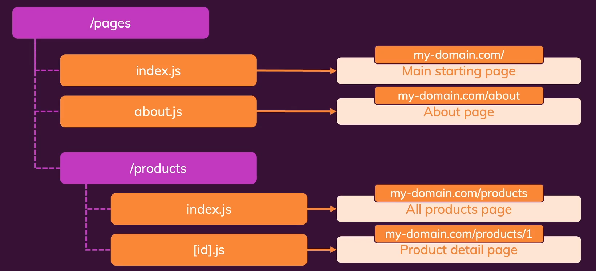
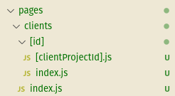
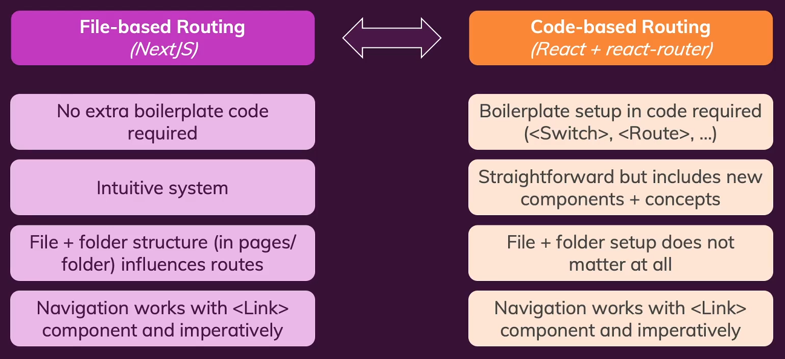
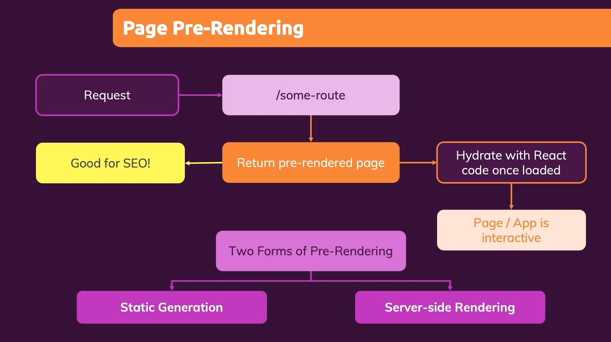
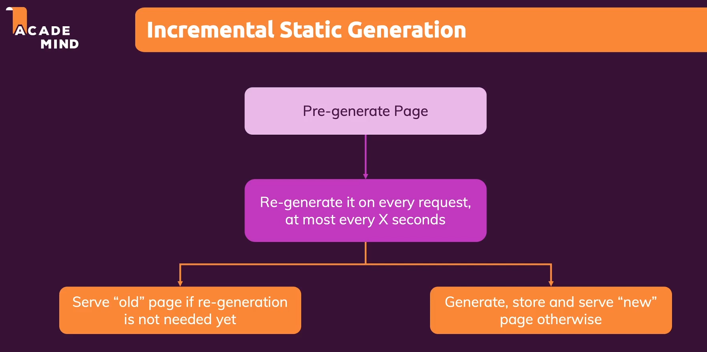
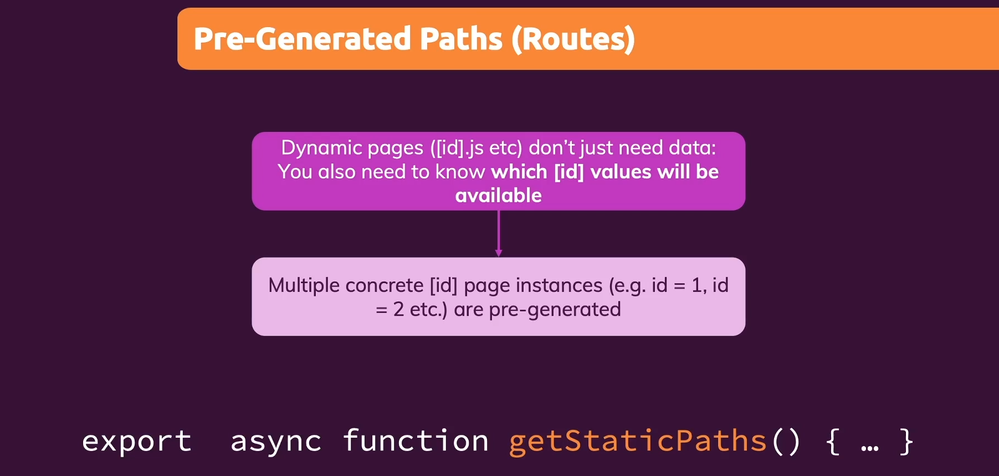
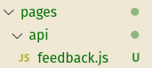
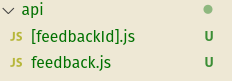
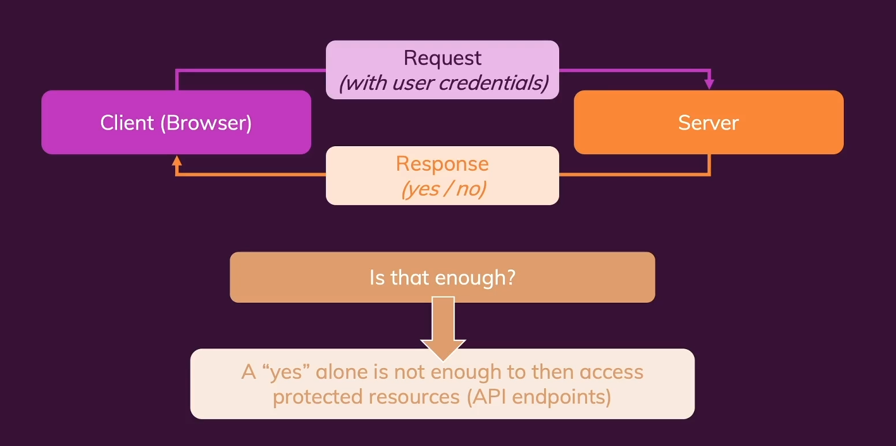
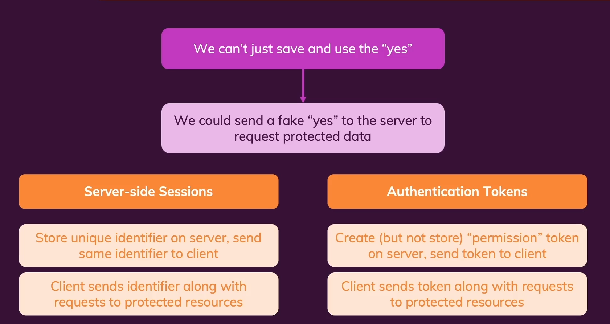

# NextJS tutorial

**[Link to NextJS documentation](https://nextjs.org/docs)**

## Getting started

<details>
<summary>Click to expand/collapse</summary>
<br />

### What is NextJS and why use it?

<details>
<summary>Click to expand/collapse</summary>
<br />

NextJS is a React framework which offers solutions for a lot of common problems we might face when developing React
applications. It markets itself as a React framework for production because it builds itself on top of React, includes
some common libraries (such as the router) out of the box and also because it makes deployment of an optimized
application to production easier with features such as built in server-side rendering and file based routing.

**Key features:**

1. **Built in server-side rendering**

    - basically the page gets prepared (rendered) and data gets loaded on the server before being loaded into the
      browser
    - if we inspect a "standard" React application in the browser we will see only an empty `<div>` element in which the
      content will be dynamically loaded on the client side (by executing JavaScript code in the browser)
    - this can be a problem due to a couple of reasons:
        - there can potentially be some _performance issues_ during the initial load if we are doing some API calls to
          fetch data (waiting until the data is loaded)
        - _search engine optimization (SEO)_ - the search engine sees only a blank container in the HTML
    - note that SSR (server-side rendering) can be added manually to a vanilla React application, but it can be tricky
      as it requires extra configuration from our side
    - on the other hand, with NextJS, we have it out of the box

2. **File based routing**

    - in classic React routing is setup in code (often using the React router package)
    - when using NextJS, instead of doing it programatically, we store pages inside the special `pages` folder and the
      structure within that folder defines the pages and routes of our application => less code, less work, more
      understandable (HTML for example works similar to this)

3. **Fullstack capabilities**

    - easily add backend (server-side, NodeJS) code to our Next / React apps

</details>

### Creating a NextJS project & setting up our IDE

<details>
<summary>Click to expand/collapse</summary>
<br />

1. Install and setup NodeJS & npm
2. run `npx create-next-app`
    - this will create a basic skeleton for a NextJS project
    - notice that, unlike with create-react-app, we don't have the `index.html` file inside the public folder
    - that is because it is dynamically loaded on the server side when needed
3. run the app using the built in `npm run dev` script
    - notice the built in page pre-rendering (inspect the page in the browser)

</details>

</details>

## Optional - small React refresher

<details>
<summary>Click to expand/collapse</summary>
<br />

**[Link to full React tutorial](https://github.com/NGril/react-tutorial)**

**React** is a client side JavaScript library used for building modern interactive user interfaces in a declarative,
component-focused approach. It's mostly used for building Single Page Applications (SPAs), which means that we load only
one HTML document and then dynamically change its content using JavaScript, instead of loading a different HTML page
from the server.

It uses the **JSX syntax** which enables us to mix HTML and JavaScript code. It's used to write reusable **components**,
pass **props** between them and handle the component specific **state**.

Note that in order to use `create-react-app`, a basic project skeleton and the most simple way to start using React, we
need to have NodeJS installed.

The basic dependencies needed to use React are `react` and `react-dom`.

To add page routing to a React project typically the `react-router-dom` library is used.

To make API requests we use either the _fetch API_ or the `axios` library.

If we have some application state which affects multiple components we can use either the _React Context_ library for
more simple use cases, or a dedicated state management library such as _Redux_ or _MobX_ for more complex use cases.

### Styling components using CSS modules

- to go along with building reusable components it would be nice if there was a way to have component specific styles in
  different files
- this is exactly what **CSS modules**, a package built into `create-react-app`, enables us to do
- if we have `Component.jsx` we can have its specific styling file called `Component.module.css` and then import it into
  our component with code like this:

```jsx
import classes from "./Component.module.css";
```

- classes defined in the css file will then become properties of the imported classes object and we can use them as
  classNames in our Component like this:

```jsx
// if we have the header CSS class defined in our CSS file
// NOTE that behind the scenes those classNames will be scoped (made unique) per component
<header className={classes.header}>Dummy text</header>
```

- a common practice for common styles is to use "wrapper" components (which use the `props.children` trick) to apply
  common styles to parts of the code where we want them applied

</details>

## Pages & File-based routing

<details>
<summary>Click to expand/collapse</summary>
<br />

### Creating routes:

<details>
<summary>Click to expand/collapse</summary>
<br />

In traditional React code we use programatic navigation with the help of the `react-router-dom` library. Instead, in
NextJS, we create component files inside the `pages` folder and let NextJS infer the routes from the folder structure.



Note that we can create normal files whose names will be used as path names or use `index.js` filename in which case the
containing folder will be considered as the path name. For nested paths we need to create sub-folders.

#### Dynamic page routes:

For creating **dynamic paths** we use the following syntax: `[paramName].js`, for example: `[id].js`. If `[id].js` page
is defined inside the `pages/portfolio` folder it will match: `/pages/portfolio/1`, `/pages/portfolio/2`
, `/pages/portfolio/something`... Note that if we have a normal static route defined in the same folder NextJS is smart
enough to match it instead of the dynamic route.

To get access to the concrete dynamic route value from the URL NextJS gives us a special `useRouter` hook we can use. If
working with class-based components there is also a `withRouter` HOC (higher order component). It provides us with an
object that contains many different useful properties, the most notable being:

```jsx
// note that we are inside the [projectId].js file which is located inside the 'portfolio' folder

const router = useRouter();

// this will print out /portfolio/[projectId]
console.log(router.pathname);

// this will print out { projectId: "1" } (or any concrete value it matches)
console.log(router.query);
```

If we have some **nested dynamic routes**, for example a path like: `/clients/[clientId]/[projectId]` we need to create
folders with the square bracket naming, `[exampleFolderName]`. An example of nested routing can be
found **[here](./1_file_based_routing/pages/clients/[id]/[clientProjectId].js)**.



There is also a use case where we want multiple ways of accessing dynamic routes. To catch all routes we can use the
special naming convention that starts with 3 dots within the square brackets, like `[...someFileName].js`. When
navigating to this file we can catch multiple dynamic routes that lead to
it, **[example](./1_file_based_routing/pages/blog/[...slug].js)**.

Example:

```jsx
// we are within a [...slug].js file that is located within the blog folder

const router = useRouter();

// for example if we go to the path /blog/write/whatever/you/want this will print { slug: ['write', 'whatever', 'you', 'want'] }
console.log(router.query);
```

</details>

### Navigating between routes:

<details>
<summary>Click to expand/collapse</summary>
<br />

#### Static and dynamic route navigation

Very similarly to React Router, in Next we also use the `<Link>` component to navigate between different routes. The
difference is that in NextJS this `<Link>` component has a bit different prop names, more options available, and is a
bit more optimized.

```jsx
import Link from "next/link";

function HomePage() {
    return (
        <div>
            <h1>The home page</h1>
            <ul>
                <li>
                    <Link href="/portfolio">Portfolio</Link>
                </li>
                <li>
                    <Link href="/clients">Clients</Link>
                </li>
            </ul>
        </div>
    );
}

export default HomePage;
```

When navigating to dynamic routes everything is pretty much the same.

```jsx
import Link from "next/link";

function ClientsPage() {
    const cleints = [
        {id: 1, name: "Max"},
        {id: 2, name: "Manu"},
    ];

    return (
        <div>
            <h1>The Clients page</h1>
            <ul>
                {cleints.map((client) => (
                    <li key={client.id}>
                        <Link href={`/clients/${client.id}`}>{client.name}</Link>
                    </li>
                ))}
            </ul>
        </div>
    );
}
```

An alternative way of setting Link hrefs (if paths are very long) is by using the config object within the href
property:

```jsx
import Link from "next/link";

function ClientsPage() {
    const cleints = [
        {id: 1, name: "Max"},
        {id: 2, name: "Manu"},
    ];

    return (
        <div>
            <h1>The Clients page</h1>
            <ul>
                {cleints.map((client) => (
                    <li key={client.id}>
                        <Link
                            href={{
                                pathname: "/clients/[id]",
                                query: {id: client.id},
                            }}
                        >
                            {client.name}
                        </Link>
                    </li>
                ))}
            </ul>
        </div>
    );
}
```

#### Programatic navigation:

For example if we want to automatically redirect someone to a different page after an action has completed.

```jsx
const router = useRouter();

function loadProjectHandler() {
    // load data, do some business logic...

    // syntax 1
    router.push("/clients/Max/projectA");

    // syntax 2
    router.push({
        pathname: "/clients/[id]/[clientProjectId]",
        query: {id: "Max", clientProjectId: "projectA"},
    });
}
```

#### Adding a custom 404 page:

To add a custom 404 page we need to create it in the root of our `pages` folder and it needs to be named `404.js` in
order for this to work. NextJS is than smart enough to navigate to this page whenever it doesn't match any routes.

#### Common layout components

If we want to add a navigation bar that will be present in all the different pages we do that in the `_app.js` file.
That is the root component where the different page components are rendered. It uses that component to display the
different pages we are navigating between. In **[this example](./2_demo_project_a/pages/_app.js)** you can see that we
wrapped the `Component` with our `Layout` so that all of the pages contain the navigation bar we created.

#### Summary



All routing code examples can be found **[here](./1_file_based_routing/pages)**
Also note that `_app.js` is the actual container in which our pages are rendered, and if we want to create some elements
which are common to all pages we can wrap the `Component` element found there, as you can see
in **[this example](./2_demo_project_a/pages/_app.js)**.

</details>

</details>

## Demo project 1

<details>
<summary>Click to expand/collapse</summary>
<br />

**[Code](./2_demo_project_a)**

Practicing routing. Also placing common components in a wrapper inside `_app.js`.

</details>

## Page pre-rendering & data-fetching

<details>
<summary>Click to expand/collapse</summary>
<br />

In standard React applications all page data is dynamically loaded by the browser on startup and the server serves only
an empty HTML element. That means that we fetch data to our component from the client side, after the component has
already been loaded. Beacause of that users need to **wait for data to be loaded** by the browser in order to be able to
see it, which can be a problem in some cases. An even bigger problem is **SEO (search engine optimization)**, since
during the indexing phase search engines will see only an empty HTML document and won't be able to determine any content
by which search engines can find our web application.

NextJS solves the following problems by serving prerendered code during the initial load (to help with SEO), and after
that **hydrates that code with our ReactJS code** which makes the page interactive. So only the initial page is
pre-rendered, and after that we use our normal React code for all subsequent renders.

There are also 2 different forms of pre-rendering - **static generation** (all pages generated in advance during build
time) and **server-side rendering** (pages are created just in time after deployment - when the request hits the server)
.

Note that **NextJS pre-renders all pages without any dynamic data by default**. If we want to pre-fetch data we can use
some mechanisms explained in the following text.



### Static generation

<details>
<summary>Click to expand/collapse</summary>
<br />

- the idea is that we pre-generate a page (with data prepared on the server-side) **during build time**
- because of that they can be cached by the server / CDN serving the app
- after that the page is hydrated with our React code
- to tell NextJS which data is needed to pre-generate a page we can export a special function **from our page
  components (only from page components)**:
  ```jsx
  export async function getStaticProps(context) { ... }
  ```
- in this function we can write any code that runs only on the server side - note that here we don't have access to all
  standard APIs and that this code will not be included in the final bundle with which our page gets hydrated - this
  also includes imports used only inside this function
- this is very useful since this code won't be visible on the client side which means sensitive data can be added there

- **example:**

  ```jsx
  function HomePage(props) {
    const { products } = props;

    return (
      <ul>
        {products.map((product) => (
          <li key={product.id}>{product.title}</li>
        ))}
      </ul>
    );
  }

  // this code will never be visible on the client side
  // it is ran first (on the server side - during build time) and it prepares the props for our component
  // that means that that data will be visible in the page source - instead of it being loaded dynamically
  export async function getStaticProps() {
    return {
      props: {
        products: [{ id: "p1", title: "Product 1" }],
      },
    };
  }

  export default HomePage;
  ```

- NOTE that this code will not actually be ran on the server, it will be ran on the machine which builds the
  application (`npm run build`)
    - this has a potential downside if we have data that changes often
    - the solution is to either use standard React code alongside static props, or better yet to use **ISR (Incremental
      Static Generation)**

#### Incremental Static Generation (ISR)

<details>
<summary>Click to expand/collapse</summary>
<br />

- this feature enables static content to be generated multiple times - it isn't generated only once, during the initial
  build, but it can also be generated periodically without us constantly redeploying the application

  

- it can be done on every request and at most each X seconds, and it is enabled by adding the `revalidate` property to
  the return value of the `getStaticProps` function:

```jsx
export async function getStaticProps(context) {
    // SOME DUMMY DATA
    const data = {a: 1, b: 2, c: 3};

    // REDIRECT OPTION ENABLES US TO GO TO SOME OTHER ROUTES
    if (!data) {
        return {
            redirect: {
                destination: "/no-data",
            },
        };
    }

    // NOT FOUND OPTION ENABLES US TO GO TO OUR 404 PAGE
    if (data.products.length === 0) {
        return {notFound: true};
    }

    // REVALIDATE OPTION ENABLES US TO DYNAMICALLY RE-GENERATE THE STATIC CONTENT
    return {
        props: {
            ...
        },
        // THIS PROP TELLS NEXTJS TO RE-GENERATE THE STATIC PROPS ON EACH REQUEST, AT MOST ONCE EACH 60 SECONDS
        revalidate: 60
    };
}
```

- revalidate behavior can be confirmed if we add some `console.log()` to our `getStaticProps()` function and then
  run `npm run build` and then `npm start`

</details>

#### Working with dynamic parameters

<details>
<summary>Click to expand/collapse</summary>
<br />

- if we want to extract url parameters on the server side we can do it like this:

```jsx
// THE CONTEXT OBJECT HAS MULTIPLE PROPERTIES WHICH PROVIDE US DETAILS ABOUT OUR COMPONENT
export async function getStaticProps(context) {
    // PARAMS CONTAIN OUR URL PARAMETERS WHERE THE KEY IS OUR DYNAMIC ROUTE FILE NAME, AND THE VALUE THE ACTUAL ID
    const {params} = context;

    const productId = params.pid;

    const filePath = path.join(process.cwd(), "data", "dummy-backend.json");
    const jsonData = await fs.readFile(filePath);
    const data = JSON.parse(jsonData);

    const product = data.products.find((product) => product.id === productId);

    return {
        props: {
            loadedProduct: product,
        },
    };
}
```

- also note that Next won't automatically pre-generate pages with dynamic routes by default
- when we add getStaticProps to a page file we tell NextJS to pre-render the page
- the combination of these 2 things results in an error, and in order to solve it we need to use the `getStaticPaths`
  function to tell NextJS which instances of dynamic routes should be available
  

```jsx
export async function getStaticPaths() {
    return {
        // HERE WE TELL NEXTJS WHICH CONCRETE PATHS NEED TO BE PREGENERATED
        paths: [
            {params: {pid: "p1"}},
            {params: {pid: "p2"}},
            {params: {pid: "p3"}},
        ],

        // THIS CAN HELP US IF WE HAVE A LOT OF PAGES WHICH NEED TO BE PREGENERATED (we want to pregenerate some frequent ones, but not all)
        // with it set to true we tell NextJS that even values not listed under paths can be valid values which should be loaded (they are not pregenerated)
        // this happens asynchronously, which means we need to have a loading state in our component
        // alternatively we can set this fallback to the string value 'blocking' in which case the loading state of our component is not needed at all (but it takes a bit more time)
        fallback: false,
    };
}
```

</details>

</details>

### Server-side rendering

<details>
<summary>Click to expand/collapse</summary>
<br />

With static generation pages are generated during build time with the help of the `getStaticProps` method which is
generally called at that time (with the exception of ISR). Sometimes this is not enough and you need to pre-render for
every request OR you need access to the request object (e.g. for cookies).

NextJS allows us to run "real server-side code" as well (code which is not pre-generated but actually ran only on the
server side and re-executed on every request). This is done using the:

```jsx
export async function getServerSideProps() {...
}
```

Like `getStaticProps` it also needs to be called exactly like this, needs to be async, needs to be exported and can only
be defined in page components. It will be executed whenever a request for a specific page is made, which means that this
code is not pre-generated but rather ran on the server after deployment. Note that only one of those should be used.

The return object of the `getServerSideProps` should be the same as in `getStaticProps`. The only difference is
the `revalidate` key which does not exist for `getServerSideProps` because per its definition it runs for every new
request. Also the context object contains more info in this method.

```jsx
// THE CONTEXT OBJECT HERE CONTAINS INFORMATION ABOUT BOTH THE REQUEST AND RESPONSE OBJECTS WHICH CAN BE READ AND MANIPULATED
// this can be very useful if we need header or cookie data or want to manipulate the response
export async function getServerSideProps(context) {
    const {params, req, res} = context;

    return {
        props: {
            username: "Niko",
        },
    };
}
```

#### Working with dynamic pages

<details>
<summary>Click to expand/collapse</summary>
<br />

When using server side props we don't need the `getStaticPaths` function because `getServerSideProps` runs on the server
anyway so dynamic paths work without adding any other additional logic.

</details>

</details>

### Client-side data fetching

<details>
<summary>Click to expand/collapse</summary>
<br />

In some cases data doesn't need to be pre-rendered or can't be prerendered. Some examples include data which is changing
with high frequency, highly user-specific data or partial data (data that's used only on a part of a page). Then we can
still use the standard React approach and combine the `useState` and `useEffect` hooks to fetch data on the client side.

Note that NextJS will still pre-render the initial component data by default, but it will NOT wait for the `useEffect`
hook to execute.

#### useSWR hook

<details>
<summary>Click to expand/collapse</summary>
<br />

**[Documentation](https://swr.vercel.app/)**

- a custom React hook developed by the NextJS team (can be used in non-Next projects as well)
- under the hood it still sends a fetch request, but it gives us some common and useful built-in functionalities such as
  caching, revalidation, error handling and so on
- SWR stands for `stale-while-revalidate`
- to use it we first need to add it to our project using the `npm install swr` command

</details>

</details>

These 2 approaches can be combined - the initial component state is the one which is statically generated, and the
updated one is the one which is received by using client-side fetching. So the initial state of the `useState` hook can
be the pregenerated state from the `getStaticProps`.

</details>

## Demo project 2

<details>
<summary>Click to expand/collapse</summary>
<br />

**[Code](./4_demo_project_b)**

Practicing data fetching. SSG, SSR, client-side fetching.

</details>

## Optimizing NextJS pages

<details>
<summary>Click to expand/collapse</summary>
<br />

### Optimizing 'head' metadata

<details>
<summary>Click to expand/collapse</summary>
<br />

Title and the description which is set inside the `<head>` element enhances the user experience by a certain amount and
is also important for SEO.

To configure the `<head>` properties of a certain page we need to:

1. Import the special `<Head>` element to the page

```jsx
import Head from "next/head";
```

2. Use the `<Head>` element inside the page

```jsx
function HomePage(props) {
    return (
        <div>
            // the head doesn't need to be written at the top level
            // inside the Head element we can write any HTML element that usually goes to the `
            <head>` element
                // it will automatically be injected into the <head> of the page
                    <Head>
                        <title>NextJS Events</title>
                        <meta name="description" content="Find a lot of great events that allow you to evolve"/>
                    </Head>
                    <EventList items={props.events}/>
        </div>
);
}
```

The good thing with this is that we can easily use dynamic values inside the `<Head>`, as it is treated as standard JSX
code.

If we want to reuse the same `<Head>` content accross multiple pages we can add it to the `_app.js` file - which is our
root app component that is being rendered for every page. Note that NextJS automatically merges `<head>` elements - so
if a property is set in both the `_app.js` and a specific component at the same time both will be applied and in case of
conflicts the latest element will be applied.

The other application wide file other than `_app.js` which we can create inside the root of the `pages` folder
is `_document.js`. The difference is that in `_document.js` we can customize the entire HTML document, where as we can
think of `_app.js` as the root container of the HTML `<body>` element (the `<Main>` element). It is important that
the `_.document.js` always has the same basic structure, but we can freely add our customizations as well (such as
a `<div>` for the React Portal modal, setting the language of the page to english and so on).

Example:

```jsx
// It's important to note that this Head component is not the same as the one imported from next/head
// This one can only be used inside this _document.js file
import Document, {Html, Head, Main, NextScript} from "next/document";

class MyDocument extends Document {
    render() {
        return (
            <Html lang="en">
                <Head></Head>
                <body>
                <div id="overlays"></div>
                <Main/>
                <NextScript/>
                </body>
            </Html>
        );
    }
}

export default MyDocument;
```

</details>

### Optimizing images

<details>
<summary>Click to expand/collapse</summary>
<br />

To optimize large images in a simple way we can use the built in `Image` component which creates multiple versions of
our images on the fly that are optimized based on the operating system and device screen size. Those images are than
cached for further use. Also note that these images are lazy loaded (only when they are visible).

To do so we need to:

1. Import the Image element:

```jsx
import Image from "next/image";
```

2. Use this new Image and specify the needed width and height props

```jsx
// Comparison
<Image src={`/${image}`} alt={title} width={250} height={160}/>

```

**[next/image docs](https://nextjs.org/docs/api-reference/next/image)**

</details>

</details>

## Adding backend code with API routes (Fullstack React)

<details>
<summary>Click to expand/collapse</summary>
<br />

### API routes

<details>
<summary>Click to expand/collapse</summary>
<br />

Some websites are about more than just serving pages. They need some backend logic in order to work properly.

API routes allow us to easily create our own (REST) API endpoints.

We do this by creating a special `api` folder within the `pages` folder. Inside we can create a page like structure
however we want for our API endpoints. Those components don't export React functions, they are used to define handler
functions which will be run on the server side and handle incoming API requests. We are essentially writing NodeJS code
there.

Example:


```js
function handler(req, res) {
    res.status(200).json({message: "This works!"});
}

export default handler;
```

When we not GET the `/api/feedback` the response body will be `This works!`. With this we can essentially create a full
backend API in the same project as our frontend.

If we want to combine both the API routes with SSG we don't need to call the `fetch` method inside the `getStaticProps`
method but rather we can utilize the same method like in the backend code because, since we have both the backend and
the frontend in the same project, they are both running on the same server.

[Using API routes for prerendering pages example](./5_API_routes/pages/feedback/index.js)

Working with dynamic routes is also really similar to how pages work. We define a dynamic API route by using the [] like
this:



We then define the request handline logic within and that's it.

The same applies to slugs, we define a file using the `[...dummyFilename].js` naming convention and that's it.

**[Code examples](./5_API_routes)**

</details>

</details>

## Demo project 3

<details>
<summary>Click to expand/collapse</summary>
<br />

**[Code](./6_demo_project_c)**

Practicing API routes. Setting up MongoDB.

**MongoDB setup**:

After setting up an account and choosing a pricing plan here, https://www.mongodb.com/, we need to install the required
dependency in order to connect to MongoDB within our app. This can be done using the: `npm install mongodb` command.

To connect to the db we can use the url which is provided in our dbms dashboard on the MongoDB website. Usage examples
for the MongoDB client: **[here](./6_demo_project_c/helpers/db-util.js)** (also see how those methods are used and how
are errors handled).

</details>

## Working with App-wide state (React Context)

<details>
<summary>Click to expand/collapse</summary>
<br />

Creating the context and the context provider: [example](./6_demo_project_c/store/notification-context.js)

Wrapping the app component with the context: [example](./6_demo_project_c/pages/_app.js)

Using values from the context: [example](./6_demo_project_c/components/layout/layout.js)

Changing values in the context, automatically clearing in
useEffect: [example](./6_demo_project_c/components/input/newsletter-registration.js)

</details>

## Full blog example

<details>
<summary>Click to expand/collapse</summary>
<br />

**[HERE](./7_blog_project)**

</details>

## Deploying NextJS Apps

<details>
<summary>Click to expand/collapse</summary>
<br />

### Deployment options

<details>
<summary>Click to expand/collapse</summary>
<br />

**1. Standard build**

- run the `next build` command (`npm run build` script)
- produces an optimized production bundle and a server-side app => this requires a NodeJS server (this would be possible
  for a standard app, but not for NextJS because of its server-side capabilities)
- pages are pre-denreder (if possible), NodeJS server is required for API routes, server-side pages and page
  revalidations
- re-deploy needed if code changes or you don't use revalidations and need page updates

**2. Full static build**

- run the `next export` command
- produces a 100% static app (HTML, CSS, JS) - no NodeJS server required
- doesn't work if your app uses API routes, server-side pages, or wants to use page revalidatins
- re-deploy needed for all code and content changes

**Deployment considerations:**

1. Add page metadata, optimize code, remove unnecessary dependencies
2. Use environment variables for variable data (database credentials, API keys...)
3. Do a test build and test the production-ready app locally or on some test server
4. Deploy!

</details>

### Working with NextJS config and environment variables

<details>
<summary>Click to expand/collapse</summary>
<br />

If we want to tweak the default NextJS settings we can create a `next.config.js` file in the root of our project. Here
we can override the default settings. There are many useful options here, for more details check
the **[docs](https://nextjs.org/docs/api-reference/next.config.js/introduction)**
. **[Usage example](./7_blog_project/next.config.js)**.

Environment variables can also be set using this configuration. Usage example of variables set in the example above can
be found [here](./7_blog_project/pages/api/contact.js) - notice that we can set different values based on the
environment we're currently in. It's important to note that **these values will be resolved during the build process**,
and not dynamically during runtime.

```jsx
// accessing the env vars through the process.env key
const connectionString = `mongodb+srv://${process.env.mongodb_username}:${process.env.mongodb_password}@${process.env.mongodb_clustername}.ntrwp.mongodb.net/${process.env.mongodb_database}?retryWrites=true&w=majority`;
```

</details>

### Deployment guide

<details>
<summary>Click to expand/collapse</summary>
<br />

Generally:

1. `npm run build`
2. OPTIONAL (`next export`) - if we are not using any server-side features
3. upload code to some machine that has NodeJS, run `npm install` and `npm start`

Vercel example: (Netlify is another good option)

1. Push your code to Github
2. Sign up to Vercel
3. Import Git repo to Vercel
4. Go through other settings (note that we can define env variables during deployment - **this is often preferred**)
5. build

Whenever we push changes to master Vercel will automatically rebuild and redeploy the app.

</details>

</details>

## User authentication

<details>
<summary>Click to expand/collapse</summary>
<br />

### How does authentication work?

<details>
<summary>Click to expand/collapse</summary>
<br />

1. user enters some data in the login form
2. client sends an HTTP request to the server (containing user credentials)
3. server checks the database for the entered credentials and returns an HTTP response



To be sure that the user is authenticated we can't use a simple "yes" or "no" response, we need some proof. For this we
can commonly use one of the following mechanisms:

1. **Server-side sessions**

- we store some unique identifier (session id) on the server and send the same identifier to the client
- the client then attaches that identifier along with its requests to protect access to restricted resources
- this identifier is usually stored in a cookie on the client side (prevented from access by JS)

2. **Authentication tokens**

- create (but not store) "permission" token on the server and send the same token to the client
- the client then attaches that token along with its requests to protect access to restricted resources
- even though the server doesn't store the token it knows how it signed it, so the server can verify whether it created
  the said token or not



SPAs usually work with tokens instead of sessions for the following reasons:

- pages are often serverd directly and populated with logic without hitting the server
- backend APIs work in a "stateless" way (they don't care about connected clients, they don't keep track of connected
  clients)
- because of that servers don't store information about authenticated clients, instead clients should get information
  that allows them to prove their authentication => for this we use tokens (**JWT token => JSON Web Token**)

**Understanding JWT tokens**

- a JWT token is generated with 3 main building blocks:
    1. Issuer data - data that is automatically added to the token by the server when it is generated (preconfigured
       metadata)
    2. Custom data - e.g. user data
    3. Secret Signing Key - also generated by the server, used for signing the key (the key is not visible by the
       client, also it's important to note that signing does not mean encryption, the token can still be read by anyone,
       the signing key just proves that a given server has created the token)
- we then combine these 3 blocks to create a JWT token string
- the token is then stored by the client and attached to outgoing requests
- the signing server is the only one able to then verify the incoming token (by checking whether it would be able to
  create the given token using its secret signing key)

</details>

### Using the `next-auth` package

<details>
<summary>Click to expand/collapse</summary>
<br />

**[Documentation](https://next-auth.js.org/)**

Next Auth has both client and server side capabilities. It also enables us to easily implement 3rd party authentication
providers (sign-in with Google, sign-in with Facebook...).

</details>

### Example project

<details>
<summary>Click to expand/collapse</summary>
<br />

**[Code](./8_user-authentication)**

`npm install next-auth`

1. Adding a user sign-up API route: [here](./8_user-authentication/pages/api/auth/signup.js)
    - important thing to note here is that we should **NOT** store plain text passwords inside the db
    - to encrypt them we'll use the `bcryptjs` package (`npm install bcryptjs`)
      , [auth helper example](./8_user-authentication/lib/auth.js)

2. Connecting to auth form: [here](./8_user-authentication/components/auth/auth-form.js)

3. Adding a user login API route: [here](./8_user-authentication/components/auth/[...nextauth].js)
    - here we have a catch all route (so anything after /api/auth will lead here)
    - we do this because the `next-auth` package will expose multiple routes for user login / logout behind the scenes
    - with it setup like that the `[...nextauth].js` will automatically handle all such requests
    - to see which routes exactly does `next-auth` create you can check the documentation linked above

4. Sending a "sign in" request from the frontend: [here](./8_user-authentication/components/auth/auth-form.js)

5. Managing active session (on the frontend): [here](./8_user-authentication/components/layout/main-navigation.js)
    - conditionally showing / hiding parts of the UI based on the session state (whether the user is logged in or not)
    - after successful login NextJS automatically adds a cookie which we can use for these things
    - this can be done by using the `useSession` custom hook

6. Adding page guards (route protection):
    - with this we can't visit certain pages depending on the session state
    - client side example: [here](./8_user-authentication/components/profile/user-profile.js)
    - server side example: [here](./8_user-authentication/pages/profile.js)

7. Protecting API routes (so that only authenticated users can perform certain
   actions): [here](./8_user-authentication/pages/api/user/change-password.js)

8. Sending change password API request from the
   frontend: [here](./8_user-authentication/components/profile/profile-form.js)

9. When deploying, we need to set the NEXTAUTH_URL environment variable so that `next-auth` knows which base url to use.
   More info can be found in NextAuth docs.

</details>

</details>
