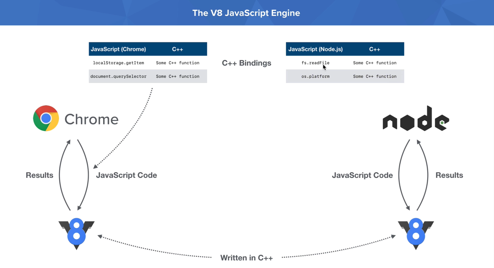
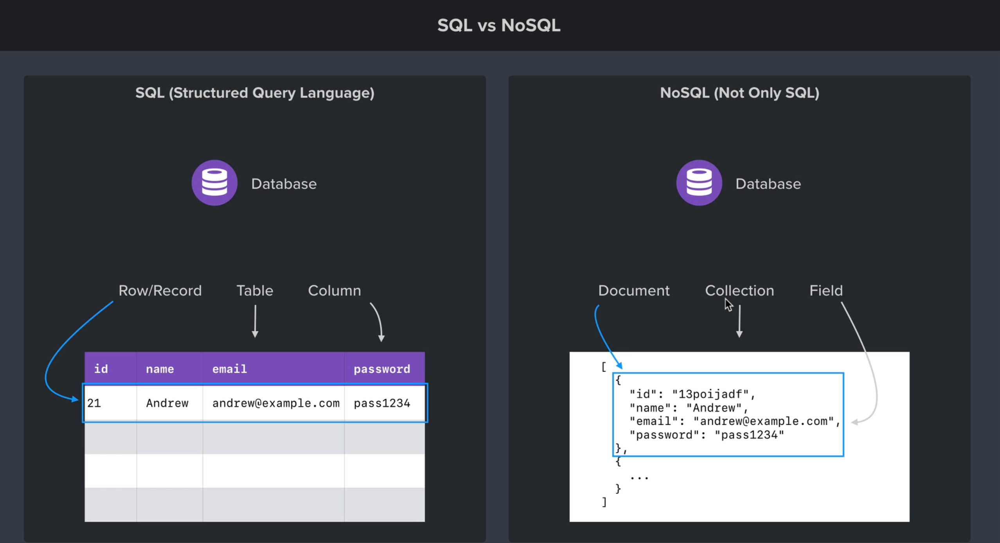

# Node.js tutorial

Attached there is a great PDF guide of the entire course which goes into great detail, download it **[here](./PDF-Guide-Node-Andrew-Mead-v3.pdf)**.

Official NodeJS docs can be found **[here](https://nodejs.org/en/docs/)**.

**[Notes App](./2_notes_app)**:

- simple command-line note taking app to explore Node.js basics
- explores how to work with npm packages, run node scripts and work with the file-system and command-line arguments

**[Weather App](./3_weather_app)**:

- simple fullstack application for getting the current weather for a location
- explores how to work with asynchronous code and fire API requests using Node, how to create and configure a web-server using Express to serve content, working with the hbs templating engine and how to deploy our application

**[Task App](./4_task_app)**:

- basic backend API
- explores using MongoDB and `mongoose` library, authentication and authentication middleware using JWT tokens, filtering, pagination and sorting using query params, file uploads with the help of the `multer` library, setting up local and remote environment variables and deployment to Heroku, and finally Node.js testing using Jest

**[Chat App](./5_chat_app/)**

- working with web sockets to create a real-time chat application

## 1. Installing and exploring Node.js

<details>
<summary>Click to expand / collapse...</summary>
<br>

**What is Node.js?**

- Node.js is a JavaScript runtime environment which enables the use of JavaScript out of the browser (on the server)
- it is built on Chrome's V8 JavaScript engine which powers Google Chrome

    

- if we execute the `node` command in the terminal we can run JS directly, just as we would within the browser console, to exit we can execute `process.exit()`
- to run a script we can use `node path/to/script.js`

**Differences between JavaScript in the browser and Node:**

- unlike JavaScript in the browser, Node doesn't have access to things like the `window` object or the `DOM`, since those are browser specifics which are provided by the browser, and not a part of JavaScript
- Node has the **`global`** and **`process`** objects instead

**Why should I learn NodeJS?**

- Node.js uses an event-drive, non-blocking I/O model that makes it lightweight and efficient
- Node.js' package exosystem, **npm**, is the largest ecosystem of open source libraries in the world

</details>

## 2. Node.js Module system (Notes App)

<details>
<summary>Click to expand / collapse...</summary>
<br>

**Importing Core Node.js modules:**

- loading modules is done using the `require` function
- if we are loading a Core Node module, we just need to provide the module name, e.g. `const fs = require("fs");`

**Importing your own files:**

- this is done by providing the path to the file within the `require` method, e.g. `require("./path/to/file.js")`
- we need to explicitly `export` all variables/functions which we want to share between files using the `module.exports = { functionToExport }`
- when we import a file it is automatically executed

**Importing npm modules:**

- first we need to initialize npm within our project by running `npm init` which will create the `package.json` configuration file
- to install packages we can run the `npm install package_name@version` command
- this will create the `node-modules` directory which holds the code for all of the packages we install, and the `package-lock.json` which contains extra information about the installed packages - _we should not directly edit these files_
- to import npm packages we do the same thing as for the core modules - we pass the package name to the `require` function, e.g. `const validator = require("validator");`

**Global npm packages and nodemon:**

- we can also install npm modules globally, which adds them to the node installation itself (the `global` variable)
- we do it by running the `npm install nodemon -g`
- `nodemon` is a tool used to run node scripts and which listens to changes to the file (we don't need to repeatedly run our scripts after every little change)
- we can then run our scripts using: `nodemon ./path/to/script.js`
- if we want nodemon to track changes to non-js files as well (html, css...) we can run: `nodemon ./path/to/script.js -e js,html,css`
- **NOTE** global modules should be avoided if they are required to run the project, since they won't be automatically available for other people working on the project unless they install it globally as well

</details>

## 3. File system and command line args (Notes App)

<details>
<summary>Click to expand / collapse...</summary>
<br>

**Getting input from users:**

- to add command line arguments we can do something like: `node app.js "Niko"`
- these command line arguments are stored in the `argv` property of the `process` object - it contains:
  - the path to the `node` executable on the local machine
  - the path to the currently running script
  - a destructured list of command line arguments we passed in through the terminal
- a core Node.js package for working with the filesystem is `fs`
- a great package for easier handling of command line arguments, which we'll be using for our notes app is `yargs`

</details>

## 4. Debugging Node.js (Notes App)

<details>
<summary>Click to expand / collapse...</summary>
<br>

Common debugging tools include:

- **`console.log()`**
- **Node debugger**, used like this in the code:
  - `debugger;`
  - to run the script in debug mode we use `node inspect script.js scriptParam`
  - it seems to be working only within the Chrome Browser, when we visit `chrome://inspect`
  - we'll see a remote target listed which we can open
  - in the next window we can debug our code, we can then add foler to workspace, run stuff in the console (pressing esc pulls up a console window, etc.)

</details>

## 5. Asynchronous Node.js (Weather App)

<details>
<summary>Click to expand / collapse...</summary>
<br>

**Asynchronous basics:**

- explanations can be found **[here](https://github.com/NGril/javascript-tutorial)**

**Making HTTP requests:**

- Node added support for `fetch` very recently, but mostly http requests are done using 3rd party packages such as **[`request`](https://www.npmjs.com/package/request)**
- check out some examples **[here](./3_weather_app/src/utils/geocode.js)** and **[here](./3_weather_app/src/utils/forecast.js)**
- we can also make http requests without a library, however it's pretty cumbersome and low-level, check it out **[here](./playground/2_raw_http_requests.js)**

</details>

## 6. Web servers - using Express.js (Weather App)

<details>
<summary>Click to expand / collapse...</summary>
<br>

Detailed info can be found on the **[Express website](https://expressjs.com/)**.

- Express **[API reference](https://expressjs.com/en/4x/api.html)**

### Basic setup:

<details>
<summary>Click to expand / collapse...</summary>
<br>

- `npm install express`
- confituration - **[example](./3_weather_app/src/app.js)** - we basically run the `express` function, get back the server (app) object and setup what is served on each given route
- we can serve HTML, JSON or just a basic string, example:

```js
// serving basic strings example
app.get("/path1", (req, res) => {
  res.send("Hello express!");
});

// serving HTML example
app.get("/path2", (req, res) => {
  res.send("<h1>Hello express!</h1>");
});

// serving JSON example
app.get("/path3", (req, res) => {
  res.send({
    name: "Niko",
    age: 26,
  });
});
```

</details>

### Serving up static assets:

<details>
<summary>Click to expand / collapse...</summary>
<br>

- Node exposes 2 special variables by default:
  - `__dirname` - path to the current directory (where the server is running), e.g. `/home/mrsavi_pas/Learning/nodejs-tutorial/3_weather_app/src`
  - `__filename` - path to the current file (where the server is running), e.g. `/home/mrsavi_pas/Learning/nodejs-tutorial/3_weather_app/src/app.js`
- Node also has a very useful core package for working with paths, `path`
  ```js
  // this would go up one directory and into the public folder, from __dirname
  path.join(__dirname, "../public");
  ```
- to serve up static assets we can configure our server using the `app.use()` function (more details on it later):

  ```js
  const publicDirectoryPath = path.join(__dirname, "../public");
  app.use(express.static(publicDirectoryPath));
  ```

- we can now put static assets (HTML, CSS, JS, images and so on within the public folder, and they'll automatically get served)

**Serving up CSS, JS, images and more:**

- we include them normally, like we would do with any frontend app, **[examples](./3_weather_app/public)**

</details>

### Dynamic pages with templating (using hbs):

<details>
<summary>Click to expand / collapse...</summary>
<br>

- we'll be using **[handlebars](https://handlebarsjs.com/)** as our templating language of choice
- to use it with express we need to install the following package which integrates it with our web server: `npm install hbs`
- we also need to configure it within `app.js` by setting the `view engine` property, `app.set("view engine", "hbs");
- we can then create `.hbs` files like **[this one](./3_weather_app/templates/views/index.hbs)**, and configure it within `app.js` like this:

```js
// setting up a dynamic route for our home page
app.get("/", (req, res) => {
  // this will automatically find the 'index.hbs' view and serve it
  // title and name are dynamic values which we can access within our template
  res.render("index", {
    title: "Weather",
    name: "Niko Gril",
  });
});
```

- we use the dynamic values within our `.hbs` file like this:

```hbs
<body>
  <h1>{{title}}</h1>
  <p>Created by {{name}}</p>
</body>
```

- by default Node looks within our `views` folder to find dynamic templates, but we can customize this by adding this to our app.js configuration:

```js
// path to our views (within templates directory)
const viewsPath = path.join(__dirname, "../templates/views");
// customizing the path to our dynamic templates
app.set("views", viewsPath);
```

**Advanced templating (hbs partials):**

- to setup partials we need to configure their path within `app.js`:

```js
const hbs = require("hbs");
...
const partialsPath = path.join(__dirname, "../templates/partials");
// registering a path to our partials
hbs.registerPartials(partialsPath);
```

- partial **[example](./3_weather_app/templates/partials/header.hbs)**
- partial usage example:

```hbs
  <body>
    <!-- no need to specify a path or anything else, syntax is the same as with dynamic values, we just add the leading '>' -->
    {{>header}}
    ...
  </body>
```

**Setting up a 404 page:**

- example:

```js
// setting up a 404 pages, this needs to come at the end since we are matching everything
app.get("/help/**", (req, res) => {
  res.send("Help article not found!");
});
app.get("*", (req, res) => {
  res.send("My 404 page");
});
```

</details>

</details>

## 7. Accessing APIs from the browser (Weather App)

<details>
<summary>Click to expand / collapse...</summary>
<br>

We can access the query parameters of a url from the `req` object by using `req.query`.

Creating an API route example:

```js
// example: http://www.example.com/weather?address=Zagreb
app.get("/weather", (req, res) => {
  const address = req.query.address;

  if (!address) {
    res.send({ error: "You have to provide an address" });
    return;
  }

  geocode(address, (error, { latitude, longitude, location } = {}) => {
    if (error) {
      res.send({ error });
      return;
    }

    forecast(
      latitude,
      longitude,
      (error, { weather_descriptions, temperature } = {}) => {
        if (error) {
          res.send({ error });
          return;
        }

        res.send({ location, weather_descriptions, temperature });
      }
    );
  });
});
```

Consuming the API from the browser example:

```js
fetch("/weather?address=Zagreb")
  .then((response) => response.json())
  .then((data) => {
    if (data.error) {
      console.log(data.error);
      return;
    }

    console.log(data.location, data.weather_descriptions[0]);
  });
```

More examples can be found in the **[Weather App](./3_weather_app/)**.

</details>

## 8. Application deployment (Weather App)

<details>
<summary>Click to expand / collapse...</summary>
<br>

We'll be using **Git**, **[GitHub](https://github.com)** and **[Heroku](https://heroku.com)**.

It's very benefitial to also install the **[Heroku CLI](https://devcenter.heroku.com/articles/heroku-cli)**

**Setup steps:**

- to login to the CLI use the `heroku login` command
- to setup ssh keys run `heroku keys:add`
- to create a heroku app run `heroku create appName` in our app root
- we need to add the `start` script within our `package.json` so heroku knows what to run
- we need to setup the `PORT` environment variable (within server-side `app.js`):

```js
// setting up the port for heroku or local development
const port = process.env.PORT || 3000;

...

// listen on env var port (production) or 3000 (local), on start callback
app.listen(port, () => {
  console.log(`Server is up on port ${port}...`);
});
```

**Deployment to Heroku:**

- make sure that the `heroku` remote exists by running `git remote`
- run `git push heroku master` - that should trigger the automatic deployment

- if you want to deploy a subfolder of your Github repo (instead of the entire repo) follow this guide: https://stackoverflow.com/questions/39197334/automated-heroku-deploy-from-subfolder
- for buildpacks manually add the required server type if it's not there already (Node, Python, Java...)

- it's also encouraged to setup automatic deployments when code is pushed to the `master` branch

</details>

## 9. MongoDB and promises (Task App)

<details>
<summary>Click to expand / collapse...</summary>
<br>

MongoDB is a **NoSQL** database which is very popular among Node.js developers.



MongoDB playground **[examples](./playground/3_mongodb.js)**.

### Local MongoDB setup

<details>
<summary>Click to expand / collapse...</summary>
<br>

- download MongoDB Community Server from **[here](https://www.mongodb.com/try/download/community)**
  - make sure to choose the correct OS, and `tgz` for the package
- extract the package, rename the folder to something like `mongodb` and move it to a permanent location
- also create a folder where the mongodb data will be stored, something like `mongodb-data`
- after that run the following command:
  `/home/mrsavi_pas/Other/mongodb/bin/mongod --dbpath=/home/mrsavi_pas/Other/mongodb-data`
- this will automatically setup everything needed for the beginning
- it's also beneficial to download and install a database GUI viewer such as **[Robo 3T (Studio 3T)](https://robomongo.org/)**, installation instructions can be found **[here](https://studio3t.com/knowledge-base/articles/installation/#studio-3t-for-linux-e-g-ubuntu-debian)**
- to interact with MongoDB from our code we need to install the **[MongoDB NodeJS driver](https://www.npmjs.com/package/mongodb)**, `npm install mongodb`
- setup example in code:

```js
const mongodb = require("mongodb");
const MongoClient = mongodb.MongoClient;

// it's better to type the ip address instead of localhost because it avoids some strange issues that tend to happen sometimes
const connectionURL = "mongodb://127.0.0.1:27017";
const databaseName = "task-app-node-tutorial";

// connecting to database
// check mongo client docs for details regarding different options
MongoClient.connect(
  connectionURL,
  { useNewUrlParser: true },
  (error, client) => {
    if (error) {
      console.log("Unable to connect to database!");
      return;
    }

    // Mongo will automagically create a database if it doesn't exist, we don't need to do it manuall, the same goes for collections
    const db = client.db(databaseName);

    // check api docs for a complete command reference
    db.collection("tasks").insertOne(
      {
        description: "Test task",
        completed: true,
      },
      (error, result) => {
        if (error) {
          console.log("Unable to insert to tasks!");
          return;
        }

        // this prints the operation output (the inserted document)
        console.log(result.ops);
      }
    );
  }
);
```

</details>

### ObjectID

<details>
<summary>Click to expand / collapse...</summary>
<br>

- it's a **GUID** (_globaly unique identifier_) object that every document gets automatically
- it enables scalability in distributed systems (no id collisions)
- we can also generate it ourselves and not let Mongo do it automatically with `const id = new ObjectID();`
- it's a 12 byte value that consists of the following:
  - 4 byte value representing the seconds since the Unix epoch - we can get the timestamp from the ObjectID with `id.getTimestamp();`
  - 5 byte random value
  - 3 byte counter, starting with a random value
  - **[reference](https://www.mongodb.com/docs/manual/reference/method/ObjectId/)**
- it's not stored as a string in order to save space
- when we are running queries by id we need to wrap the string within the `ObjectID` function / constructor in order to get the real byte value

</details>

### Running CRUD operations

<details>
<summary>Click to expand / collapse...</summary>
<br>

- all of these operations return promises
- to **create** documents we can use `insertOne` and `insertMany`
- to **read** documents we can use `findOne` and `find`
- to **update** documents we can use `updateOne` and `updateMany`, check the full list of update operators **[here](https://www.mongodb.com/docs/manual/reference/operator/update/)**
- to **delete** documents we can use `deleteOne` and `deleteMany`
- for a full list of commands consult the MongoDB **[API docs](https://www.mongodb.com/docs/drivers/node/current/quick-start/)**

</details>

</details>

## 10. REST APIs and Mongoose (Task App)

<details>
<summary>Click to expand / collapse...</summary>
<br>

**Mongoose** is a popular NodeJS library that simplyfies working with MongoDB. It makes features such as document **validation** and **authentication** much easier. It's essentially an **ODM (object document mapper)**, meaning that it's used to map between the database model and regular object models within our code.

**[Mongoose docs](https://mongoosejs.com/docs/guide.html)**

### Mongoose setup

<details>
<summary>Click to expand / collapse...</summary>
<br>

- `npm install mongoose`
- connecting to the database:

```js
const mongoose = require("mongoose");

const connectionUrl = "mongodb://127.0.0.1:27017";
const dbName = "task-manager-api";

// connecting to the db using mongoose
mongoose.connect(`${connectionUrl}/${dbName}`, {
  useNewUrlParser: true,
  useCreateIndex: true,
});
```

</details>

### Creating models:

<details>
<summary>Click to expand / collapse...</summary>
<br>

- example:

```js
// creating a model blueprint
const Task = mongoose.model("Task", {
  description: {
    type: String,
    required: true,
    trim: true,
    default: "",
    validate(value) {
      if (value.length > 250) {
        throw new Error("Description too long!");
      }
    },
  },
  completed: {
    type: Boolean,
    default: false,
  },
});

// instantiating a model
const test = new Task({
  description: "Test task 1",
  completed: false,
});

// saving it to the db
test
  .save()
  .then(() => {
    console.log(test);
  })
  .catch((error) => {
    console.log("error", error);
  });
```

- when creating models `mongoose` will automatically lowercase and pluralize them and use that for the collection where they will be stored (this can of course be manually configured and overriden if needed)
- `mongoose` provides validation out of the box, for example if we provide a different data type from the one we defined within our model inserting to the database will fail
- we can also setup additional validation and sanitization by defining our own custom validators or by using a 3rd party validation library such as `validator`
- model examples: **[here](./4_task_app/src/models)**

</details>

### Exposing REST endpoints

<details>
<summary>Click to expand / collapse...</summary>
<br>

- creating REST endpoints is pretty straightforward
- to separate our routes in different files we can use the router object to register our routes, and then use them within `app.js`
- examples:
  - **[users](./4_task_app/src/routers/user.js)** - user routes
  - **[tasks](./4_task_app/src/routers/task.js)** - task routes
  - [app.js](./4_task_app/src/app.js) - using those routes within `app.js`

</details>

</details>

## 11. API Authentication and Security (Task App)

<details>
<summary>Click to expand / collapse...</summary>
<br>

### Securely storing passwords

<details>
<summary>Click to expand / collapse...</summary>
<br>

- we don't want to store plain text passwords, instead we want them hashed
- for password hashing we'll be using **bcryptjs**, `npm install bcryptjs`
- the two methods we'll be using are `bcrypt.hash(password, noOfSaltRounds)` and `bcrypt.isMatch(plainTextPassword, hashedPassword)`
- we'll not be implementing this directly within our routes file, we'll be using mongoose **[middleware](https://mongoosejs.com/docs/middleware.html)**
- example:

```js
// password hashing middleware
// first argument is the name of the event, second is the function which is ran - note that it is not defined as an arrow function on purpose - we want to bind the `this` variable
// check docs for more details
userSchema.pre("save", async function (next) {
  const user = this;

  // this will be true if the password has been changed (PATCH), or a new one was created (POST)
  if (user.isModified("password")) {
    user.password = await bcrypt.hash(user.password, 8);
  }

  // next is a function which needs to be called to register that the middleware operations are over
  next();
});
```

- full example from code: [here](./4_task_app/src/models/user.js)

</details>

### Logging in and out (JWT, auth tokens, middleware)

<details>
<summary>Click to expand / collapse...</summary>
<br>

**JWT (JSON Web Token):**

- JWT is a token which is used for restricting access to application functionalities only for authenticated users
- it consists of 3 parts:
  - **header** - base64 encoded JSON string - meta information
  - **body (payload)** - base64 encoded JSON string - provided data
  - **signature** - used to verify the token
- we'll be using the `jsonwebtoken` npm library, `npm install jsonwebtoken`
- basic usage:

```js
const jwt = require("jsonwebtoken");

const myFunction = async () = > {
  // creating a token
  // first param is the data, second is the secret, third is an optional options param
  const token = jwt.sign({ _id: "dummyId" }, "thisIsARandomSeriesOfCharacters", { expiresIn: "7 days" });

  // verifying a token (it returns the payload, or it throws an error)
  // jwt is verified using the provided secret (usually an env variable)
  const data = jwt.verify(token, "thisIsARandomSeriesOfCharacters");
}
```

- we need to store JWT tokens somewhere so that we can invalidate them and thus enable the user to logout, and thus we'll be adding it to our **[User model](4_task_app/src/models/user.js)**:

```js
// USER MODEL
...
  tokens: [
    {
      token: {
        type: String,
        required: true,
      },
    },
  ],
```

**Using Express middleware to add tokens to API requests:**

- we'll be adding auth middleware in read auth tokens from the headers of incoming requests before they get to the handlers in order to allow / prevent access to a certain API route
- example: **[here](4_task_app/src/middleware/auth.js)**

**Hiding private data:**

- when returning a response we don't want to share private data such as passwords, emails and so on
- to hide this we can:

  - manually return only the fields we want
  - change how our model i serialized, e.g.:

  ```js
  // this is a built in serialization method which we are changing to hide private data
  // we could've also created a new method, but then we'd have to call it everywhere within user routes
  userSchema.methods.toJSON = function () {
    const user = this;
    // mongoose method to return raw profile data without mongoose data
    const userObject = user.toObject();

    delete userObject.password;
    delete userObject.tokens;

    return userObject;
  };
  ```

**Creating a connection between db models (foreign key):**

- we do it by manually defining a field which will be used as the foreign key, **[example](./4_task_app/src/models/task.js)**
- we can also explicitly define this connection with the `ref` property, which makes mongoose enable us with some additional helper funcitons to simplify things, e.g.:

```js
const Task = mongoose.model("Task", {
  description: {
    type: String,
    required: true,
    trim: true,
  },
  completed: {
    type: Boolean,
    default: false,
  },
  // this field is used as a foreign key (connecting users and tasks)
  owner: {
    type: mongoose.Schema.Types.ObjectId,
    required: true,
    // this field explicitly tells monoose that this is a foreign key
    // with it we get access to the entire User model whenever we have access to a certain task
    // this is done using the populate method, check it in routes/docs :)
    ref: "User",
  },
});
```

- we can then use the `populate` method to get access to the entire connected model through the foreign key, e.g.

```js
const task = await Task.findById("123");
// owner is our foreign key field within the task model
await task.populate("owner").execPopulate();
// this now contains the entire User object, not just the id
// it's essentially a 'join' query which is handled behind the scenes
console.log(task.owner);
```

- we can also do the opposite, e.g.

```js
// within the user model
// this is not actually stored in the db
// it's just a way for mongoose to figure out the relationship between different collections
userSchema.virtual("tasks", {
  ref: "Task",
  localField: "_id",
  foreignField: "owner",
});

// within routes
const user = await User.findById("qwe");
await user.populate("tasks").execPopulate();
// this now contains user tasks (nothing is actually stored in the db, it's a virtual field)
console.log(user.tasks);
```

**BONUS - Postman setup:**

- we should be using _environment variables_, such as `{{baseUrl}}` so we can easily switch between _dev_ and _prod_ environments
- we can also setup `{{authToken}}` as an environment variable and use the _Test_ tab on the _login_ and _sign up_ routes to automatically set it up once that request is fired, code example:

```js
if (pm.response.code === 200) {
  pm.environment.set("authToken", pm.response.json().token);
}
```

- we can also automatically set the `Authorization` header for all requests in a collection by configuring the authentication options of the collection, and setting the authentication configuration for each request that needs that header to _inherit from parent_

</details>

### Steps for creating a complete auth flow

<details>
<summary>Click to expand / collapse...</summary>
<br>

1. create helper functions for password hashing (this one is a middleware), finding a user by credentials, and generating JWT auth tokens, **[example](./4_task_app/src/models/user.js)**

2. create signin / signout / logout endpoints which create / invalidate JWT auth tokens that are added to the `Authorization` header of API requests **[example](./4_task_app/src/routers/user.js)**

3. create an auth middleware which will check auth token within the `Authorization` header before firing an API request (and block it if the user is not authenticated), **[example](./4_task_app/src/middleware/auth.js)**

4. hide private data from response bodies

5. setup Postman and test everything :)

</details>

</details>

## 12. Filtering, pagination and sorting (Task App)

<details>
<summary>Click to expand / collapse...</summary>
<br>

**Working with timestamps:**

- we'll be adding `createdAt` and `updatedAt` fields to our models using mongoose built in functionalities
- this is done by adding the second argument to our model schema (the first being the field configuration of a certain model), and setting the `timestamps: true` option, **[example](./4_task_app/src/models/user.js)**

**Filtering, pagination and sorting:**

- full example: **[here](./4_task_app/src/routers/task.js)**

```js
// this route shows how we can use filtering, sorting and pagination
// filtering, e.g. GET /tasks?completed=true
// pagination, e.g. GET /tasks?limit=10&skip=20
// sorting, e.g. GET /tasks?sortBy=createdAt:desc
router.get("/tasks", auth, async (req, res) => {
  // filtering
  const match = {};
  if (req.query.completed) {
    match.completed = req.query.completed === "true";
  }

  // sorting
  const sort = {};
  if (req.query.sortBy) {
    const parts = req.query.sortBy.split(":");
    sort[parts[0]] = parts[1] === "desc" ? -1 : 1;
  }

  try {
    // data fetching - approach 1
    // const tasks = await Task.find({ owner: req.user._id });
    // res.send(tasks);

    // data fetching - approach 2
    await req.user
      .populate({
        path: "tasks",
        // filtering options
        match,
        // pagination & sorting options, mongoose has these options built in
        options: {
          // pagination
          limit: parseInt(req.query.limit),
          skip: parseInt(req.query.skip),
          // sorting
          sort,
        },
      })
      .execPopulate();
    res.send(req.user.tasks);
  } catch (error) {
    res.status(500).send();
  }
});
```

</details>

## 13. File uploads (Task App)

<details>
<summary>Click to expand / collapse...</summary>
<br>

- `express` doesn't support file uploads out of the box, but there is a popular npm library managed by the same team, `npm install multer`, **[npm docs](https://www.npmjs.com/package/multer)**
- it is basically a middleware with which we can easily upload files
- it supports common validation out of the box (file size, file type)
- example:

```js
const multer = require("multer");

// configuring multer for the file upload route
const upload = multer({
  // the destination is based on the project root
  // if we remove this the image data won't be immediatelly saved, it will be passed through to req.file
  // dest: "avatars",
  limits: {
    // validation for file size (in bytes)
    fileSize: 1000000,
  },
  // validation for file type - cb is the callback which is called, 1st param is the error, and 2nd a boolean for accepting the file upload
  fileFilter(req, file, cb) {
    if (!file.originalname.match(/\.(jpg|jpeg|png)$/)) {
      return cb(new Error("Please upload a valid image file."));
    }

    cb(undefined, true);
  },
});

// file upload route with 2 middlewares (auth is first)
router.post(
  "/users/me/avatar",
  auth,
  // the argument 'avatar' is the name of the form-data field
  upload.single("avatar"),
  async (req, res) => {
    // image data - accessible since we didn't use `dest` in multer config
    req.user.avatar = req.file.buffer;
    await req.user.save();
    res.send();
  },
  // this second argument is the error handler for middleware errors
  // it needs to have this exact signature so express knows what it is (all function arguments must be provided)
  (error, req, res, next) => {
    res.status(400).send({ error: error.message });
  }
);


/// NOTE - we added a binary field to the User model for saving images like this:
...
avatar: {
  type: Buffer,
},
```

**Serving up images for the client:**

- to use images on the client side we can:

  - use raw binary data to display the image in html

  ```html
  
  ```

  - serve up a url where the image will be accessible to the client

  ```js
  // serving up images
  router.get("/users/:id/avatar", async (req, res) => {
    try {
      const user = await User.findById(req.params.id);

      if (!user || !user.avatar) {
        throw new Error();
      }

      // setting up response headers
      res.set("Content-Type", "image/jpg");
      res.send(user.avatar);
    } catch (error) {
      res.status(404).send();
    }
  });
  ```

**Auto-cropping and image formatting:**

- we'll be using the `sharp` npm library to resize and convert images to the correct file type before saving them to our db, `npm install sharp`, **[docs](https://www.npmjs.com/package/sharp)**
- usage example:

```js
const sharp = require("sharp");

router.post(
  "/users/me/avatar",
  auth,
  upload.single("avatar"),
  async (req, res) => {
    // using sharp to resize the image and convert it to png
    // image data - accessible in req.file.buffer since we didn't use `dest` in multer config
    const buffer = await sharp(req.file.buffer)
      .resize({ width: 250, height: 250 })
      .png()
      .toBuffer();
    req.user.avatar = buffer;
    await req.user.save();
    res.send();
  },
  (error, req, res, next) => {
    res.status(400).send({ error: error.message });
  }
);
```

</details>

## 14. Environment variables, production database, Heroku deployment (Task App)

<details>
<summary>Click to expand / collapse...</summary>
<br>

**Environment variables**:

- environment variables live on the process object
- they are used to improve _security_ (e.g. hiding API keys away from our code) and _customizibility_ (e.g. dynamically changing db connection urls)
- we can also provide environment variables locally on our machine so that we never have to hardcode values such as the server port or database url by using the `dev.env` **[file](./4_task_app/config/dev.env)**
- we'll be setting it up by using the `env-cmd` npm module which makes cross OS compatibility and their different ways of setting up env variables easy, **[npm docs](https://www.npmjs.com/package/env-cmd)**
- we do this by providing the path to our `env` file in our local development script within **[package.json](./4_task_app/package.json)**, e.g.

```js
// package.json
"scripts": {
  ...
  "dev": "env-cmd -f ./config/dev.env nodemon src/index.js"
},
```

- it's important to add the local environment variables to .gitignore so that they don't get pushed to a remore repository (potential security risk)
- `dev.env` example:

```
PORT=3000
JWT_SECRET=thisIsARandomSeriesOfCharacters
MONGODB_URL=mongodb://127.0.0.1:27017/task-manager-api
```

**Production database:**

- we'll be using **[MongoDB Atlas](https://www.mongodb.com/atlas/database)**
- the setup is a bit complex so it's best to rewatch the video / lookup info in the pdf guide, but basically we need to:
  - create a cluster
  - setup an IP whitelist: `0.0.0.0/0` which whitelists all IPs
  - setup a username & password, e.g. `nodejstutorial`
  - setup MongoDB Compass (GUI tool similar to Studio 3T)
  - connect to the remote database using the Compass App

**Heroku deployment:**

- deployment and setting of environment variables on Heroku is similar to the previous app
- check guides online, since in my case I'm deploying a subfolder of our repo
- for easier deployment using heroku cli check the pdf guide and command reference
- currently (May, 2022.) there are some problems with connecting Heroku and Github, so I won't be deploying for now

</details>

## 15. Testing Node.js (Task App)

<details>
<summary>Click to expand / collapse...</summary>
<br>

We'll be using the **[Jest testing framework](https://jestjs.io/docs/getting-started)**. Another popular option, which we'll not be exploring as a part of this course is **[Mocha](https://mochajs.org/)**.

Some more information on Jest can also be found in this **[tutorial](https://github.com/NGril/web-testing-tutorial)**.

**Why write tests?**

- saves times
- creates reliable software
- gives flexibility to developers - refactoring, collaborating, profiling...
- peace of mind

### Jest basics

<details>
<summary>Click to expand / collapse...</summary>
<br>

- when running tests, if an error is thrown then the test fails, otherwise it passes
- when writing tests, we should use the built in assertion library which Jest provides, see [docs](https://jestjs.io/docs/expect)
- to run tests we can use the `jest` command, with an optional `--watch` flag to watch for changes, other CLI options can be found [here](https://jestjs.io/docs/cli)
- basic example:

```js
// example functions we need to test
const fahrenheitToCelsius = (temp) => {
  return (temp - 32) / 1.8;
};

const celsiusToFahrenheit = (temp) => {
  return temp * 1.8 + 32;
};

// example Jest tests
test("Should convert 32F to 0C", () => {
  expect(fahrenheitToCelsius(32)).toBe(0);
});

test("Should convert 0C to 32F", () => {
  expect(celsiusToFahrenheit(0)).toBe(32);
});
```

- when testing asynchronous code we need to use the _promise / async-await_ syntax, otherwise the test will not wait fot asynchronous code execution and may produce wrong results
- basic examples:

```js
// this test will pass, since we are not awaiting the result of an asynchronous action
test("Async test demo - WRONG", () => {
  setTimeout(() => {
    expect(1).toBe(2);
  }, 2000);
});

// 1st approach with async code - done callback
// this test will fail since we are notifying the framework when the test should end
test("Async test demo - CORRECT", (done) => {
  setTimeout(() => {
    expect(1).toBe(2);
    done();
  }, 2000);
});

// 2nd approach - promises / async-await
// FUNCTION TO TEST
const add = () => {
  return new Promise((resolve, reject) => {
    setTimeout(() => {
      if (a < 0 || b < 0> {
        return reject("Numbers must be non-negative");
      })

      resolve(a + b);
    })
  })
}

// TEST CASE - promises
test("Should add two numbers - promises", () => {
  add(2,3).then((sum) => {
    expect(sum).toBe(5);
  })
})

// TEST CASE - async await
test("Should add two numbers - async await", async () => {
  const sum = await add(2, 3);
  expect(sum).toBe(5);
})
```

</details>

### Testing a REST API

<details>
<summary>Click to expand / collapse...</summary>
<br>

**Setup:**

1. we need to setup a separate dev environment for tests, [example](4_task_app/config/test.env) (notice the different DB url, we don't want test data to populate dev / prod DB)
2. we also need to load in the `test.env` when running tests, and optionally run tests synchronously so that our setups and mocks don't interfere with each other, the `package.json` command should be:

```
"test": "env-cmd -f ./config/test.env jest --watch --runInBand"
```

3. we need to add a jest configuration, either within package.json, or in a separate file, example (more complex options can be found in the [docs](https://jestjs.io/docs/configuration)):

```
// very, very basic example within package.json
"jest": {
  "testEnvironment": "node"
},
```

**Testing REST endpoints:**

- to test a REST endpoint we can either:

  - start up a server on port 3000, fire requests and expect certain results
  - use a 3rd party library such as **[supertest](https://www.npmjs.com/package/supertest?ref=hackernoon.com)** for these kinds of things, the benefit is that we don't need to run our server if we are using `supertest`, it's enough to just pass our application instance to the library

- this **[example](4_task_app/tests/user.test.js)** covers:
  - setup in `beforeEach` - actual setup function defined **[here](4_task_app/tests/fixtures/db.js)**
  - using `supertest`
  - testing authenticated endpoints (generating user tokens and adding them to requests using `supertest`)
  - advanced assertions
  - uploading files using `supertest`

**Mocking libraries:**

- it's customary to create our mocks within the `__mocks__` directory, located within the `tests` folder (this is where Jest automatcally searches for mocks)
- within `__mocks__` we name subdirectories / files as npm module names and expose all methods which we are using from said module, with some custom functionality if needed, **[example](4_task_app/tests/**mocks**/@sendgrid/mail.js)**

**Fixtures:**

- within fixtures we setup an environemt within which we are running our tests, for example an image using for testing
- example of database setup can be found **[here](4_task_app/tests/fixtures/db.js)**
- example of testing image upload can be found within this **[file](4_task_app/tests/user.test.js)**

Additional testing examples can be found **[here](4_task_app/tests/task.test.js)**.

</details>

</details>

## 16. Real-Time Web Applications with Socket.io (Chat App)

<details>
<summary>Click to expand / collapse...</summary>
<br>

**The WebSocket protocol:**

- the WebSocket protocol, like the HTTP protocol, allows us to setup communication between the client and the server
- the differemce is that with WebSockets we can have bi-directional communication (where as with HTTP it only works one way)

**Socket.io:**

- Socket.io is a very popular library for working with WebSockets
- check out their **[docs](https://socket.io/docs/v4/)**, they are really good and all code examples and explanations are there

**Implementation:**

- backend Socket.io setup: **[example](./5_chat_app/src/index.js)**

  - here we configured the express server to work with Socket.io

- frontend implementation (barebones):

  - **[HTML file](5_chat_app/public/index.html)** - here we loaded the socket io dependency and our custom frontend JS code
  - **[JS file](5_chat_app/public/js/chat.js)** - here we configured the frontend part of the WebSocket connection

- basic example:

```js
// BACKEND
// setup
const path = require("path");
const http = require("http");
const express = require("express");
const socketio = require("socket.io");

const app = express();
const server = http.createServer(app);
const io = socketio(server);

const port = process.env.PORT || 3000;
const publicDirectoryPath = path.join(__dirname, "../public");

app.use(express.static(publicDirectoryPath));

// WEB SOCKET implementation
let count = 0;
io.on("connection", (socket) => {
  console.log("New WebSocket connection");

  // emitting a 'countUpdated' event
  socket.emit("conutUpdated", count);

  // reacting on increment event
  socket.on("increment", () => {
    count++;
    // here we are using io.emit instead of socket.emit because we are emitting an event to all clients, not just the currently connected one
    io.emit("conutUpdated", count);
  });
});

server.listen(port, () => {
  console.log(`Server is up on port ${port}...`);
});
```

```html
<!-- FRONTEND - HTML -->
<body>
  Chat App
  <button id="increment">+1</button>

  <!-- since we are creating a barebones frontend this is just a way to use web sockets on the frontend -->
  <!-- the first script loads in the socket io library and gives access to it to the second script -->
  <!-- the second script is our custom web socket setup for the frontend -->
  <script src="/socket.io/socket.io.js"></script>
  <script src="/js/chat.js"></script>
</body>
```

```js
// FRONTEND - JS
// initializing the socket
const socket = io();

// reacting on the updated event
socket.on("conutUpdated", (count) => {
  console.log("The count has been updated", count);
});

document.querySelector("#increment").addEventListener("click", () => {
  console.log("Clicked");
  // emitting the increment event
  socket.emit("increment");
});
```

**Emit event types:**

- note that there are a couple of different ways for emmitting events (from the backend):
  - `socket.emit(eventName, payload)` => emits the event to the currently connected client only
  - `io.emit(eventName, payload)` => emits the event to all connected clients
  - `socket.broadcast.emit(eventName, payload)` => emits the event to all connected clients except the currently connected one
  - `io.to(roomName).emit` => emits an event to everyone in a specific room
  - `socket.broadcast.to(roomName).emit` => emits an event to all connected clients in a specific room except for the currently connected one

**Event acknowledgements:**

- the receiver of the event can optionally acknowledge that he received and processed the event
- acknowledgements are added as an optional callback function to the `emit` function, and are handled received as the 2nd argument of the `on` function
- example:

```js
// CLIENT CODE
// the last argument of the emit function is the callback that will be fired when the event is acknowledged
socket.emit("sendMessage", message, (ackMsg) => {
  console.log("The message was delivered", ackMsg);
});

// SERVER CODE
// the 2nd function parameter, the callback function, makes sure that we acknowledge the event from the client
socket.on("sendMessage", (message, ackCallback) => {
  io.emit("message", message);
  ackCallback("Delivered");
});
```

**Socket.io rooms:**

- `socket.io` provides us with a special socket `socket.join(roomName)` method which allows us to create separate chat rooms
- to emit events to a specific room only we can use the `io.to(roomName).emit(eventName, payload)` and `socket.broadcast.to(roomName).emit(eventName, payload)` methods mentioned above
- it's also important to note that each separate socket connection has its own unique id which is available by acessing the `socket.id` property
- **[examples](./5_chat_app//src/index.js)**

- the rest of the Chat app code revolves around other things such as working with the `mustache` and `moment.js` to display info on the frontend, autoscrolling and so on

</details>
