# Tips & tricks

<details>
  <summary> Click to expand/collapse... </summary>
  <br />

- make reusable components as much as possible
- use [config objects](./3_seasons/src/SeasonDisplay.js) in components
- avoid conditionals inside the 'render()' method of class components
- React standards dictate that functional components should be at the bottom of the page
- imports for third party packages should be above the imports of our components
- if having problems with running app (most likely webpack issues because it is shit) try:
  - npm cache clean --force
  - delete node_modules and package-lock.json
  - npm install
  - npm start
- React fragments can be useful, [example](./6_widgets/src/components/Accordion.jsx)
- hidden feature in React is converting a String to JSX using dangerouslySetInnerHTML attribute, [example](./6_widgets/src/components/Search.jsx) - be careful as doing this can introduce a security hole in your application, to be more specific an XSS attack (a cross site scripting attack), which is why it is hidden in the first place
- if we have a situation where we want to cancel some timeout we can use the function clearTimeout(timeoutId) - the setTimeout function returns the timeoutId, [example](./6_widgets/src/components/Search.jsx)
- even though there is a way to cancel event bubbling, it is usually a bad practice
- why are there multiple index.js files within our project? [answer](./8_songs/src/actions/index.js)
- it is a very good practice to define constans for redux action types like [here](./10_streams/client/src/actions/types.jsx) so there is less chance for making errors]
- if we need to use both the `connect` and `reduxForm` functions (when exporting a class) we can do it like this:
`connect(mapStateToProps)(reduxForm(()(StreamForm)))`, or we can extract the logic inside the second set of parentheses to a separate variable
</details>

# 1. Introduction, JSX, basic setup with Create React App

<details>
  <summary> Click to expand/collapse... </summary>
  <br />
  
  [**Entire tutorial source code from the author**](https://github.com/StephenGrider/redux-code)
  
## React Component:

- a **function** or a **class** that produces HTML to be displayed to the user (using the **JSX** syntax) and handles user feedback (using event handlers)

## JSX:

- set of instructions which tell React what content we want to show on the screen
- special dialect of JS, similar to HTML
- JSX elements use either a normal HTML element (`<div>`, `<span>`, `<h1>`...) or another React component (e.g. `<MyComponent />`)
- since browsers don't understand it natively Babel is used to convert JSX to vanilla JS
- syntax specifics (differences between JSX and HTML):

  - adding custom styling:
    - HTML: `<div style="border: 1px solid red; background-color: blue">`
    - JSX: `<div style={{ border:'1px solid red', backgroundColor: 'blue' }}>`
  - adding CSS classes to an element:
    - HTML: `<div class="myClass">`
    - JSX: `<div className="myClass">`
  - JSX can reference JS variables:
    - JSX: `<div> {myTextVariable} </div>`
    - howerver JSX can't show React objects where it expects text
  - there are some other subtle differences which are less important and can be easily debugged in the browser console

- the entry point to a React application is the method `ReactDOM.render(<App />, document.getElementById("root"))` located inside the entrypoint of a JavaScript application, (most often this is the `index.js` file)
- this method executes the JavaScript function inside the parent component of the entire application (in this case `<App />`), converts the resulting JSX code into HTML and puts it into the DOM of our HTML file (most often this is a "root" `<div>` element inside `index.html`)

- React uses 2 separate libraries:
  - #### React
    - knows how to work with components
    - called a **reconciler**
  - #### ReactDOM
    - knows how to take instructions on what we want to show and turn it into HTML, it essentially takes the JSX code, converts it to HTML and puts it inside the DOM
    - called a **renderer**

## Create React App

- `npx create-react-app myapp`
- includes (among other things) Babel, Webpack and Dev Server
- also includes some starter boilerplate code
- **very basic setup**:
  - delete React boilerplate code (everything from the `src` folder)
  - display something on the screen by following these steps:
    - import React and ReactDOM libs
    - create some React component (function component in our case)
    - display it on the screen (render using ReactDOM)

</details>

# 2. Components and props

<details>
  <summary> Click to expand/collapse... </summary>
  <br />

## Creating a reusable, configurable component

1. Identify the JSX that appears to be duplicated
2. Find a descriptive name for the component
3. Create a new file which will contain the new component
4. Make the component configurable by using React's 'props' system

- NOTE - there is also no limit to **component nesting**

## Props (properties)

- system for passing data from a parent component to a child component
- the goal is to customize or configure a child component

- to provide props from parent to child we use this syntax:
  `<Component prop1="propStringValue" prop2=5 prop3={propVariable}/>`
- to consume props in the child component we first pass the props object as the argument of a (functional) component and then use its atributes like this:
  `<div>{props.prop1}</div>`
- when passing arguments we often use destructuring for cleaner syntax

- we can also pass entire components as props, using a syntax similar to HTML, e.g.

```
  <Component1>
    <Component2 />
  </Component1>
```

- in this case Component2 will be shown as a `children` property inside the props object
- so, if we want to display a child component inside a parent component using this method, we need to pass it using props.children from the parent component - in `Component1` we would have `{props.children}` in the place where we want to display `Component2`
- we can also use this technique to display normal text, it doesn't have to be a component
- **[example](./2_components_and_props/src)**

</details>

# 3. Class based components and state

<details>
  <summary> Click to expand/collapse... </summary>
  <br />

## Why class based components

In the olden days of React function components couldn't update component state or run code at specific points in time, they could only produce JSX. That's why they weren't used so much before. With the introduction of the hooks system they became much more used because now they can do all of those things.

Class components, on the other hand could use lifecycle methods and the 'state' system to do all those things even before hooks, so that's why they were used much more in the past.

We need to understand both :)

For example if we want a component to be rerendered when some function produces a result we can use the lifecycle methods of a **class based component**.

The rules for creating a class based component are:

- it must be a JS class
- it must extend React.Component
- it must define a 'render' method which returns some amount of JSX

## State

Rules of state:

- only usable with class components (if we aren't using the hooks system)
- you will confuse props with state :(
- 'state' is a JS object that contains data relevant to a component
- updating 'state' on a component causes the component to (almost) instantly rerender
- state must be initialized when a component is created
- **State can only be updated using the function `setState`**

- Initializing state through the constructor:

```
constructor(props) {
  super(props);
  this.state = { a: null, b: null };
}

this.setState({ a: 1, b: 2 });
```

- Alternate (and more frequently used) way of initializing state - uses React/Babel magic:

```
// outside of the constructor, directly inside component
// notice the omition of the 'this' keyword
state = { lat: null, errorMessage: "" };

this.setState({ lat: 45.45, errorMessage: "An error occured!" });
```

One important thing to add is that, when updating state, **we don't need to update all of its properties**, we can update only the ones we need and the rest of them are going to stay untouched (additive update mechanic).

</details>

# 4. Understanding lifecycle methods

<details>
  <summary> Click to expand/collapse... </summary>
  <br />

## Component lifecycle

- a component **lifecycle method** is a function we can optionally define within our **class-based** component
- if we decide to implement these methods they will be automatically called during the lifecycle of our component

### Lifecycle method order of execution and why they are used:

1. **constructor**
   - called one time when the component is initialized
   - good place to do one time initialization
2. **render**
   - called every time a component updates and also right after initialization - the result is that content becomes visible on the screen
   - avoid doing anything other than returning JSX here
3. **componentDidMount**
   - called once, right after the initial render method
   - good place to do data loading
4. **componentDidUpdate**
   - called every time a component is updated (rerendered) - usually on every change of state (but not after the first render)
   - good place to do data loading which is dependent on props/state changes
5. **componentWillUnmount**
   - called when the component is no longer shown on screen
   - good place to do cleanup (especially for non-React stuff)

Other (rarely used) lifecycle methods:

- **shouldComponentUpdate**
- **getDerivedStateFromProps**
- **getSnapshotBeforeUpdate**

<br />

**[example 1](./3_seasons/src/index.js)**

- Lifecycle methods
- State initialization
- Passing state as props
- Avoiding conditional logic inside the 'render()' method

**[example 2](./3_seasons/src/SeasonDisplay.js)**

- Extracting options to config objects (trying to make a pie out of shit - using JS in a clean(er) way - check it out)
- importing CSS - we import it to the component and Webpack does the rest

**[example 3](./3_seasons/src/Spinner.js)**

- using default props (value which will be used if prop values are not specified)

</details>

# 5. Handling user input with forms and events

<details>

<summary> Click to expand/collapse... </summary>
<br />

## Handling user input events

**[Example](./4_images/src/components/SearchBar.js)**

To handle user input events we:

1. Create an input JSX element
2. Add a callback property to it (most often those are `onClick`, `onChange` or `onSubmit`), and for the value pass a **reference** to the callback function (this has to be a reference to the function, not a function call in order for us to be able to control when the function will be called, otherwise it would be called on every render of the component - it can also be an inline arrow function)
3. Create the callback function - it will take the trigger event as a parameter (naming convention - "on" + elementName + event type - e.g. onInputSubmit, onDivClick, etc.) - these steps are sometimes (when the logic is really simple) abbreviated to use an inline arrow function inside the onChange property of the input JSX element
4. Transform input element into a controlled one => more on that in the next section

### Uncontrolled vs controlled elements

- A **controlled** element is one that gets its value directly from the React component (either its state or some variable or whatever)
- An **uncontrolled** element on the other hand has to get the value from the DOM because the value of the element (in our case user input) is available in React only during the instant of the input

- To transform an element into a controlled one we need to use some mechanism to store the input value into our component - in this case this is achieved using the "state" mechanism

Controlled mechanism flow:

1. User types in input
2. Callback gets invoked
3. We call 'setState' with the new value of the input (thus storing the value)
4. Component rerenders (because 'setState' is called)
5. Input is told what its value is (coming from state) - a bit confusing but that's how it is - this in turn enables us to have default input values or do some input text manipulations much easier

### Handling form submittal

- by default when the form is submitted (or enter is pressed on the form) the browser automatically refreshes the entire page => to prevent this behaviour we need to attach an event handler to the form element and use the `event.preventDefault()` method like [here](./4_images/src/components/SearchBar.js)

- **be careful when using `this` in callback functions, either use an arrow function or use the `bind(this)` method to handle the way JS works with the `this` keyword (it points to the global object in function calls, arrow functions on the other hand don't have that problem, find more in [JS docs](https://developer.mozilla.org/en-US/docs/Web/JavaScript/Reference/Operators/this))**
- a good rule regarding the `this` keyword is to look where the function is called and look to the left of the `.` to see what value `this` is going to have (if there is nothing to the left of the `.` then `this` points to the `window` object, otherwise it points to the object to the left of the `.`)

</details>

# 6. Communicating from child to parent (using callbacks)

<details>

<summary> Click to expand/collapse... </summary>
<br />

To pass data from the child component to the parent we use the following mechanism:

- Using the props system we pass a reference to a callback function to the child component
- In the child component that method can then be invoked with actual arguments (be careful to call it by using an arrow function, or by creating your own function inside that component)
- [example](./5_videos/src/components/VideoItem.jsx) -> here we passed the method reference from the App component to the VideoList and then to the VideoItem, where we invoked the method with actual arguments and the result has thus been propagated upstream

</details>

# 7. Making API requests with React

<details>

<summary> Click to expand/collapse... </summary>
<br />

Easiest way to make API requests in JS projects is by using the **fetch API** or the **axios library** in conjunction with the `then` (promises) or `async await` syntax.

**[Useful trick for preconfiguring axios](./4_images/src/api/unsplash.js)**

</details>

# 8. Building lists of records

<details>

<summary> Click to expand/collapse... </summary>
<br />

- when building lists of records, to improve performance (and resolve the warning that will be shown in the console otherwise), we should add a `key` attribute to the root JSX element of that list
- [example](./4_images/src/components/ImageList.js)

</details>

# 9. Using refs for DOM access

<details>

<summary> Click to expand/collapse... </summary>
<br />

- to access DOM elements using React we don't need to use vanilla JS and its `document.querySelector`
- instead we make use of the **React refs**

**React refs (references)**

- a mechanism that gives us access to a single DOM element
- important thing to keep in mind here is that JSX isn't actual HTML, so this is the only way we can access the DOM using React
- they are initialized in the constructor, then assigned to instance variables and finally passed to a particular JSX element as props
- **[example](./4_images/src/components/ImageCard.js)**

</details>

# 10. Hooks

<details>

<summary> Click to expand/collapse... </summary>
<br />

Hooks are a way to write reusable code, instead of more classic techniques like inheritance. They are used to provide additional functionalities to functional components. Some of the most popular are:

- **useState** -> allows us to use the state mechanism in functional components
- **useEffect** -> allows us to use something similar to lifecycle methods in functional components
- **useRef** -> allows us to create refs in functional components

All primitive hooks (included by default in React):

- useState
- useEffect
- useContext
- useReducer
- useCallback
- useMemo
- useRef
- useImperativeHandle
- useLayoutEffect
- useDebugValue

We can also create our own custom made hooks.

## useState hook

A replacement for the state system inside functional components.

**Usage:**

1. import the hook and initialize state (using the array destructuring syntax) and the default value for state, variable name and the setter method can be named however suits us:

```
  import { useState } from React;
  ...
  const [value, setValue] = useState(initialValue);
```

_equivalent in class based components:_

```
  state = { attr: value };
```

2. to reference the value we can use it directly with `value`, where as in class based components we would use something like `this.state.value`

3. to update the value we use the `setValue(10)` method, in contrast to the `setState({ value: 10 })` from class based components

Also when using the `useState` hook be aware that we need to initialize and update each state value separately, for instance:

```
  const [value, setValue] = useState(initialValue);
  const [value2, setValue2] = useState(initialValue);

  setValue(10);
  setValue2(20);
```

<br />

Also, as it is in class components, calling the setter of the useState hook causes the component to rerender!

Handling [user input](./6_widgets/src/components/Search.jsx) works the same, even though we are using hooks.
  
**Bonus:**
  - the state updating function is really fast, but it is not instantaneous
  - if we are dependant on the previous state value to set the new one we can pass a function with the previous state value as a parametar to the `setState` function like this:
  ```jsx
  setState((prevState) => {
    return prevState + 5;
  })
  ```

## useEffect hook

A replacement for lifecycle methods inside functional components (similar but not the same).

We can configure the useEffect hook to run some code automatically in one of these three scenarios:

1. After the component is rendered **for the first time only** - happens if the second argument of `useEffect` is an **empty array**, []
2. Whenever the component is rerendered (**first render and any subsequent render**) - happens if the second argument of `useEffect` is nothing
3. When the component is **rendered for the first time and any subsequent renderes which include some data change** - happens if the second argument of the `useEffect` is an array of data, which if it changes, causes the function from the `useEffect` hook to run

- **[Example](./6_widgets/src/components/Search.jsx)**

Note that we are **not allowed** to mark the first argument of the useEffect (function that gets executed) as **async** (and thus we can't use the await syntax inside). To get around this we can:

- create an async-await inner function and after that call it
- create an async-await inner function and wrap it in a closure (which calls it immediatelly, cool solution)
- use normal promises instead of async await

The `useEffect` hook also has a built in **cleanup function**. The only value we can return from the useEffect hook function is another function. That function will automatically get invoked before each subsequent render after the first. So, if we have a `useEffect` hook which will be called on initial render and on every subsequent change, the cleanup function would be **created after the first render** and then **called before every subsequent render**, [example](./6_widgets/src/components/Search.jsx).

Sometimes we will get warnings inside the dependency array of the useEffect hook regarding a missing dependency. This is because create-react-app has a built in es-lint rule which demands that we need reference every different prop or piece of state inside the `useEffect` dependency array. This is because there are some scenarios where not listing all the dependencies inside the dependency array of the `useEffect` hook can lead to some really hard to debug problems. Nontheless arbitrarily adding stuff to the dependencies array is also an issue which causes bugs, so we are in a tough spot here. To solve this we are unfortunatelly forced to change the way our component works and introduce another piece of state and another `useEffect` hook - ([the whole thing with debounced term](./6_widgets/src/components/Search.jsx)).

Another debouncing example: **[here](./6_widgets/src/components/Convert.jsx)**.
Basically we are creating 2 separate `useEffect` hooks - the first one is called every time we update the `translationText`, and it sets a timer to update the `debouncedTranslationText` in 500ms. It also returns a cleanup function that cancels this timer (remember what happens when we return a function inside the useEffect hook - cleanup). The other useEffect hook will make an API request once the `debouncedTranslationText` is updated. So while we are typing, the update to `debouncedTranslationText` will constantly be delayed until we stop typing for half a second (500ms). When that finally happens, the `debouncedTranslationText` will be updated, in turn the second `useEffect` hook will be activated and an API request will be made. We have separated this into 2 different hooks to avoid warnings within the dependencies array of the useEffect hook.

## useRef hook

#### Reminder on **event bubbling**

If we have some event handler, when it's triggered, the browser creates an **event object** which is used to describe the information about the event that triggered it. The event object then traverses all of the parent DOM elements and gets invoked every time it finds another event handler of the same type in the DOM tree. Because the event seamingly bubbles up the DOM tree, this is called **event bubbling**.

In situation when the DOM element needs to determine an event handler has been fired on some elements which are not its children we have an issue. In this case we can manually set up an event listener (without using React) on the body element (because in the end all events will eventually bubble up to the body) using that component, [example](./6_widgets/src/components/Dropdown.jsx). In this case it is also important to know that the event listeners created in this way will always get called **before** the ones created by React, even if they are in parent DOM elements.

_NOTE_ - even though there is a way to cancel event bubbling, it is usually a bad practice

#### useRef

The **useRef** hook is very similar to the `React.createRef()` from class based components. It allows us to get a reference to a DOM element. It is very easy to use, and is shown [here](./6_widgets/src/components/Dropdown.jsx). Basically we create a ref using the `useRef()` syntax, wire it up to the DOM element in JSX using the ref property (e.g. `<div ref={ref}>Example div</div>`), and can then access that DOM element using `ref.current` in our component.

## Creating custom hooks

- best way to create reusable code in a React project (besides components)
- created by extracting hook-related code out of a function component - - when we want to make JSX reusable we create another component, when we want to make function logic reusable we create custom hooks
- custom hooks _always_ make use of at least one primitive hook internally
- each custom hook should have _one_ purpose
- kind of an art form
- data fetching is a freat thing to try to make reusable

Process for creating reusable hooks:

1. Identify each line of code related to some single purpose
2. Identify the _inputs_ to that code
3. Identify the _outputs_ to that code
4. Extract all of the code into a separate function, receiving the inputs as arguments and returning the outputs

We can return the outputs as an array (following the `useState` example), or, a more common JS convention, return an object.

**[Custom hook example](./7_videos_hooks/src/hooks/useVideos.jsx)**
**[Using a custom hook example](./7_videos_hooks/src/components/App.jsx)**

Here we are basically returning a list of videos and a function to fetch those videos.

Custom hooks are quite a complex part of React which requires practice to be used understood completely and used effectively.

</details>

# 11. Navigation from scratch

<details>

<summary> Click to expand/collapse... </summary>
<br />

To implement navigation in React apps we usually use the **React-Router library**.
However:

- React Router has frequent breaking changes
- it's more important to learn the ideas and theory of navigation (React Router will be used later)

The first important thing is to determine **route mappings** - on which url is which component shown?
To find out more information about a given url we can use the `window.location` command inside the browser console. By doing this we can conclude that route mappings are actually determined by the `pathname` property of `window.location`.

The navigation architecture looks something like this: 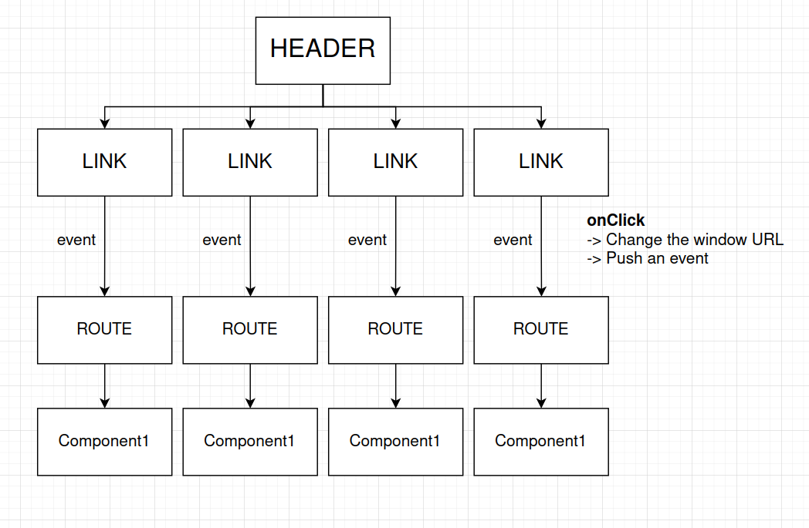

Basically we have a parent navigation component, [Header](./6_widgets/src/components/Header.jsx), which contains [Link](./6_widgets/src/components/Link.jsx) components with different url paths (`href` properties). Each link has an `onClick` event handler which changes the window url and dispatches a new event which lets the [Route](./6_widgets/src/components/Route.jsx) components know that the url has changed. The Route component in turn wraps the concrete components which are conditionally shown based on the current window url path. It listens to the event which the Link component dispatched, and when it's triggered it rerenders and shows the child component (if the current window url path matches the required path to display the concrete component).

</details>

# 12. Deploying a React App

<details>

<summary> Click to expand/collapse... </summary>
<br />

In order to deploy a React App online we need to do the following:

1. Build the app (using the built in script from create-react-app, ) and thus create a Deployment Bundle
2. Deploy the bundle to some deployment target (some service provider which will host those files)

NOTE - For deploying a React application we **don't need some running VM** as we are not executing any code!!!

Deployment examples:

1. **Using VERCEL:**

- [sign up](https://vercel.com)
- install the Vercel CLI, `npm install -g vercel`
- login to vercel using the cli (inside your project directory), `vercel login`
- run `vercel` in your project directory
- to redploy some changes using vercel use the `vercel --prod` command

2. **Using NETLIFY:**

- [sign up](https://www.netlify.com/)
- link up your github project with netlify
- netlify automatically redeploys changes in the master branch of our project
</details>

# 13. Redux basics

<details>

<summary> Click to expand/collapse... </summary>
<br />

- **Redux** is a state management library
- it maktes creating _complex_ applications easier
- it's _not_ required to create a React app, and it's _not_ explicitly designed to work with React

## Redux cycle:

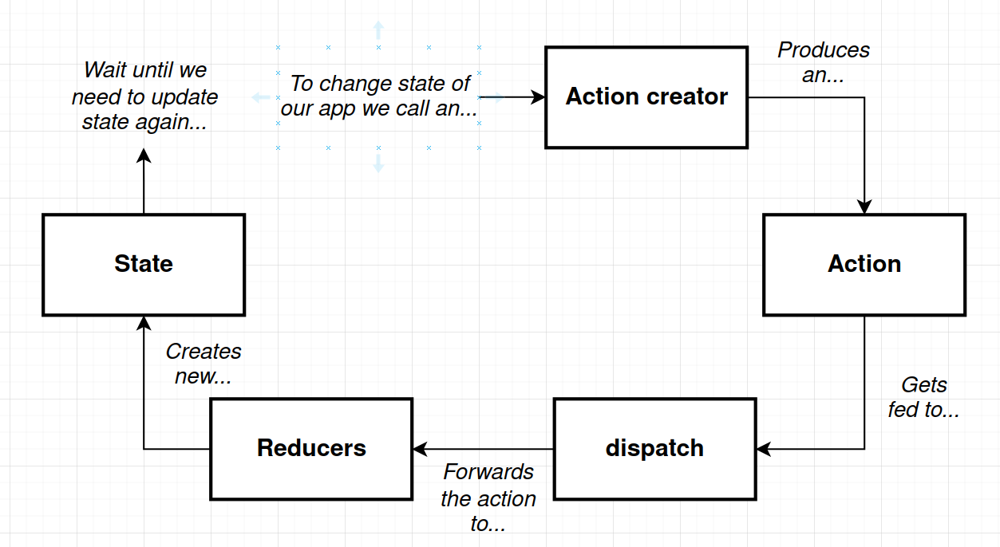

1. **Action creator**

- a function that returns a plain JavaScript object (an action)

2. **Action**

- it describes some change that we want to make inside the data of our application
- an object which has a **type** property (mandatory) which describes the change which we want to make to our data, and a **payload** property (optionally) which gives us some context about the change we are making
- example (a separate action creator is created for each type, they all look very similar to this):

```
// Action creator
const createPolicy = (name, amount) => {
  // an action
  return {
    type: "CREATE_POLICY",
    payload: {
      name: name,
      amount: amount
    }
  };
};
```

3. **dispatch**

- a function that takes an action object, creates copies of it, and dispatches them off to a bunch of different places in our application
- part of the Redux library (we don't have to write it out ourselves)

4. **Reducers**

- a function that is responsible for taking in an action and some existing amount of data
- it processes the action, makes some changes to the data and finally returns the new data so that it can be centralized in some other location
- important to note that _every time_ we make a change to data we want to create a new array, and _never_ modify the existing one
- example (a separate reducer is created for each type of data, reducer arguments are always the same, be careful to default the first argument in the case we are calling the reducer for the first time - when there is no old data yet):

```
const policies = (listOfPolicies = [], action) => {
   if (action.type === "CREATE_POLICY") {
     return [...listOfPolicies, action.payload.name];
   }

   if (action.type === "DELETE_POLICY") {
     return listOfPolicies.filter(name => name !== action.payload.name);
   }

   return listOfPolicies;
};
```

5. **State**

- a central repository of all data that has been created by our reducers
- example:

```
// REDUX
const { createStore, combineReducers } = Redux;

// used to wire up all of the reducers together
const ourDepartments = combineReducers({
  // variables on the left side will become the property names of our final state object
  // variables on the right side are the names of reducers
  // we could've used ES6 syntax here but this is more clear
  accounting: accounting,
  claimsHistory: claimsHistory,
  policies: policies
});

const store = createStore(ourDepartments);

// each time we run the dispatch function the entire Redux cycle is ran
store.dispatch(createPolicy("Alex", 20));
store.dispatch(createPolicy("Jim", 30));
store.dispatch(createPolicy("Bob", 40));

store.getState();

store.dispatch(createClaim("Alex", 120));
store.dispatch(createClaim("Jim", 50));

store.getState();

store.dispatch(deletePolicy("Bob"));

store.getState();
```

- it's important to note that we cannot access the Redux state in any other way other then through this mechanism (dispatching actions created by action creators to the reducers)
</details>

# 14. Integrating React with Redux

<details>

<summary> Click to expand/collapse... </summary>
<br />

**React-Redux** is a helper library which has a lot of helper functions that make this integration easier.

### React-Redux library

Usage:

- we create new instances of `Provider` and `Connect` Redux components (implemented by React-Redux), they are also frequently called tags or functions
- the `Provider` keeps a permanent reference to the Redux store, and becomes the top level component of our application (even above the `App` component)
- the `Connect` component wraps all of the components which require some data from state stored in the redux store

  - it is able to directly communicate with the `Provider` component at the top of our hierarchy, which directly passes the required data to it, and then the `Connect` component passes the received data to the component it wraps as a prop
  - the `Connect` component also makes sure that Action Creators can be called directly from the component it wraps, they are also passed to the wrapped component as props

- `Provider` **[example](./8_songs/src/index.js)**

- `combineReducers` **[example](8_songs/src/reducers/index.js)**

  - the key names from this funciton will be the keys present in the state object

- `connect` flow:

  - import `connect`
  - **define `mapStateToProps` function - its first argument is always `state`, and an optional second parameter is `ownProps` which references the properties from a component** (if we ever want to decouple the component from the `mapStateToProps` logic, [example](./9_blog_posts/src/components/UserHeader.jsx))
    - it will always return an object which will be shown in props within our component
  - call `connect(mapStateToProps)(OurComponent)` during export
  - we can now access the values returned by `mapStateToProps` function as props within our component
  - also if we want to update the state we use action creators which are passed as a second argument of the `connect` function like this, `connect(mapStateToProps, { actionCreator1, actionCreator2 })(OurComponent)`, and then once that action creator function is available within props we can call it from inside our component (also we can use any key name we want for the function name, if we are going to use the same then new ES6 syntax is shorter - so we don't write the same keys and values)
  - **[example](./8_songs/src/components/SongList.js)**

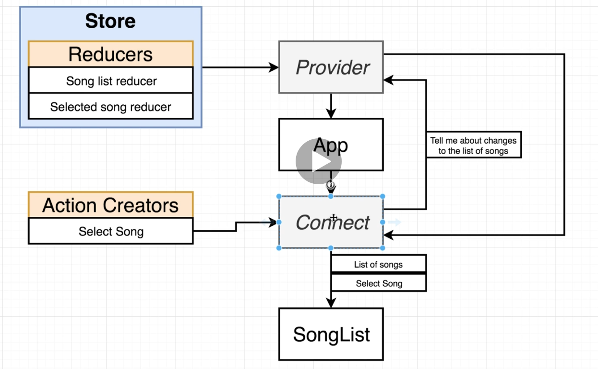

Redux project structure:

- we would have separate `actions`, `reducers` and `components` folders
- root `index.js` file sets up _both_ the React and Redux sides of the app
- eaach of the redux folders would have an index.js file (convention for clearer imports)

**Redux is not magic!**

- it does not automatically detect action creators being called
- it does not automatically detect a function returning an object that is an _action_
- that is why we need to call the `dispatch` redux function which takes in an action creator - in order for our redux store to be updated
- in our code, where we are using react-redux, we do it by passing our action creators to the `connect` function which automatically calls the dispatch function of the redux store

</details>

# 15. Async actions with Redux Thunk

<details>

<summary> Click to expand/collapse... </summary>
<br />

**Redux thunk** is a middleware which helps us make network requests in a redux application. It does so by slightly changing the behavior of the redux store, either by adding new functionalities or by tweaking existing ones.

**General data loading with Redux:**

1. component gets rendered onto the screen
2. component's `componentDidMount` lifecycle method gets called
3. we call an action creator from `componentDidMount`
4. action creator runs code to make an API request

- be aware that by redux convention we should not fire an API request directly from an action creator
- an action creator should be simple and just create a plain JS object, otherwise we'll get an error like _"Actions must be plain objects. Use custom middleware for async actions."_ - more on this error message later
- for async actions we use **redux-thunk**

5. API responds with data
6. action creator returns an _action_ with the fetched data on the `payload` property
7. some reducer sees the action, returns the data off the `payload`
8. because we generated some new state object, _redux/react-redux_ cause our React app to be rerendered

**"Actions must be plain objects. Use custom middleware for async actions."** error message:

- **[example](./9_blog_posts/src/actions/index.jsx)** (commented part would cause the error)

1. _action creators must return plain JS objects with a type property_

- we are not doing that, even though it looks like we are in this example (the commented out part)
- the reason is that the `async await` syntax which we are using is an ES8 feature gets transpiled to ES6
- when it gets transpiled we get code which is a lot more complex
- what actually happens the very first time we run an API call is that the request object is returned instead of a normal action object with `type` and `payload` properties - this is not what we would anticipate and it is why this error occurs when our code is ran in the browser

2. _by the time our action gets a reducer, we won't have fetched our data_

- if we decide to use promises instead of async await this is the problem

**Redux middleware:**

- a middleware is a plain JS function that gets called every time we dispatch an action
- it has the ability to STOP, MODIFY or otherwise mess around with actions
- there are lots of popular open source middlewares, mostly used for dealing with async actions
- during the redux cycle the middleware positions itself between the dispatch function and the reducers

### Redux thunk

- a Redux middleware which among other things enables us to easily use **asynchronous action creators**
- it expands the rules of Redux by loosening the rule which states that action creators must return action objects and also **allows that functions be returned from actions creators**
- if the action is an object it just passes it on to the reducers without doing anything
- if the action is a function _redux-thunk_ calls it with the `dispatch` and `getState` functions as arguments
  - the `dispatch` function causes changes inside the redux store by invoking reducers
  - the `getState` function returns all of the data (state) from our redux store
  - the trick with _redux-thunk_ is that we can manually dispatch an action after the request has been completed (this time it will be an action)
  - after we do that it is again dispatched automatically by redux\
  - when it gets to the _redux-thunk_ type check, since this time it is an object, it is automatically passed on to the reducers
- the entire redux-thunk middleware is 14 lines long - [check it on github](https://github.com/reduxjs/redux-thunk/blob/master/src/index.js) - wow

**Usage:**

1. wire redux-thunk up to the redux store, [example](./9_blog_posts/src/index.jsx)
2. return a function with `dispatch` and `getState` functions as arguments, if we are not using the `getState` we can ommit it, [example](./9_blog_posts/src/actions/index.jsx)

- the syntax with 2 chained arrow functions is interesting here, basically it's just a function returning a function

</details>

# 16. Redux store design

<details>

<summary> Click to expand/collapse... </summary>
<br />

**Rules of reducers:**

- **reducers must return _any_ value besides `undefined`**
- **produces `state`, or data to be used inside of your app, using only previous state and the action**
  - at application startup all reducers are ran once (initialization process)
  - during the initialization process the reducer will be called with the arguments of `undefined` and action, and will produce the initial state value
  - that is why we often provide default values for the first argument of the reducer (which is by default called `state`)
  - on every subsequent call to the reducer the value of the first argument will be the result of the last time the reducer was called, so for example on the second call to the reducer the value of the first argument would be the initial value of state
  - the second argument, the action object, is the one that changes from call to call
- **must not return reach 'out of itself' to decide what value to return (reducers are pure)**
  - the reducer is only supposed to look at the previous state and the action object to decide the next value of state
  - it should not reach 'out of itself' - meaning that it shouldn't make an API request, get some user input, read DOM values and so on
- **must not mutate its input `state` argument - MISLEADING AND POSSIBLY FALSE RULE**
  - the first argument of the reducer is by convention called `state`
  - in JavaScript strings and numbers are immutable values
  - this rule mostly comes to light when we are working with arrays and objects
  - when testing for equality of objects and arrays we are not testing if they contain the same values but whether they occupy the same memory location
  - this rule is misleading because, even though it's a bad practice, you can absolutely mutate the state value - Redux is not going to throw any errors!
  - still we should follow this case, it is just important to understand why it exists
  - the corner case that causes trouble and the reason that this rule exists is [here](https://github.com/reduxjs/redux/blob/master/src/combineReducers.ts#L192) (if line numbers change at some point it's at the bottom, look for the `hasChanged` boolean variable) - basically this logic looks for any changes in state, in all of our reducers, and if any has changed then it will change the value of state
  - this is a problem because, if we return the same state value from the reducer (in terms of memory location), whether it is modified or not, the state WILL NOT change!

**Safe state updates in reducers:**
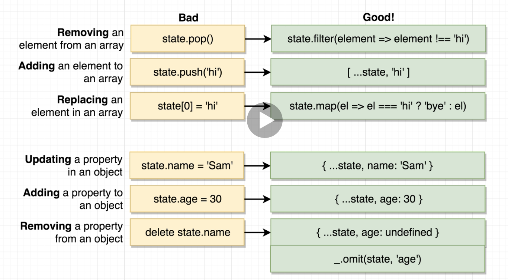

- to delete a property the cleanest way is to use the lodash library with its `_.omit(obj, property)` function

**[Reducer example:](./9_blog_posts/src/reducers/postsReducer.jsx)** -> switch cases are extremely common in reducers

**Caching requests**

- if we want to avoid repeating multiple same API requests we can:

1. memoizie functions using the lodash library and its `memoize` function

- the function will only be called once per unique value, each subsequent time the function will not be called, it will just return the initial value
- [example](./9_blog_posts/src/actions/index.jsx)
- one problem is if we want to actully call the function again for some reason - we would need a duplicated, non-memoized function

2. conditionally calling functions

- [example](./9_blog_posts/src/actions/index.jsx) - the `fetchPostsAndUsers` method

</details>

# 17. Navigation with React Redux

<details>

<summary> Click to expand/collapse... </summary>
<br />

We don't actually want to install the `react-router` library, we want `react-router-dom` (most likely), `react-router-native` or `react-router-redux` which are its implementations.

**React Router** works by matching the url path with a given React component using the `BrowserRouter`, `Route`, and `Link` components, **[example](./10_streams/client/src/components/App.jsx)**.

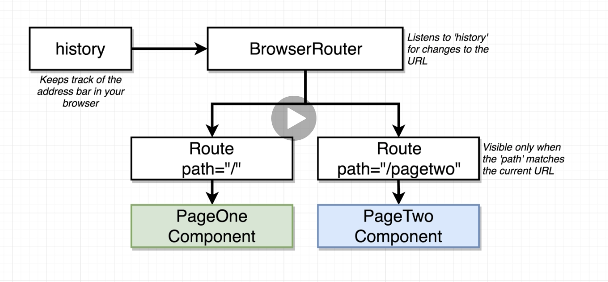

**How paths get matched:**

- different routes can be matched by the same url - multiple components can be shown on the same url path
- React Router doesn't match the path exactly, but checks whether our path is contained in the given path
  - for example the path `/example` would be matched in a url `localhost:8080/example/abc/1` which can potentially cause a confusion as we probably only wanted the exact route on `/example/abc/1` to be shown
  - if we don't want this behaviour, but rather only the exact path to be matched we need to add the `exact` attribute to the route component and set it to true (`exact={true}` is equivalent to just `exact`)

**How to navigate with React router:**

- the classical HTML approach with `<a href="/path">Link</a>` is bad because the browser dumps the old _index.html_ file along with all the React/Redux state data during the process of going to a new path like this
  - that means that each time we click an href link we make a new network request for an entirely new _index.html_ file, as well as executing the entire JS bundle again (the React App)
- the correct approach is to use the `<Link>` components instead of `<a>`, and the `to` attribute instead of `href`, [example](./10_streams/client/src/components/App.jsx)
  - by using this we are not making new network requests when navigating to a different page because React Router is preventing such behavior - **SPA (single page application)**

**Different types of routers: (deployment issues)**

- `BrowserRouter` - uses everything after the domain or port as the path (includes the `/`), e.g. localhost:3000/**pagetwo**
  - potentially tricky to deploy
  - unlike a traditional server, a create-react-app dev server doesn't return 404 when it stumbles upon a route which it can't find, instead it serves us the index.html file
  - this is great because all of our route definitions are on the client side, the server has no knowledge of those route definitions
- `HashRouter` - uses everything after the # as the path (includes the `/`), e.g. localhost:3000/#/**pagetwo**
  - automatically puts the # after the URL
  - used in instances where we configure the server not to look at anything after the `#`
  - then we configure the main part of the URL to always return the index.html file and the client side application will look at the url path
- `MemoryRouter` - doesn't use the URL to track navigation

**Steps to create navigation:**

1. Define React components and their paths
2. Define the `Route` components with the appropriate paths inside the parent, `BrowserRouter`, component
3. Create a `Header` component which will contain the different `Link` components which lead us to the different routes we've just set up

- beware that the `Header` component also needs to be inside the `BrowserRouter` (only if it contains `Link` components) - otherwise we will get an error

**Programmatic navigation (user is redirected automatically):**

- the best way to do this is by using the `history` object (created by the `BrowserRouter`) which doesn't only track our urls, but can also change them
- when we want to get a reference to the history object from a React Component it's very easy, however when we want to do it from somewhere else in our app, such as an action creator it's much more difficult
- the best way to solve this is, unfortunately, to create our own history object and manage it ourselves instead of letting the `BrowserRouter` to do it for us
  - it should have the same type as the router implementation we are using (browser, hash or memory history)
  - because of that we will be using `Router` instead of the `BrowserRouter` as the top component in our browser hierarchy
  - there are no other changes needed and navigation will continue working as intended
- steps:
  - [creating our own history object](./10_streams/client/src/history.js)
  - [using the plain `Router`](./10_streams/client/src/components/App.jsx)
  - [programmatically navigating the user](./10_streams/client/src/actions/index.js)

**URL based selection:**

- done by passing a variable from the browser url to the react component
- for matching any id in the routes for the url we can use the wildcard syntax, `:id` (the `:` is important here), like [here](./10_streams/client/src/components/App.jsx)
- because we are using react-router-dom we have some default props available on the routed component such as _history_, _location_, _route params_ and so on
- a potentially unexpected behaviour can sometimes happen when using the redux store and react router at the same time and url based selection:
  - if we directly navigate to some edit page which contains an id the object with that id can potentially be `undefined` because we are filling the redux store with data on some other url which displays the list of objects
  - that is why we always have to follow the rule that says that **every component needs to be designed to work in isolation when using react-router!**
  - that means that every component needs to fetch its own data

**Switches with React-Router:**

- because of problems with the way that React Router matches paths it's sometimes necessary to use its `Switch` component to avoid the router matching multiple url paths
- the switch basically stops trying to find additional route matches after it finds the first match, [example](./10_streams/client/src/components/App.jsx)
  </details>

# 18. Handling Authentication with React

<details>

<summary> Click to expand/collapse... </summary>
<br />

### Email/Password Authentication

- we store a record in a database with the user's email and password
- when the user tries to login, we compare email/pw with what's stored in the DB
- a user is logged in when they enter the correct email/pw

### OAuth based authentication

- user authenticates with outside service provider (Google, Linkedin, Facebook)
- user authorizes our app to access their information
- outside provider tells us about the user
- we are trusting the outside provider to correctly handle identification of a user
- OAuth can be used for:
  - user identification in our app
  - our app making actions on behalf of the user

### OAuth for servers vs OAuth for JS browser apps

Servers:

- results in a _token_ that a server can use to make requests on behalf of the user
- _usually_ used when we have an app that needs to access user data **when they are not logged in** (for example an app that accesses a users email every 10 minutes to filter something)
- difficult to setup because we need to store a lot of info about the user

Browser:

- results in a _token_ that a server can use to make requests on behalf of the user
- _usually_ used when we have an app that needs to access user data **while they are logged in**
- very easy to setup thanks to Google's JS lib to automate flow

Steps for setting up OAuth with google:

1. Create a new project at _console.developers.google.com_
2. set up an OAuth confirmation screen
3. generate an OAuth client id
4. install Google's API library, initialize it with the OAuth client ID

- add this script to index.html - `<script src="https://apis.google.com/js/api.js"></script>`
- call `gapi.load('client:auth2')` in the browser console to load up the authentication library
- call `gapi.client.init({ clientId: 'clientId' })` to initialize the library with our API key
- [example](./10_streams/client/src/components/GoogleAuth.jsx)

5. make sure the lib gets called any time the user clicks on the _Login with Google_ button

- [example](./10_streams/client/src/components/GoogleAuth.jsx)
- basically during the initial component render we are initializing the auth library, after that we are getting the auth instance, setting the current login status to our component state and setting up an event listener so that the state is changed whenever the login status changes
- this enables us to dynamically rerender the login button, without needing to refresh the page (auto rerender occurs when the state changes)
- then we add appropriate on click event handlers to those buttons - and voila - we are done :)

We will eventually move the information whether the user is signed in into our redux store so that we can reference that information from any place in our app, because a lot of logic depends upon whether the user is signed in. This may seem a bit weird because we also need that information on the component level, so we are going to have to also get it there from the redux store.
Basically (to revise the redux flow) we:

- create action creators which produce objects that will be stored in our state - [actions](./10_streams/client/src/actions/index.jsx)
- create [reducers](./10_streams/client/src/reducers/index.jsx) which will update the state object based on the action type (uses the `combineReducers` function)
- setup redux by creating the store, passing it our reducers and setting up the `Provider` component which references that store in the root [index.jsx](./10_streams/client/src/index.jsx)
- wire up our concrete component with redux using the `connect` function which takes in the `mapStateToProps`, our action creators and the concrete component as arguments, [here](10_streams/client/src/components/GoogleAuth.jsx)
</details>

# 19. Redux devtools

<details>

<summary> Click to expand/collapse... </summary>
<br />

**[Redux devtools](https://github.com/zalmoxisus/redux-devtools-extension)** is a very helpful extension which enables us to inspect the redux store from the browser.
To set it up we need to:

- add it as a browser extension (Chrome or Firefox)
- [set it up](./10_streams/client/src/index.jsx) in code using `compose`
- if we go to `localhost:3000?debug_session=<some_string>` we start a debug session during which all data in the redux store is saved between refreshes of the page - very useful for debugging
  - we can also have named debug sessions and jump between them

</details>

# 20. Handling forms with Redux Form

<details>

<summary> Click to expand/collapse... </summary>
<br />

Redux form is a bit notorious for being quite challenging to understand. Their [documentation](https://redux-form.com/) is vey helpful though. Basically redux form does many steps in setting up user input with forms automatically, so we don't have to write a lot of boilerplate code.
Redux form flow:

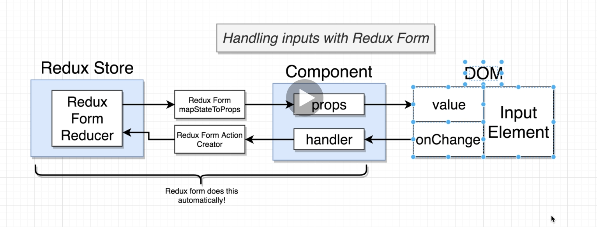

Setup:

1. install the redux-form dependency (some issues with new npm version, so `npm install redux-form --legacy-peer-deps` command might be needed instead of a classic installation)
2. add the redux-form reducer to our `combineReducers` call, [example](./10_streams/client/src/reducers/index.jsx)

**[Usage example:](./10_streams/client/src/components/streams/StreamForm.jsx)** (worth looking at since it contains some explanations as well)

- we import `Field`(react component) and `reduxForm`(a special redux-form function similar to `connect`)
- `Field` needs to be passed multiple props - `name` which assignes the field to some given label and `component` which tells the field the actual content which it needs to display
- if we fail to do that we will receive a misleading error message that says something along the lines of: "Element type is invalid: expected a string or a class/function but got undefined."
- to further customize the components rendered in the `Field` element we just need to pass additional props to the `Field` element, which will automatically pass them to the function which renders the component if it doesn't natively know what to do with them

**Validation of form inputs:**

- we define a `validate` function which takes in the form values as an argument

  - if the values are valid we return an empty object which lets redux-form know that the inputs are valid
  - otherwise we return an errors object which holds different key-value pairs that contain the name of the fields and error message - if that happens the redux-form will compare the name attribute of the `Field` component with the key names of the errors object, and if they match we can display the error message on the screen by using the built in `meta` redux-form prop which contains, among other things, the error message (meta.error)
  - we can also use `meta` to help us conditionally show the error message (for example if we actually touched the input)

- **[example](./10_streams/client/src/components/streams/StreamForm.jsx)**

**Setting initial values with redux-form:**

- when we have a component wrapped in redux-form it technically receives the props passed to the component first and then forwards them to our concrete component
- there are also some special types of props which we can pass to our redux-form wrapped component, such as `initialValues`, which will automatically populate the corresponding form values based on key names inside that object (matching key name from the prop object with the field name of redux-form)
- **[example](./10_streams/client/src/components/streams/StreamEdit.jsx)**
  </details>

# 21. REST-based React Apps

<details>

<summary> Click to expand/collapse... </summary>
<br />

**RESTful conventions**

- standardized system for designing APIs
  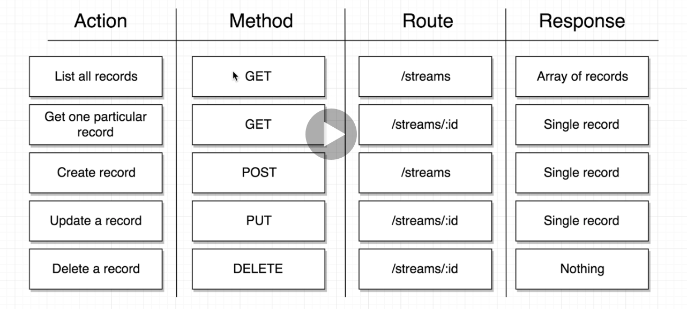
- for the purpose of the streams project we'll just use the json server npm package so we don't have to write our own api server from scratch
- we'll also be using this [RTMP server](https://github.com/illuspas/Node-Media-Server) for implementing video streaming, see [app architecture](./10_streams/streams_app_architecture.png)

- other than that the rest should be standard, creating [action creators](./10_streams/client/src/actions/index.js) that make an API request using `dispatch`
- for the [reducer](./10_streams/client/src/reducers/streamReducer.js) we are going to do things a bit differently so that our operations are easier, instead of returning an array of streams we are going to return an object which will have the stream id as the key and the corresponding stream object as the value
- by doing that we can use the **key interpolation syntax** for updating the object, i.e. `return { ...state, [action.payload.id]: action.payload }`
- another example of key interpolation:

```
const animalSounds = { cat: "meow", dog: "bark" };
const newAnimal = "lion";
const newSound = "roar";
const newAnimalSounds = { ...animalSounds, [newAnimal]: newSound }
```

Interesting RESTful sidenote (PUT vs PATCH):

- PUT request updates all the properties of a record, where as PATCH updates only some properties
- that means the the body of the PUT request will replace the entire body of the object (if we follow PUT request conventions strictly) - excluding the id property

</details>

# 22. React Portals

<details>

<summary> Click to expand/collapse... </summary>
<br />

**Portals** enable us to render a component outside the usual React parent-child component hierarchy. Basically a component can render some content which will not be shown as its child component, but rather a child of some other element in the DOM. This is very useful in many different use cases, in our examples we'll be creating a modal, but it's also often used when we want to render some content into some HTML that wasn't created by our application.

- **[example](./10_streams/client/src/components/Modal.jsx)**
</details>

# 23. React Context

<details>

<summary> Click to expand/collapse... </summary>
<br />

**Props system** - gets data from a parent component to a **direct** child component

**Context system** - gets data from a parent component to **any** nested child component

Two ways to get information in and out of the context:

- to get information into the context we can either use the _default value_ or create a `Provider` component in the parent component
- to get information out of the context we can either use the `this.context` syntax or create a `Consumer` component in the child component

**Setup:**

1. [creating the context](./11_translate/src/contexts/LanguageContext.jsx)

- in this example we also passed a _default value_ to the context immediately

2. [hooking up the context to a component](./11_translate/src/components/Field.jsx)

- we need to define `static contextType = LanguageContext;`, alternatively we can define e.g. `Field.contextType = LanguageContext;` outside of the class, those two are equivalent

3. after that we can access the value inside the context by using `this.context`

### Context Provider

If we ever want to change the value inside our context object instead of always using the default we need to create the `Provider` component (different than the one from Redux) which will wrapp the components which need information from the react context and pass the value which the context needs to hold to it, so that it doesn't always hold the default value, **[example](./11_translate/src/components/App.jsx)**

- the parent component renders the `Context.Provider` component
  - whatever value we pass to its `value` prop will update the value of the context object in child components, regardless of the value
- flow (from our example application):
  1. Application loads up in the browser
  2. We create a context object with a default value of 'english'
  3. App component gets rerendered, creates a `Provider` that wraps `UserCreate`
  - **each separate use of `LanguageContext.Provider` creates a separate 'pipe' of information!**
  - this means that if we wrap some other sibling component with another `LanguageContext.Provider` and pass it some other value it will not have any reference to the first `Provider`
  4. Provider updates the value of the context object to `this.state.language`
  5. `Button` and `Field` reach into the context object, see the value from `this.state.language`
  6. `Button` and `Field` render appropriate text to the screen

### Context Consumer

An alternate way of consuming values when using React Context, similarly to the provider component it is automatically created when we initialized the context. We would use this any time we want to get information out of multiple different context objects inside of a single component.

- to use it we **always** need to pass it a function as a child, [example](./11_translate/src/components/Button.jsx)
- the first argument of that function is the value which is currently present in the context
- to make it more readable we can extract the function

## OPTIONAL - Replacing Redux with context

- React Context is not a complete replacement for Redux because it only provides a way to distribute data to various components, where as Redux also provides us with a way to centralize data in a store and a mechanism to change that data

- if we want to use Context in place of Redux we need to:

1. be able to get data to any component in our hierarchy (we have that out of the box)
2. we need to be able to separate our view logic from business logic
3. we need to be able to split up business logic (not have a single file with 10000 lines of code)

- look at this [simple project](./12_translate_context_vs_redux/src) for inspiration
- we created a [store](./12_translate_context_vs_redux/src/contexts/LanguageContext.jsx) and propagated its data to other parts of the app, where it was needed

- it is still recommended to use Redux for more serious, larger apps because it has excellent docs, uses well-known design patterns and has a tremendous amount of open source libs

</details>

# 24. BONUS - MobX

<details>

<summary> Click to expand/collapse... </summary>
<br />

MobX is an open source state management library that can be used by any UI framework. It is a good alternative to Redux because, unlike Redux, it's easy to use, fast to set up and it doesn't have nearly as much boilerplate.

## MobX fundamentals

Main terms:

- state (observable) - data
- actions - functions that update our data
- computations - produce derived data
- reactions - same as computations but also produce side effects such as updating the UI

Mobx cycle:
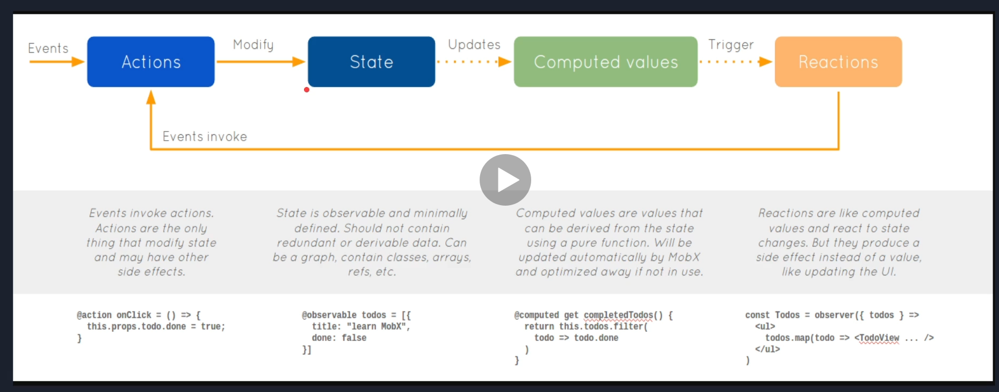

#### Observables (state)

- in MobX observable is the "state" => everything we want to track in our application
- can be defined with `@observable` decorator (be sure to enable _experimentalDecorators_ in tsconfig if using TypeScript), or with a normal `observable` function
- everything in observable will be made recursively observable as well (except classes)
- _observable_ wraps the object with a new one with extra mobx functionalities
- to return to the normal object you should use the `toJS` mobx function, or create your custom one
- **[example](./13_mobx-react-typescript/src/examples/fundamentals/observable.ts)**

#### Actions

- actions are what we use to update our state
- 3 ways to update our state with an action:
  - `@action` decorator above a class method
  - passing a function to the MobX `action` function
  - by calling the `runInAction` MobX function
- all updates inside an action are batched (if we update multiple observables inside one action function they will only be updated once, if we update them in separate functions they will be updated more times)
- **actions don't support async operations**, so everything updated after the async code will be executed in the next batch, see example
- **[example](./13_mobx-react-typescript/src/examples/fundamentals/actions.ts)**

#### Reactions

- reactions is our way to know that an observable has been changed and to act/react/do something with the change
- there are 3 main types of reactions in MobX:
  - **autorun** - tracks every observable accessed inside it, needs to be disposed through the disposal function (otherwise we will get memory leaks)
  - **reaction** - triggered by a condition you pass to it, also needs to be disposed
  - **when** - also triggered by a confition but doesn't need to be disposed, it runs only once after the condition is met and is automatically disposed
- so `autorun` and `reaction` return a disposer function which needs to be called after we no longer need them to dispose of them and avoid memory leaks
- **important note** - observables used after async code won't be tracked, which means that reactions won't be invoked in that case
- **[example](./13_mobx-react-typescript/src/examples/fundamentals/reactions.ts)**

#### Computations

- computed values are derivations of the state
- they are similar to _Reactions_, but instead of producing side effects (like logging), they retutn a value
- they can be used with a decorator or a function
- they are also automatically updated, just like observables
- computed values that are used inside a reaction function will be cached, if it's not used within a reaction it wont be cached
- **[example](./13_mobx-react-typescript/src/examples/fundamentals/computed.ts)**

## MobX principles and concepts

#### What MobX reacts to?

- MobX reacts to _any existing_ observable _property_ that is **read during** the execution of a **tracked function**
  - reading is referencing an objects property (e.g. user.name)
  - tracked functions are expressions of **computed**, first argumnets of **reactions** and the render method of an **observer** component
  - during means that only those observables that are being read while the function is executing are tracked
- MobX won't react to:
  - values that are obtained from observables, but outside the tracked function
  - observables that are read in an async invoked code block

#### Create our own MobX

- [code](./13_mobx-react-typescript/src/examples/principals and concepts/our-mobx.ts)

#### MobX applications mindset

- most applications consist of a database, the backend and the frontend
- our frontend should have clear separation of concerns - we need to have separate services which call the backend api using http, mobx stores which hold and track data and the UI part (in React in our case)
  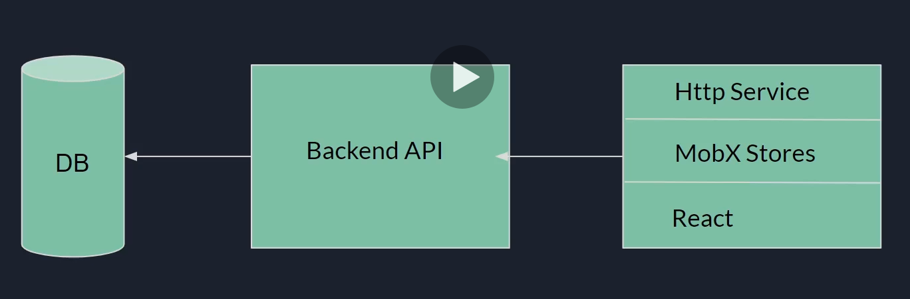

#### Store types

- **Domain store**
  - in charge on managing our application data and logic, we should have one per entity, e.g. TodoStore, UserStore, BookStore...
  - it will usually hold a collection (list) of those entities
  - a **domain object** (Todo, Book, User) is in charge of managing specific domain logic and can be connected to the domain store
- **UI store**
  - usually used to share global UI information for the entire application or a specific page, e.g. Chat Page, Global View

**Store types**:

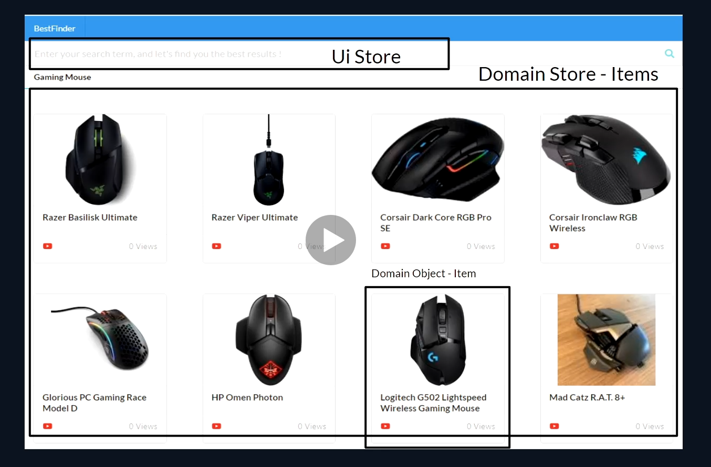

**Store structure**:

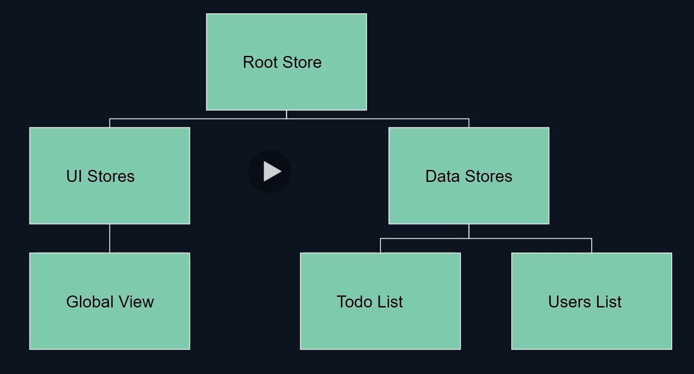

[EXAMPLE](./13_mobx-react-typescript/src/stores)

## Connecting MobX to React

- **mobx-react** and **mobx-react-lite** are libraries that serve as a bridge between MobX and React
- **mobx-react-lite** - base library that works only with hooks
- **mobx-react** - an extension of mobx-react-lite that enables us to use React class components with MobX

_MobX React API_ consists of 3 main tools to connect to React components:

- `observer` HOC (high order component) component
  - applies `React.Memo` on the component for caching
  - Mostly used similarly to the `connect` function in Redux, which means we wrap the component with `observer` during export.
- `useObserver` Hook
- `<Observer />` Component

We can think of these 3 just like **tracked functions**, but in React. All of thenm do the same job, we can choose the one that suits our case the most.

- **[example](./13_mobx-react-typescript/src/examples/connecting mobx to react/mobx-react-api.tsx**)

#### Connecting stores to React

- **VERY COOL CONCEPT - put some time to understand this and go through code examples in detail!!!**
- to connect our stores to React we will put our Root Store inside the React Context
- we will also create a helper function `createStore` so we have a1 clear place to initialize our RootStore and everything related to it
- we will create a custom hook that will get us the stores from React Context called `useStores`

- Helpers **[example](./13_mobx-react-typescript/src/stores/helpers)**
- Putting root store in context **[example](./13_mobx-react-typescript/src/index.tsx)**
- Usage in App.tsx **[example](./13_mobx-react-typescript/src/App.tsx)** - notice the `observer` that wraps the component during export

#### When to use MobX state vs React State

**MobX state**

- persistent data (User, Todo, ...) and shared UI state (Theme, Views)
- if we have big UI features that need to be shared accross components easily

**React state**

- reusable components (Button, Input, Design Library)
- small local UI state (shouldShowInput, isVisible)

#### MobX 6 changes

- MobX 6 dropped the decorator syntax because it's not officially part of JS
- `makeObservable`
  - a function that receives a target, annotations and options object, usually we will just call `makeObservable(this)` inside the constructor
  - if we are not using annotations we will also need to pass the annotations object to it, e.g.
  ```
  makeObservable(this, {
    name: observable,
    updateName: action,
    coolName: computed
  })
  ```
  - each class that uses observables needs to call this (even sub and super-classes)
  - it needs to be called after the properties are declared
  - [example](./13_mobx-react-typescript/src/examples/mobx-6/makeObservable.ts)
- `makeAutoObservable`
  - a function that receives a target, overrides and options object
  - cannot be used on sub-classes or classes with super call
  - converts everything automatically by the next rules:
    - any (inherited) member that is a generator function will be annotated with flow
    - any (inherited) member that contains a function value will be annotated with autoAction
    - any getter will be annotated with computed
    - any other own field will be marked with observable
    - members marked with false in the overrides argument will not be annotated, use this for example for read only fields such as identifiers
    - [example](./13_mobx-react-typescript/src/examples/mobx-6/makeAutoObservable.ts)
- if we still want to use decorators (not recommended):
    - we will need to use `makeObservable` or `makeAutoObservable` inside the class constructor
    - we will need to enable 'experimantalDecorators' in tsconfig and a new flag 'useDefineForClassFields' (also set it to true)

</details>
